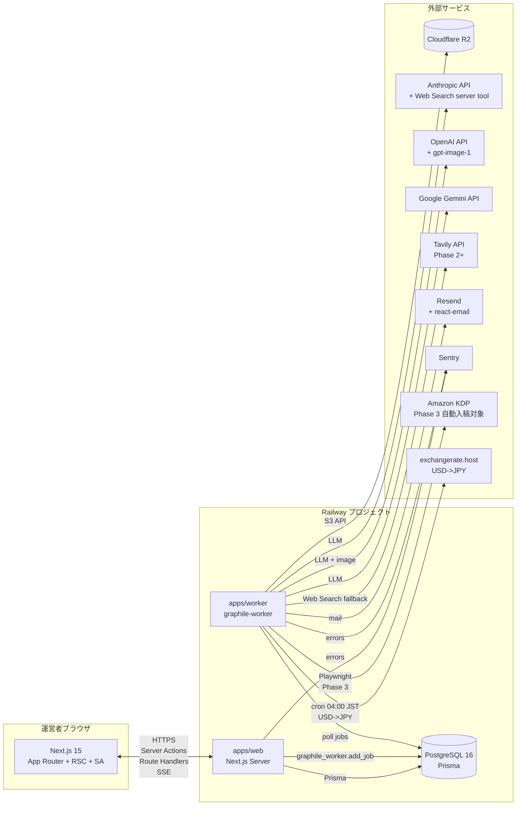
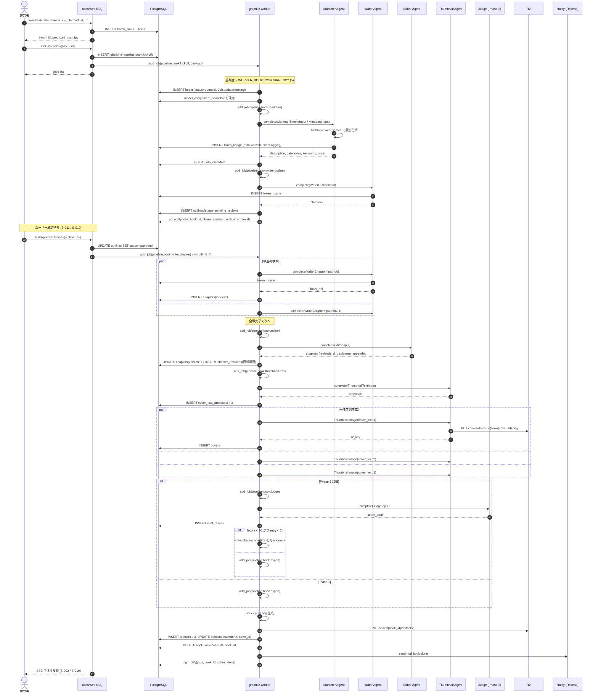
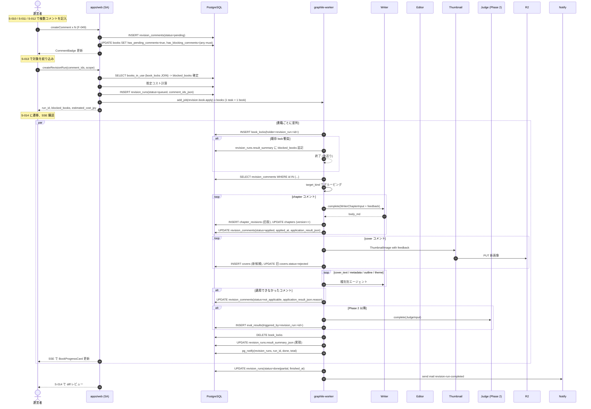

# 05. プログラム設計

> 本ドキュメントは `program-design` ハーネスエージェントが生成・更新する。
> 構造の指示は `.claude/agents/program-design.md` を参照。
> 起点: `CLAUDE.md`, `docs/01-business-requirements.md`, `docs/02-functional-requirements.md`（F-001〜F-050 / UC-01〜UC-06）, `docs/03-tech-selection.md`（確定スタック C-01〜C-14 + 追加選定 A〜J）, `docs/04-ui-design.md`（S-001〜S-029）。
> 本書は `programmer` エージェントの唯一の実装根拠。コードを書く前に再決定をしてはならない。

---

> **関連**: KDP出版事業を丸ごと回す **組織エージェント（CEO→6本部長→担当者＋全社ToDoバックログ）** の
> 設計は [`docs/06-org-agents-design.md`](06-org-agents-design.md) に分離。**P4 増分2 実装済み（2026-07-13）**。
> 既存パイプライン/販促自動運用を実行レイヤーとして再利用し、その上に計画・実行・検証・コスト統治を載せる。
>
> P4増分1: `promotion_accounts`（多アカウント台帳）＋ `plan_accounts`（account_strategist が推奨アカウントを台帳pending＋作成仕様付き create_account(needs_human) で起票。作成は規約/KYC のため人手=connect-once 固定）。
> P4増分2: `promotion_posts.account_id`＋`pickAccountForChannel`。台帳を接続(connect-once, `/org/accounts`)すると `promotion.posts.generate` が投稿を接続済みアカウントへ自動振り分け、`promotion.post.publish` がそのアカウントの資格情報で投稿（未接続なら failed、account_id 無しは channel 既定にフォールバック）。
> P4増分3: `evaluateKdpPublishReadiness`＋`org.kdp.screen`（AppSettings `org_kdp_auto_publish_enabled`(既定OFF)/閾値）。publish_kdp を品質/価格/メタで審査し result_json.kdp_readiness へ。ゲートONかつ合格のみ needs_human→approved(公開クリア)。実入稿(kdp.submit Playwright)は Phase 3 まで人手。
> P4増分4: `org_playbook`(singleton)＋`computeWinningPatterns`。org.plan が実績(ジャンル×売上)から勝ちパターンを抽出→台帳蓄積＋CEOスナップショット(winning_patterns)へ供給。/org に「勝ちパターン」カード。
> P4増分5: `computeBakeoffRecommendation`＋`ORG_BAKEOFF_ROLES`/`orgBakeoffSampleInput`。/org からロール選択で bakeoff 起動(`launchOrgModelBakeoff`)→`bakeoff.run`(org_optimize)完了→`org.bakeoff.recommend` が最良モデルを選定し `optimize_model`(needs_human)切替提案を起票。適用は人手(モデル割当変更は影響大)。既存 F-053 再利用。
> P4増分6（自律運用の起動UI＋自己改善ループの停滞解消, 2026-07-25）:
>   - `/org` に「自律運用設定」カード追加（`lib/org-automation-core.ts` の DI コア＋`updateOrgAutomation` SA）。5フラグ(`org_auto_plan_enabled`/`org_auto_execute_enabled`/`org_ops_watch_enabled`/`org_finance_tick_enabled`/`org_kdp_auto_publish_enabled`)とそれぞれの cron を DB 直接編集なしで ON/OFF・編集可能に。cron の反映は worker 起動時 `fetchAppSettingsForCron`(`apps/worker/src/runner.ts`) 読み込みのため **worker 再起動後**（UI にノート表示）。
>   - `org.execute.dispatch` の連鎖起票（改善ToDo follow-up）を、`isHumanKind` が false の kind は `proposed` ではなく `approved` で起票するよう変更（`apps/worker/src/tasks/org-execute.ts`）。人手前提 kind は従来通り `needs_human`。これにより次サイクルの dispatcher が自動着手し、CEO立案を待たずに自己改善が回る。
>   - 全社ToDoボード（`/org/tasks`）に、`blocked`→`approved`（「再実行」、error クリア）／`needs_human`→`approved`（「承認」）の前進操作を追加（`retryOrgTask` SA、`lib/org-view.ts` の `canRetryOrgTask`）。従来は `blocked`/`needs_human` を前進させる手段がボードになかった。
>
> F-089（CEO起点のプロンプト改訂, 2026-08-22）:
>   - **目的**: 運営者が CEO チャット(`/org`, `org.ceo.chat`)で「あるエージェントの発信内容/書き方/方針を変えたい」と伝えると、対象 runtime エージェントの system プロンプト(`prompts`)を CEO 権限で恒久改訂し、以後の全生成に反映させる（＝入力した指示が効き続ける）。
>   - **CEO出力拡張**: `CeoChatOutputSchema` に `prompt_edits: [{role, instruction}]`(最大5, 任意) を追加（`packages/contracts/src/org/index.ts`）。`ceo_chat` プロンプトを v2 化し本能力を告知（`packages/db/apply-ceo-chat-v2.ts`）。
>   - **新エージェント `prompt_editor`**（`packages/agents/src/org/prompt-editor.ts`, role 追加 `llm-client.ts`, I/O は `PromptEditorInput/Output` in `org/index.ts`, seed `apply-prompt-editor.ts` = anthropic/claude-opus-4-8）: 対象の現行本文＋改訂指示＋保持必須プレースホルダを受け、**最小改訂**した新本文を返す。プレースホルダ(`{…}`)は全保持が絶対条件。
>   - **適用フロー**（`apps/worker/src/tasks/org-ceo-chat.ts` `applyCeoPromptEdit`）: ①対象 role の現行 active プロンプト取得(genre=null優先) ②`prompt_editor` で改訂 ③検証（新本文が空/無変更/プレースホルダ欠落なら中止） ④`$transaction`: `prompt_proposals`(status=auto_approved, decided_by='ceo', rollback_until=+7d) 作成＋旧 active を archived＋新版 active(created_by=`ceo:<message_id>`, placeholders 継承)＋`AuditLog`(action='prompt.approve', trigger=ceo)。1件失敗しても対話は壊さない(try/catch)。CEO返信に「✅/⚠️ role を vN に更新…」を追記。
>   - **ガード**: `ceo`/`ceo_chat`/`prompt_editor` 自身は改訂対象外（`PROMPT_EDIT_EXCLUDED_ROLES`）。`prompts` の active 一意制約を守るため archive→insert を同一tx。旧版保持でロールバック可。
>
> P1（起票）＋P2（制作/出版/分析の実行）＋P3（販促/運用/経営の統合）追加物（本ドキュメントの各レジストリへの反映）:
> - **DB**: `org_objectives` / `org_tasks`（+`token_usage.org_task_id`、`org_tasks.theme_id/account_id`、`app_settings.org_auto_plan_enabled/org_plan_cron/org_auto_execute_enabled/org_execute_cron/org_ops_watch_enabled/org_ops_watch_cron/org_finance_tick_enabled/org_finance_tick_cron`）
> - **worker タスク**: `org.plan`（CEOティック。日次cron 既定05:00 JST）／`org.execute.dispatch`（承認済タスクの実行。15分毎cron）／`org.ops.watch`（運用の自己復旧監視。10分毎cron。モデル障害の割当自動切替 `healModelOutages` に加え、2026-09-02 から**デプロイ残骸の自己修復** `defaultRepairOrphan` を実装 — デプロイ/強制終了で worker ごと殺され `public.jobs` が running のまま graphile ジョブを失った行を queued に戻し保存 payload で再投入。タスクの CAS が stale running に弾かれて再試行が空振り消滅し本が無言凍結する実障害への恒久対策）／`org.finance.tick`（経営の予算ガード。毎時cron）。いずれも AppSettings フラグで条件付き有効化。フラグ/cron は `/org` の「自律運用設定」カードから編集可能（P4増分6）
> - **dispatch 対象 kind**: 制作 `plan_book`/`write`、出版 `prepare_metadata`/`set_price`、分析 `analyze_sales`/`research_market`/`report`、販促 `create_content`/`publish_post`/`analyze_promo`、運用 `recover_job`、経営 `cost_report`/`budget_review`。`enforce_limit`/`triage_error`/`publish_kdp`/`create_account`/`connect_account` は `needs_human`
> - **エージェント役割**: `ceo` ＋ 6本部長 ＋ 担当者 `sales_analyst`/`market_analyst`/`metadata_worker`（P2）・`promo_analyst`/`cost_accountant`（P3）
> - **画面**: `/org`（経営ダッシュボード＋自律運用設定カード）・`/org/tasks`（全社ToDoカンバン＋「承認済タスクを実行」「運用監視を実行」「予算ガードを実行」＋成果/コスト表示＋`blocked`/`needs_human`の前進操作）

## 0. 本ドキュメントの読み方

- §3 DB スキーマは **Prisma DSL** で記述する。`programmer` は `packages/db/schema.prisma` にそのまま転記してよい。
- §4 API 仕様は **Next.js Route Handler / Server Action** の単位で zod schema を `TypeScript` で記述する。
- §5 ジョブ仕様は **graphile-worker タスク** の単位で payload schema・リトライ回数・タイムアウトを記述する。
- 各仕様には `[F-xxx]` `[S-xxx]` `[UC-xx]` のトレース ID を付与する。
- 「不確実」または「Phase 後送り」は §12 Open Questions に集約する。

---

## 1. アーキテクチャ概観

### 1.1 全体構成

`CLAUDE.md` の構成を以下に再掲し、Phase ごとの差分を明示する。



### 1.2 サービス構成

| サービス | 役割 | 主な処理 |
|---|---|---|
| `apps/web` | Web/API サーバ | UI (App Router) / Server Actions / Route Handlers / NextAuth / SSE 進捗配信 |
| `apps/worker` | バッチワーカ | graphile-worker タスク実行（パイプライン / 修正反映 / 単価取得 / 為替取得 / KDP 入稿 / 売上取得） |
| PostgreSQL | DB + ジョブキュー | Prisma スキーマ + graphile-worker テーブル (`graphile_worker.*`) |
| Cloudflare R2 | オブジェクトストア | docx/pdf/png/中間 md / KDP スクショの永続化 |

### 1.3 Phase ごとの差分

| Phase | 追加・変更点 |
|---|---|
| **Phase 1 (MVP)** | F-001〜F-007, F-010〜F-025, F-027〜F-028, F-032〜F-037, F-039〜F-040, F-043〜F-046, F-049〜F-050。S-001〜S-015 / S-017〜S-020 / S-022 / S-024〜S-029。`apps/worker` は LLM / 画像 / R2 / 単価取得バッチ / 修正反映ジョブまで実装。KDP 自動入稿関連スキーマ（`accounts.kdp_credentials_enc`, `kdp_submission_progress`, `kdp_2fa_codes`）は **空欄で先取り保持**（§14 設計判断 #5 参照）。 |
| **Phase 2** | F-008 (Quality Judge) / F-009 (Optimizer) / F-026 (A/B 比較) / F-029〜F-031 / F-038 (売上自動取得) を有効化。S-021 / S-023 を追加。`apps/worker` に Judge / Optimizer / Sales Auto Fetch タスクを追加。 |
| **Phase 3** | F-041 (KDP 自動入稿) / F-042 (ASIN 取込) を有効化。S-016 を追加。`apps/worker` に Playwright + stealth プラグインを導入し、KDP タスクを追加。`kdp_credentials_enc` / `kdp_2fa_codes` の本格利用開始。 |
| **Phase 4** | F-047 (note 連携) / F-048 (複数アカウント運用) は本書では枠のみ。 |

### 1.4 リアルタイム更新方針（S-002 / S-014 / S-016 / S-026 用）

- **SSE (Server-Sent Events)** を一次採用する。`docs/03 §G` のオブザーバビリティ方針（個人運用で軽量）と整合。WebSocket は採用しない（双方向通信は不要、Railway での Next.js + WS は複雑化する）。
- エンドポイント: `GET /api/sse/jobs?bookId=...`, `GET /api/sse/revision-runs/:id`, `GET /api/sse/cost`。
- フォールバック: ブラウザがクローズ済みの場合、再オープン時に最新値を 1 回 GET。
- 配信元: Worker は `jobs` / `revision_runs` / `token_usage` 行更新時に Postgres `LISTEN/NOTIFY` を発火、Web は `NOTIFY` を購読して SSE に流す。

---

## 2. モノレポ構成

`pnpm` workspace。`packages/contracts` を中心線として、`apps/web` と `apps/worker` の両方が依存する型定義の単一ソースとする。

```
A2P/
├─ package.json                     # pnpm workspace 定義
├─ pnpm-workspace.yaml
├─ turbo.json                       # optional: タスクキャッシュ（Phase 1 後半）
├─ .env.example                     # docs/03 §5 全 28 項目
├─ .github/workflows/               # I-01 GitHub Actions
├─ apps/
│  ├─ web/                          # Next.js 15 App Router
│  │  ├─ app/
│  │  │  ├─ (auth)/login/page.tsx          # S-001
│  │  │  ├─ (app)/
│  │  │  │  ├─ layout.tsx                  # §3.2 Header/Sidebar
│  │  │  │  ├─ dashboard/page.tsx          # S-002
│  │  │  │  ├─ accounts/page.tsx           # S-003
│  │  │  │  ├─ accounts/[id]/page.tsx      # S-004, S-005
│  │  │  │  ├─ themes/page.tsx             # S-006
│  │  │  │  ├─ themes/[id]/page.tsx        # S-007
│  │  │  │  ├─ batches/new/page.tsx        # S-008
│  │  │  │  ├─ books/page.tsx              # S-009
│  │  │  │  ├─ books/[id]/page.tsx         # S-010 (tabs)
│  │  │  │  ├─ outlines/page.tsx           # S-011
│  │  │  │  ├─ covers/page.tsx             # S-012
│  │  │  │  ├─ comments/page.tsx           # S-013
│  │  │  │  ├─ revision-runs/[id]/page.tsx # S-014
│  │  │  │  ├─ kdp/checklist/page.tsx      # S-015
│  │  │  │  ├─ kdp/monitor/page.tsx        # S-016 (Phase 3)
│  │  │  │  ├─ sales/page.tsx              # S-017
│  │  │  │  ├─ sales/manual/page.tsx       # S-018
│  │  │  │  ├─ models/assignments/page.tsx # S-019
│  │  │  │  ├─ models/catalog/page.tsx     # S-020
│  │  │  │  ├─ models/ab/page.tsx          # S-021
│  │  │  │  ├─ prompts/page.tsx            # S-022
│  │  │  │  ├─ prompts/proposals/page.tsx  # S-023
│  │  │  │  ├─ cost/page.tsx               # S-024
│  │  │  │  ├─ jobs/page.tsx               # S-025
│  │  │  │  ├─ jobs/[id]/page.tsx          # S-026
│  │  │  │  ├─ settings/page.tsx           # S-027
│  │  │  │  ├─ alerts/page.tsx             # S-028
│  │  │  │  └─ audit/page.tsx              # S-029
│  │  │  ├─ api/
│  │  │  │  ├─ auth/[...nextauth]/route.ts
│  │  │  │  ├─ health/route.ts
│  │  │  │  ├─ sse/jobs/route.ts
│  │  │  │  ├─ sse/revision-runs/[id]/route.ts
│  │  │  │  ├─ sse/cost/route.ts
│  │  │  │  ├─ artifacts/[id]/download/route.ts
│  │  │  │  ├─ kdp/2fa/[jobId]/route.ts            # Phase 3
│  │  │  │  └─ webhooks/                            # 将来の外部 webhook 受け口
│  │  │  └─ actions/                                # Server Actions（フォーム送信専用）
│  │  │     ├─ themes.ts                            # F-001/F-017
│  │  │     ├─ batches.ts                           # F-010/F-021
│  │  │     ├─ outlines.ts                          # F-018
│  │  │     ├─ covers.ts                            # F-019
│  │  │     ├─ comments.ts                          # F-049
│  │  │     ├─ revision-runs.ts                     # F-050
│  │  │     ├─ model-assignments.ts                 # F-022/F-023
│  │  │     ├─ prompts.ts                           # F-027〜F-031
│  │  │     ├─ prompt-proposals.ts                  # F-029/F-030
│  │  │     ├─ sales.ts                             # F-037
│  │  │     ├─ jobs.ts                              # F-046
│  │  │     ├─ settings.ts                          # S-027
│  │  │     ├─ accounts.ts                          # F-044
│  │  │     └─ kdp-checklist.ts                     # F-020
│  │  ├─ components/                                # shadcn/ui ベースの UI 部品
│  │  ├─ lib/                                       # auth, sse, prisma クライアント単一インスタンス
│  │  └─ next.config.js
│  └─ worker/                       # graphile-worker プロセス
│     ├─ src/
│     │  ├─ index.ts                # runner 起動 (worker pool, crontab)
│     │  ├─ tasks/
│     │  │  ├─ pipeline.book.kickoff.ts     # F-010
│     │  │  ├─ pipeline.book.marketer.ts    # F-001/F-040
│     │  │  ├─ pipeline.book.writer.outline.ts  # F-003
│     │  │  ├─ pipeline.book.writer.chapter.ts  # F-004
│     │  │  ├─ pipeline.book.editor.ts      # F-005
│     │  │  ├─ pipeline.book.thumbnail.text.ts  # F-006
│     │  │  ├─ pipeline.book.thumbnail.image.ts # F-007
│     │  │  ├─ pipeline.book.judge.ts       # F-008 (Phase 2)
│     │  │  ├─ pipeline.book.export.ts      # F-012/F-013/F-014/F-015
│     │  │  ├─ revision.book.apply.ts       # F-050
│     │  │  ├─ optimizer.prompt.generate.ts # F-009 (Phase 2)
│     │  │  ├─ catalog.fetch.ts             # F-024
│     │  │  ├─ fx.fetch.ts                  # B-04
│     │  │  ├─ sales.fetch.ts               # F-038 (Phase 2)
│     │  │  ├─ kdp.submit.ts                # F-041 (Phase 3)
│     │  │  ├─ kdp.asin.fetch.ts            # F-042 (Phase 3)
│     │  │  ├─ alert.cost.check.ts          # F-034/F-036
│     │  │  └─ archive.jobs.ts              # 90 日超ログ R2 退避
│     │  └─ crontab.ts                      # graphile-worker cron 定義
│     └─ Dockerfile                 # libvips + chromium 同梱
├─ packages/
│  ├─ db/                           # Prisma スキーマ + クライアント
│  │  ├─ schema.prisma              # §3 全体
│  │  ├─ migrations/
│  │  ├─ seed.ts                    # 初期 prompts / model_assignments / settings
│  │  └─ index.ts                   # PrismaClient シングルトン
│  ├─ contracts/                    # 横断型定義
│  │  ├─ env.ts                     # docs/03 §5 zod env スキーマ
│  │  ├─ jobs/*.ts                  # graphile-worker payload zod schema
│  │  ├─ agents/*.ts                # ランタイムエージェント I/O 型
│  │  ├─ api/*.ts                   # SA/RH の入出力 schema
│  │  └─ logger.ts                  # pino logger 共通ファクトリ
│  ├─ agents/                       # ランタイムエージェント
│  │  ├─ lib/
│  │  │  ├─ llm-client.ts           # 統一インターフェース (§6)
│  │  │  ├─ ai-sdk-client.ts        # Vercel AI SDK 実装
│  │  │  ├─ agent-sdk-client.ts     # Anthropic Messages API (@anthropic-ai/sdk) + web_search_20250305 server tool 実装
│  │  │  ├─ with-token-logging.ts   # token_usage 自動 INSERT ミドルウェア
│  │  │  ├─ errors.ts               # PipelineError / AgentError 型
│  │  │  └─ prompt-loader.ts        # prompts テーブルから取得
│  │  ├─ marketer/                  # F-001/F-002/F-040
│  │  ├─ writer/                    # F-003/F-004
│  │  ├─ editor/                    # F-005
│  │  ├─ thumbnail/                 # F-006/F-007
│  │  ├─ judge/                     # F-008
│  │  ├─ optimizer/                 # F-009
│  │  └─ tools/
│  │     ├─ web-search.ts           # Anthropic server tool or Tavily アダプタ
│  │     └─ image-gen.ts            # OpenAI gpt-image-1
│  ├─ storage/                      # R2 クライアント
│  │  ├─ r2.ts                      # S3 互換クライアント
│  │  ├─ keys.ts                    # §8 キー設計
│  │  └─ signed-url.ts
│  ├─ output/                       # 成果物変換
│  │  ├─ word/                      # F-012 docx ビルダ
│  │  ├─ pdf/                       # F-013 @react-pdf/renderer
│  │  └─ image/                     # F-014 sharp 後処理
│  ├─ notify/                       # メール送信
│  │  ├─ email.ts                   # Resend ラッパ
│  │  └─ templates/                 # react-email 5 種
│  ├─ crypto/                       # AES-256-GCM (KDP-04)
│  │  └─ kdp-credentials.ts
│  └─ kdp/                          # Phase 3 Playwright 実装
│     ├─ browser.ts                 # playwright-extra + stealth
│     ├─ submit.ts
│     └─ asin-fetch.ts
└─ tests/
   ├─ e2e/                          # Playwright specs（UC-01〜UC-06）
   ├─ unit/                         # Vitest
   └─ fixtures/                     # msw ハンドラ + testcontainers seed
```

### 2.1 パッケージ責務サマリ

| パッケージ | 責務 | 依存先 |
|---|---|---|
| `apps/web` | UI + API。NextAuth / Server Actions / Route Handlers / SSE | `packages/{db,contracts,storage,notify}` |
| `apps/worker` | graphile-worker タスク群。LLM 実行 / 出力生成 / 単価取得 / 修正反映 / Phase 3 KDP | `packages/{db,contracts,agents,storage,output,notify,crypto,kdp}` |
| `packages/db` | Prisma スキーマ + PrismaClient シングルトン + seed | — |
| `packages/contracts` | env / job payload / API I/O / agent I/O の zod 定義。**他パッケージはここを介してのみ型を共有** | `zod` |
| `packages/agents` | ランタイムエージェント本体 + LLM クライアント二層 + token_usage ミドルウェア | `packages/{db,contracts,storage}`, `ai`, `@anthropic-ai/sdk` |
| `packages/storage` | R2 (S3 互換) クライアント。キー生成 / アップロード / 署名付き URL | `@aws-sdk/client-s3` |
| `packages/output` | Markdown → docx/pdf 変換、画像 sharp 後処理 | `docx`, `@react-pdf/renderer`, `sharp` |
| `packages/notify` | Resend 経由のメール送信 + react-email テンプレ 5 種 | `resend`, `react-email` |
| `packages/crypto` | AES-256-GCM による KDP 認証情報暗号化 | `node:crypto` |
| `packages/kdp` | Phase 3 Playwright 実装 | `playwright-extra` |

---

## 3. DB スキーマ (Prisma)

> `packages/db/schema.prisma` にそのまま転記可能な DSL。22 エンティティ（`docs/02 §4`）+ Phase 3 用 `kdp_2fa_codes`、履歴系 `chapter_revisions`、ロック `book_locks`、設定 `app_settings`、NextAuth 用 `users` を含め全 **30 テーブル**。JSON 列の型は TypeScript コメントで明示する。
>
> **インデックス命名規約**: `{table}_{cols}_idx`、ユニークは `{table}_{cols}_key`。

```prisma
// packages/db/schema.prisma

generator client {
  provider = "prisma-client-js"
  output   = "./generated"
}

datasource db {
  provider = "postgresql"
  url      = env("DATABASE_URL")
}

// =====================================================================
// 認証（単一ユーザー）
// =====================================================================
model User {
  id            String   @id @default(cuid())
  username      String   @unique
  password_hash String   // bcrypt
  failed_count  Int      @default(0)
  locked_until  DateTime?
  created_at    DateTime @default(now())
  updated_at    DateTime @updatedAt

  auditLogs     AuditLog[]
  revisionRuns  RevisionRun[]

  @@map("users")
}

// =====================================================================
// アカウント = KDP ペンネーム単位 [F-044/F-048]
// =====================================================================
model Account {
  id                    String   @id @default(cuid())
  pen_name              String
  display_name          String?
  bio                   String?
  target_reader         String?
  // type: { primary_genre: 'practical'|'business'|'self_help', ratio: Record<string, number>, focus_themes: string[] }
  genre_policy_json     Json
  kdp_credentials_enc   String?  // AES-256-GCM 暗号文 (Phase 3 用、Phase 1 は null)
  kdp_2fa_secret_enc    String?  // TOTP シークレット（任意保管）
  status                String   @default("active") // active | archived
  created_at            DateTime @default(now())
  updated_at            DateTime @updatedAt

  books                 Book[]
  themeCandidates       ThemeCandidate[]
  publishingPlans       PublishingPlan[]

  @@index([status], map: "accounts_status_idx")
  @@map("accounts")
}

// =====================================================================
// 長期出版プラン [F-002]
// =====================================================================
model PublishingPlan {
  id           String   @id @default(cuid())
  account_id   String
  period_from  DateTime
  period_to    DateTime
  // type: { months: Array<{ ym: string; planned_count: number; theme_categories: string[]; series_candidates: string[] }> }
  plan_json    Json
  created_at   DateTime @default(now())

  account      Account  @relation(fields: [account_id], references: [id], onDelete: Cascade)

  @@index([account_id, period_from], map: "publishing_plans_account_period_idx")
  @@map("publishing_plans")
}

// =====================================================================
// テーマ候補 [F-001/F-017]
// =====================================================================
model ThemeCandidate {
  id                 String   @id @default(cuid())
  account_id         String
  theme_session_id   String   // §14 設計判断 #6: 書籍未確定段階の token_usage 集計キー
  genre              String   // practical | business | self_help
  title              String
  subtitle           String?
  hook               String   // 差別化要素
  target_reader      String?
  // type: Array<{ asin?: string; title: string; url: string; rank?: number; review_summary?: string }>
  competitors_json   Json
  // type: { search_volume?: number; rank_estimate?: number; sources: string[] }
  signals_json       Json
  status             String   @default("pending") // pending | accepted | rejected
  rejected_reason    String?
  created_at         DateTime @default(now())
  decided_at         DateTime?

  account            Account  @relation(fields: [account_id], references: [id], onDelete: Cascade)
  books              Book[]

  @@index([account_id, status, created_at], map: "theme_candidates_account_status_idx")
  @@index([theme_session_id], map: "theme_candidates_session_idx")
  @@map("theme_candidates")
}

// =====================================================================
// 書籍 [F-010/F-016/F-033/F-042]
// =====================================================================
model Book {
  id                          String   @id @default(cuid())
  account_id                  String
  theme_id                    String?
  title                       String
  subtitle                    String?
  asin                        String?  @unique
  // queued | running | editing | judging | thumbnail | exporting | done
  // | needs_human_review | failed | cancelled | paused_cost
  status                      String   @default("queued")
  cost_status                 String   @default("normal") // normal | warn | paused | exceeded
  cost_jpy_total              Decimal  @default(0) @db.Decimal(10, 2)
  // type: Record<role, prompt_id> このジョブ実行時の active バージョン
  prompt_version_ids_json     Json
  // type: Record<role, { provider, model, input_price, output_price }>
  model_assignment_snapshot   Json
  has_pending_comments        Boolean  @default(false)
  has_blocking_comments       Boolean  @default(false) // F-049: must コメントが 1 件以上
  created_at                  DateTime @default(now())
  updated_at                  DateTime @updatedAt
  done_at                     DateTime?

  account                     Account          @relation(fields: [account_id], references: [id], onDelete: Cascade)
  theme                       ThemeCandidate?  @relation(fields: [theme_id], references: [id], onDelete: SetNull)
  outline                     Outline?
  chapters                    Chapter[]
  chapterRevisions            ChapterRevision[]
  covers                      Cover[]
  coverTextProposals          CoverTextProposal[]
  kdpMetadata                 KdpMetadata?
  kdpSubmissionProgress       KdpSubmissionProgress?
  artifacts                   Artifact[]
  jobs                        Job[]
  evalResults                 EvalResult[]
  tokenUsages                 TokenUsage[]
  salesRecords                SalesRecord[]
  revisionComments            RevisionComment[]
  batchPlanItems              BatchPlanItem[]

  @@index([account_id, status, created_at(sort: Desc)], map: "books_account_status_idx")
  @@index([status, has_blocking_comments], map: "books_status_blocking_idx")
  @@index([cost_status], map: "books_cost_status_idx")
  @@map("books")
}

// =====================================================================
// アウトライン [F-003/F-018]
// =====================================================================
model Outline {
  id            String   @id @default(cuid())
  book_id       String   @unique
  // type: Array<{ index: number; heading: string; summary: string; target_chars: number; subheadings: string[] }>
  chapters_json Json
  status        String   @default("draft") // draft | pending_review | approved | rejected
  reject_note   String?  // 差戻し時のコメント。Writer 再実行プロンプトに渡す
  approved_at   DateTime?
  created_at    DateTime @default(now())
  updated_at    DateTime @updatedAt

  book          Book     @relation(fields: [book_id], references: [id], onDelete: Cascade)

  @@index([status], map: "outlines_status_idx")
  @@map("outlines")
}

// =====================================================================
// 章 [F-004] + 履歴
// =====================================================================
model Chapter {
  id           String   @id @default(cuid())
  book_id      String
  index        Int
  heading      String
  body_md      String   @db.Text
  status       String   @default("draft") // draft | done | failed
  char_count   Int      @default(0)
  version      Int      @default(1) // 修正反映で +1
  created_at   DateTime @default(now())
  updated_at   DateTime @updatedAt

  book         Book                @relation(fields: [book_id], references: [id], onDelete: Cascade)
  revisions    ChapterRevision[]

  @@unique([book_id, index], map: "chapters_book_index_key")
  @@index([book_id, status], map: "chapters_book_status_idx")
  @@map("chapters")
}

// 章の旧版退避（F-050 ロールバック用）
model ChapterRevision {
  id          String   @id @default(cuid())
  chapter_id  String
  book_id     String
  version     Int
  body_md     String   @db.Text
  reason      String   // "revision_run:<run_id>" | "manual_edit" 等
  created_at  DateTime @default(now())

  chapter     Chapter  @relation(fields: [chapter_id], references: [id], onDelete: Cascade)
  book        Book     @relation(fields: [book_id], references: [id], onDelete: Cascade)

  @@index([chapter_id, version(sort: Desc)], map: "chapter_revisions_chapter_version_idx")
  @@map("chapter_revisions")
}

// =====================================================================
// カバー [F-006/F-007/F-014/F-019]
// =====================================================================
model CoverTextProposal {
  id              String   @id @default(cuid())
  book_id         String
  title           String
  subtitle        String?
  band_copy       String?  // 帯文
  status          String   @default("proposed") // proposed | adopted | rejected
  created_at      DateTime @default(now())

  book            Book     @relation(fields: [book_id], references: [id], onDelete: Cascade)

  @@index([book_id, status], map: "cover_text_proposals_book_status_idx")
  @@map("cover_text_proposals")
}

model Cover {
  id                  String   @id @default(cuid())
  book_id             String
  cover_text_id       String?
  r2_key              String   // 原画像 R2 キー
  artifact_id         String?  // KDP 寸法 PNG 出力後の Artifact ID
  prompt_used         String   @db.Text
  width               Int
  height              Int
  status              String   @default("generated") // generated | adopted | rejected
  // type: { provider: 'openai', model: 'gpt-image-1', cost_jpy: number }
  generation_meta_json Json
  created_at          DateTime @default(now())

  book                Book                @relation(fields: [book_id], references: [id], onDelete: Cascade)

  @@index([book_id, status], map: "covers_book_status_idx")
  @@map("covers")
}

// =====================================================================
// KDP メタデータ [F-040]
// =====================================================================
model KdpMetadata {
  id             String   @id @default(cuid())
  book_id        String   @unique
  description    String   @db.Text
  categories     String[] // KDP 2 カテゴリ
  keywords       String[] // 最大 7 個
  price_jpy      Int
  created_at     DateTime @default(now())
  updated_at     DateTime @updatedAt

  book           Book     @relation(fields: [book_id], references: [id], onDelete: Cascade)

  @@map("kdp_metadata")
}

// =====================================================================
// KDP 入稿チェックリスト [F-020] / 自動入稿進捗 [F-041 Phase 3]
// =====================================================================
model KdpSubmissionProgress {
  id                       String   @id @default(cuid())
  book_id                  String   @unique
  // type: Record<field, { copied: boolean; checked: boolean; checked_at?: string }>
  checklist_state_json     Json
  // null | queued | logging_in | inputting | uploading | pricing | awaiting_2fa | publish_pending | done | failed
  auto_submit_status       String?
  auto_submit_started_at   DateTime?
  auto_submit_finished_at  DateTime?
  last_error               String?
  screenshot_r2_keys       String[] // 失敗時スクショ
  submitted_at             DateTime?
  created_at               DateTime @default(now())
  updated_at               DateTime @updatedAt

  book                     Book     @relation(fields: [book_id], references: [id], onDelete: Cascade)

  @@map("kdp_submission_progress")
}

// KDP 2FA コード受け渡し [KDP-03 Phase 3]
model Kdp2FaCode {
  id           String   @id @default(cuid())
  job_id       String   @unique // graphile-worker のジョブ ID と紐付け
  status       String   @default("awaiting") // awaiting | submitted | timeout
  code         String?  // 運営者入力
  requested_at DateTime @default(now())
  submitted_at DateTime?
  timeout_at   DateTime // 既定 +10 分

  @@index([status, timeout_at], map: "kdp_2fa_codes_status_timeout_idx")
  @@map("kdp_2fa_codes")
}

// =====================================================================
// 成果物 [F-012〜F-015]
// =====================================================================
model Artifact {
  id          String   @id @default(cuid())
  book_id     String
  kind        String   // docx | pdf | png_cover | md_source | kdp_screenshot
  r2_key      String   @unique
  byte_size   Int
  checksum    String   // sha256 hex
  created_at  DateTime @default(now())

  book        Book     @relation(fields: [book_id], references: [id], onDelete: Cascade)

  @@index([book_id, kind], map: "artifacts_book_kind_idx")
  @@map("artifacts")
}

// =====================================================================
// ジョブ実行ログ（graphile-worker とは別に業務用ジョブを記録） [F-010/F-016/F-045/F-046]
// =====================================================================
model Job {
  id              String   @id @default(cuid())
  graphile_job_id BigInt?  // graphile_worker.jobs.id への参照（worker 側で確定後に書き戻し）
  kind            String   // task_identifier と同じ
  book_id         String?
  parent_job_id   String?
  status          String   @default("queued") // queued | running | done | failed | cancelled
  payload_json    Json
  result_json     Json?
  error           String?  @db.Text
  retries         Int      @default(0)
  started_at      DateTime?
  finished_at     DateTime?
  created_at      DateTime @default(now())

  book            Book?    @relation(fields: [book_id], references: [id], onDelete: SetNull)
  parent          Job?     @relation("JobParent", fields: [parent_job_id], references: [id], onDelete: SetNull)
  children        Job[]    @relation("JobParent")
  tokenUsages     TokenUsage[]

  @@index([status, kind, created_at(sort: Desc)], map: "jobs_status_kind_idx")
  @@index([book_id, kind], map: "jobs_book_kind_idx")
  @@map("jobs")
}

// =====================================================================
// 夜間バッチ計画 [F-021]
// =====================================================================
model BatchPlan {
  id                  String   @id @default(cuid())
  planned_at          DateTime
  concurrency         Int      @default(5)
  deadline            DateTime?
  predicted_cost_jpy  Int
  status              String   @default("scheduled") // scheduled | running | done | failed | cancelled
  kicked_at           DateTime?
  created_at          DateTime @default(now())

  items               BatchPlanItem[]

  @@index([status, planned_at], map: "batch_plans_status_planned_idx")
  @@map("batch_plans")
}

model BatchPlanItem {
  id            String   @id @default(cuid())
  batch_id      String
  theme_id      String?  // 採用テーマ
  book_id       String?  // キック後に紐付け
  // type: Record<role, { provider, model }> | null
  override_model_assignments_json Json?
  status        String   @default("pending") // pending | kicked | failed

  batch         BatchPlan       @relation(fields: [batch_id], references: [id], onDelete: Cascade)
  book          Book?           @relation(fields: [book_id], references: [id], onDelete: SetNull)

  @@index([batch_id], map: "batch_plan_items_batch_idx")
  @@map("batch_plan_items")
}

// =====================================================================
// モデルカタログ [F-024/F-025]
// =====================================================================
model ModelCatalog {
  id                        String   @id @default(cuid())
  provider                  String   // anthropic | openai | google
  model                     String   // claude-opus-4-7 等
  input_price_per_mtok_usd  Decimal  @db.Decimal(10, 6)
  output_price_per_mtok_usd Decimal  @db.Decimal(10, 6)
  image_price_per_image_usd Decimal? @db.Decimal(10, 6)
  fx_rate_usd_jpy           Decimal  @db.Decimal(10, 4)
  fetched_at                DateTime @default(now())
  source                    String   // "anthropic_pricing_page_v1" | "openai_pricing_v2" | "manual_edit"
  raw_json                  Json
  is_current                Boolean  @default(true)

  @@unique([provider, model, fetched_at], map: "model_catalog_provider_model_time_key")
  @@index([is_current, provider], map: "model_catalog_current_idx")
  @@map("model_catalog")
}

// =====================================================================
// モデル割当 [F-022/F-023]
// =====================================================================
model ModelAssignment {
  id              String   @id @default(cuid())
  role            String   // marketer | writer | editor | judge | thumbnail_text | thumbnail_image | optimizer
  genre           String?  // null = 全ジャンル既定
  provider        String
  model           String
  status          String   @default("active") // active | archived
  activated_at    DateTime @default(now())
  archived_at     DateTime?
  created_by      String   // user_id

  // パーシャル UNIQUE: status='active' の組合せは 1 つに制限（手書きマイグレーションで設定）
  @@index([role, genre, status], map: "model_assignments_role_genre_status_idx")
  @@index([role, genre, activated_at(sort: Desc)], map: "model_assignments_role_genre_time_idx")
  @@map("model_assignments")
}

// =====================================================================
// プロンプト管理 [F-027〜F-031]
// =====================================================================
model Prompt {
  id                 String   @id @default(cuid())
  role               String
  genre              String?  // null = 役割デフォルト
  version            Int
  body               String   @db.Text
  // type: string[]  例: ["title", "chapter_outline"]
  placeholders_json  Json
  status             String   @default("active") // active | archived
  created_by         String   // "human" | "optimizer:<proposal_id>"
  activated_at       DateTime?
  archived_at        DateTime?
  created_at         DateTime @default(now())

  proposals          PromptProposal[] @relation("PromptProposalSource")

  @@unique([role, genre, version], map: "prompts_role_genre_version_key")
  // パーシャル UNIQUE: status='active' は 1 つに制限（手書きマイグレーション）
  @@index([role, genre, status], map: "prompts_role_genre_status_idx")
  @@index([role, genre, version(sort: Desc)], map: "prompts_role_genre_ver_idx")
  @@map("prompts")
}

model PromptProposal {
  id                 String   @id @default(cuid())
  source_prompt_id   String   // 旧版
  role               String
  genre              String?
  proposed_body      String   @db.Text
  diff               String   @db.Text
  rationale          String   @db.Text
  // type: { score_delta?: number; sales_delta_pct?: number }
  expected_effect_json Json
  sample_output      String?  @db.Text
  status             String   @default("pending") // pending | approved | rejected | auto_approved
  decided_by         String?  // user_id or "auto"
  decided_at         DateTime?
  rejection_note     String?
  rollback_until     DateTime? // 自動承認時の 24h ロールバック猶予
  created_at         DateTime @default(now())

  sourcePrompt       Prompt   @relation("PromptProposalSource", fields: [source_prompt_id], references: [id], onDelete: Cascade)

  @@index([status, created_at(sort: Desc)], map: "prompt_proposals_status_idx")
  @@map("prompt_proposals")
}

// =====================================================================
// 評価結果 [F-008/F-009/F-030]
// =====================================================================
model EvalResult {
  id                       String   @id @default(cuid())
  book_id                  String
  // type: Record<role, prompt_id> 採点対象の生成時バージョン
  prompt_version_ids_json  Json
  score_total              Int      // 0..100
  // type: { benefit_clarity, logical_consistency, style_consistency, japanese_naturalness, title_alignment, genre_fit: number }
  score_breakdown_json     Json
  // type: Record<axis, string>
  judge_comments_json      Json
  triggered_by             String   // "auto" | "manual" | "revision_run:<id>"
  retry_count              Int      @default(0)
  judged_at                DateTime @default(now())

  book                     Book     @relation(fields: [book_id], references: [id], onDelete: Cascade)

  @@index([book_id, judged_at(sort: Desc)], map: "eval_results_book_time_idx")
  @@index([judged_at(sort: Desc)], map: "eval_results_time_idx")
  @@map("eval_results")
}

// =====================================================================
// トークン使用量 [F-032〜F-035] — 観測の中心
// =====================================================================
model TokenUsage {
  id                  String   @id @default(cuid())
  book_id             String?  // nullable: テーマ生成段階等
  theme_session_id    String?  // book_id 未確定時の集計キー
  job_id              String?
  provider            String   // anthropic | openai | google
  model               String
  role                String   // marketer | writer | editor | judge | thumbnail_text | thumbnail_image | optimizer | revision
  input_tokens        Int      @default(0)
  output_tokens       Int      @default(0)
  cached_input_tokens Int      @default(0) // Prompt Caching 利用時の節約分
  image_count         Int      @default(0)
  // type: { input_per_mtok_usd, output_per_mtok_usd, image_per_image_usd?, fx_rate_usd_jpy }
  unit_price_snapshot Json
  cost_jpy            Decimal  @db.Decimal(10, 4)
  created_at          DateTime @default(now())

  book                Book?    @relation(fields: [book_id], references: [id], onDelete: SetNull)
  job                 Job?     @relation(fields: [job_id], references: [id], onDelete: SetNull)

  @@index([book_id, created_at], map: "token_usage_book_time_idx")
  @@index([theme_session_id], map: "token_usage_session_idx")
  @@index([provider, model, created_at], map: "token_usage_provider_model_idx")
  @@index([role, created_at], map: "token_usage_role_idx")
  @@index([created_at(sort: Desc)], map: "token_usage_time_idx") // 月次集計
  @@map("token_usage")
}

// =====================================================================
// 売上 [F-037/F-038/F-039]
// =====================================================================
model SalesRecord {
  id            String   @id @default(cuid())
  book_id       String
  year_month    String   // "2026-05"
  royalty_jpy   Int
  review_count  Int      @default(0)
  avg_stars     Decimal? @db.Decimal(3, 2)
  bsr           Int?     // Amazon Best Seller Rank
  source        String   // manual | auto
  fetched_at    DateTime @default(now())
  updated_at    DateTime @updatedAt

  book          Book     @relation(fields: [book_id], references: [id], onDelete: Cascade)

  @@unique([book_id, year_month], map: "sales_records_book_month_key")
  @@index([year_month], map: "sales_records_month_idx")
  @@map("sales_records")
}

// =====================================================================
// アラート [F-024/F-034/F-036]
// =====================================================================
model Alert {
  id          String   @id @default(cuid())
  kind        String   // cost_per_book_warn | cost_per_book_pause | monthly_cost_80 | monthly_cost_95 | monthly_cost_100 | catalog_price_change | job_failed_3times | catalog_fetch_failed | fx_fetch_failed | revision_run_failed
  severity    String   // info | warning | critical
  payload_json Json
  read_at     DateTime?
  resolved_at DateTime?
  created_at  DateTime @default(now())

  @@index([resolved_at, created_at(sort: Desc)], map: "alerts_resolved_time_idx")
  @@index([kind, created_at(sort: Desc)], map: "alerts_kind_time_idx")
  @@map("alerts")
}

// =====================================================================
// 監査ログ [F-029/F-030/F-046]
// =====================================================================
model AuditLog {
  id          String   @id @default(cuid())
  actor_id    String?  // user_id, "system", "optimizer"
  action      String   // prompt.approve | prompt.rollback | model_assignment.change | job.retry | job.bulk_retry | job.cancel | revision_run.kick | settings.update
  target_kind String
  target_id   String
  before_json Json?
  after_json  Json?
  created_at  DateTime @default(now())

  actor       User?    @relation(fields: [actor_id], references: [id], onDelete: SetNull)

  @@index([created_at(sort: Desc)], map: "audit_log_time_idx")
  @@index([target_kind, target_id], map: "audit_log_target_idx")
  @@map("audit_log")
}

// =====================================================================
// 修正コメント [F-049]
// =====================================================================
model RevisionComment {
  id                       String   @id @default(cuid())
  book_id                  String
  target_kind              String   // chapter | outline | cover | cover_text | metadata | theme
  target_id                String
  // type: { paragraph_range?: [number, number]; line_range?: [number, number]; image_region?: { x, y, w, h } } | null
  range_json               Json?
  body                     String   @db.Text
  priority                 String   // must | should | may
  status                   String   @default("pending") // pending | applied | not_applicable | superseded
  run_id                   String?
  // type: { reason?: string; new_target_id?: string; diff_summary?: string }
  application_result_json  Json?
  created_by               String   // user_id
  created_at               DateTime @default(now())
  applied_at               DateTime?

  book                     Book        @relation(fields: [book_id], references: [id], onDelete: Cascade)
  run                      RevisionRun? @relation(fields: [run_id], references: [id], onDelete: SetNull)

  @@index([book_id, status, priority], map: "revision_comments_book_status_idx")
  @@index([status, created_at], map: "revision_comments_status_time_idx")
  @@index([target_kind, target_id], map: "revision_comments_target_idx")
  @@map("revision_comments")
}

// =====================================================================
// 修正一括反映実行 [F-050]
// =====================================================================
model RevisionRun {
  id                  String   @id @default(cuid())
  triggered_by        String   // user_id
  triggered_at        DateTime @default(now())
  started_at          DateTime?
  finished_at         DateTime?
  status              String   @default("queued") // queued | running | done | failed | partial
  // type: string[]
  book_ids_json       Json
  // type: string[]
  comment_ids_json    Json
  // type: { applied: number; not_applicable: number; failed: number; cost_jpy: number; rescore_delta?: number; blocked_books?: string[] }
  result_summary_json Json?
  error               String?  @db.Text

  triggeredByUser     User             @relation(fields: [triggered_by], references: [id], onDelete: NoAction)
  comments            RevisionComment[]

  @@index([status, triggered_at(sort: Desc)], map: "revision_runs_status_time_idx")
  @@map("revision_runs")
}

// =====================================================================
// 書籍単位の排他制御ロック [§14 設計判断 #4]
// =====================================================================
model BookLock {
  book_id     String   @id
  holder      String   // "revision_run:<id>" | "pipeline:<job_id>" | "kdp_submit:<job_id>"
  acquired_at DateTime @default(now())
  expires_at  DateTime // 既定 +30 分（タスクタイムアウトと整合）

  @@index([expires_at], map: "book_locks_expires_idx")
  @@map("book_locks")
}

// =====================================================================
// アプリ設定（S-027 単一行） [F-030/F-034/F-036/F-038]
// =====================================================================
model AppSettings {
  id                                String   @id @default("singleton")
  notification_email_to             String
  // type: Record<AlertKind, boolean>
  notification_kinds_json           Json
  cost_per_book_warn_jpy            Int      @default(500)
  cost_per_book_pause_jpy           Int      @default(750)
  monthly_cost_yellow_jpy           Int      @default(40000)
  monthly_cost_orange_jpy           Int      @default(47500)
  monthly_cost_red_jpy              Int      @default(50000)
  catalog_price_change_threshold    Decimal  @default(0.10) @db.Decimal(4, 3) // ±10%
  prompt_auto_approval_enabled      Boolean  @default(false)
  prompt_auto_approval_rollback_h   Int      @default(24)
  sales_auto_fetch_enabled          Boolean  @default(false)
  sales_auto_fetch_cron             String   @default("0 17 * * *") // 02:00 JST
  // docs/06 増分7: ToDo 自動承認。true=起票を(人手前提kind除き)即approved自動実行/false=proposedで人手承認待ち。
  org_auto_approve_tasks            Boolean  @default(true)
  // ※ org_* の自律運用フラグ(auto_plan/execute/ops_watch/finance_tick/kdp_auto_publish + 各cron)も存在。詳細は docs/06。
  // KDP アクセスを自宅回線(住宅IP)経由にするトンネルプロキシ設定 (docs/09 §9.6)。
  // 自宅の scripts/kdp-home-proxy.mjs が ngrok アドレスを heartbeat 公開し、worker が
  // Playwright の HTTP プロキシとして使う。認証情報は env(KDP_PROXY_USER/PASS)、DBには置かない。
  kdp_proxy_enabled                 Boolean  @default(false)  // 自宅プロキシ経由の有効化
  kdp_proxy_url                     String?  // ngrok の host:port
  kdp_proxy_updated_at              DateTime? // 最終 heartbeat(5分超で失効→直結フォールバック)
  kdp_submit_timeout_minutes        Int      @default(10)
  kdp_submit_retry_count            Int      @default(2)
  job_log_retention_days            Int      @default(90)
  ai_disclosure_text                String   @db.Text  // F-005 巻末挿入文
  updated_at                        DateTime @updatedAt

  @@map("app_settings")
}

// F-051/F-052: AI プロバイダ API キーの UI 設定・暗号化保存
// 設計方針: LLM クライアントは `getApiKey(provider)` で本テーブル優先、env フォールバック (§6.1.x 参照)
model ApiCredential {
  id                       String    @id @default(cuid())
  provider                 String    @unique // "anthropic" | "openai" | "google" | "tavily"
  key_enc                  String    @db.Text // @a2p/crypto AES-256-GCM (T-01-08)
  key_mask                 String    // 表示用 `sk-ant-…••••` (prefix 8 文字 + マスク)
  set_at                   DateTime  @default(now())
  set_by                   String    // 運営者 User.id
  last_tested_at           DateTime?
  last_test_result_json    Json?     // { ok: boolean, latency_ms: number, models_available?: number, error?: string }
  created_at               DateTime  @default(now())
  updated_at               DateTime  @updatedAt

  setter                   User      @relation(fields: [set_by], references: [id])

  @@map("api_credentials")
}
```

### 3.1 graphile-worker テーブル

`graphile_worker` スキーマは別管理（マイグレーションは `graphile-worker --once --schema-only` で初期化）。`Job` モデル側で `graphile_job_id BigInt?` を持たせ、worker タスク内で書き戻す。

### 3.2 パーシャル UNIQUE の補足

Prisma DSL は WHERE 付きユニーク制約をネイティブサポートしないため、以下は手書きマイグレーションで追加する：

```sql
-- ModelAssignment: 役割 × ジャンル × active は 1 行のみ
CREATE UNIQUE INDEX model_assignments_role_genre_active_key
  ON model_assignments (role, COALESCE(genre, ''))
  WHERE status = 'active';

-- Prompt: 役割 × ジャンル × active は 1 行のみ
CREATE UNIQUE INDEX prompts_role_genre_active_key
  ON prompts (role, COALESCE(genre, ''))
  WHERE status = 'active';
```

---

## 4. API 仕様

### 4.1 設計判断: Server Actions vs Route Handlers の使い分け

`docs/03 §10` 申し送り #4 に沿って明確化：

| 種別 | 用途 | 例 |
|---|---|---|
| **Server Action (SA)** | 認証ユーザーが UI フォーム / バルクボタンから起動する mutation。`useFormState` / `useTransition` 連携。Type-safe で `revalidatePath` が使える | テーマ採用 / アウトライン承認 / 修正実行ボタン / 設定保存 |
| **Route Handler (RH)** | NextAuth コールバック / SSE / 外部 webhook / cron からの ping / 認証不要のヘルスチェック / バイナリレスポンス（ファイルダウンロード） | `/api/auth/[...nextauth]` / `/api/sse/*` / `/api/artifacts/:id/download` / `/api/health` / `/api/kdp/2fa/:jobId` |

**原則**: UI 起動の mutation はすべて SA。外部入出力・ストリーミング・バイナリは RH。GET 系のデータ取得は **RSC + Prisma 直接呼び出し**（API ハンドラを介さない）。

### 4.2 Route Handler 一覧

| Method | Path | 認証 | 用途 | Request | Response |
|---|---|---|---|---|---|
| POST | `/api/auth/[...nextauth]` | — | NextAuth | NextAuth 標準 | NextAuth 標準 |
| GET  | `/api/health` | — | ヘルスチェック | — | `{ ok: true, ts }` |
| GET  | `/api/sse/jobs?bookId=...` | 必須 | ジョブ進捗 SSE | query: `{ bookId?: string }` | `text/event-stream` |
| GET  | `/api/sse/revision-runs/[id]` | 必須 | 修正実行進捗 SSE | path: `id` | `text/event-stream` |
| GET  | `/api/sse/cost` | 必須 | CostMeter 用 SSE | — | `text/event-stream` |
| GET  | `/api/artifacts/[id]/download` | 必須 | R2 署名付き URL リダイレクト | path: `id` | 302 → R2 URL |
| GET  | `/api/artifacts/zip?bookIds=...` | 必須 | 一括 zip ダウンロード | query: `{ bookIds: string[] }` | `application/zip` (stream) |
| POST | `/api/kdp/2fa/[jobId]` | 必須 | 2FA コード入力 (Phase 3) | path: `jobId`, body: `{ code: string }` | `{ ok: true }` |
| POST | `/api/kdp/2fa/[jobId]/email-callback` | URL 署名 | メール内ボタンからの 2FA 入力画面 | — | 302 → `/kdp/2fa/[jobId]` |
| GET  | `/api/notify/test` | 必須 (S-027) | テストメール送信 | — | `{ ok: true }` |
| POST | `/api/line/webhook` | LINE 署名 (`x-line-signature`) | LINE 双方向認証リレー受信 (KDP ログイン/OTP 中継, `scripts/kdp-publish.mjs` と連携) | LINE Webhook 標準ペイロード | `{ ok: true }` (常に 200) |

#### 4.2.1 SSE イベント形式

```typescript
// packages/contracts/api/sse.ts
export type SseJobEvent =
  | { type: 'job.update'; jobId: string; status: JobStatus; phase?: string; progress?: number }
  | { type: 'book.update'; bookId: string; status: BookStatus; costJpy: number }
  | { type: 'revision_run.progress'; runId: string; done: number; total: number; eta?: string }
  | { type: 'cost.update'; monthlyCostJpy: number; perBookWarn: string[]; perBookPaused: string[] }
  | { type: 'heartbeat'; ts: string }
```

### 4.3 Server Actions 一覧

すべての SA は `apps/web/app/actions/*.ts` に配置し、最初の引数で zod parse を行う。失敗時は `{ ok: false, errors }` を返却、成功時は `{ ok: true, data }` + `revalidatePath()`。

> 型は `packages/contracts/api/*.ts` で再利用される。

#### 4.3.1 アカウント [F-044] — `actions/accounts.ts`

```typescript
// 作成 [S-003, S-004]
export const createAccountInput = z.object({
  pen_name: z.string().min(1).max(50),
  display_name: z.string().max(50).optional(),
  bio: z.string().max(1000).optional(),
  target_reader: z.string().max(500).optional(),
  genre_policy: z.object({
    primary_genre: z.enum(['practical', 'business', 'self_help']),
    ratio: z.record(z.string(), z.number().min(0).max(1)),
    focus_themes: z.array(z.string()).max(20),
  }),
  kdp_credentials: z.object({
    email: z.string().email(),
    password: z.string().min(1),
    totp_secret: z.string().optional(),
  }).optional(), // Phase 3 用、空可
})
export async function createAccount(input: z.infer<typeof createAccountInput>): Promise<ActionResult<{ id: string }>>

// 更新 [S-004]
export const updateAccountInput = createAccountInput.partial().extend({ id: z.string() })
export async function updateAccount(input: z.infer<typeof updateAccountInput>): Promise<ActionResult<void>>

// 削除 (出版済みありはソフト削除)
export async function archiveAccount(id: string): Promise<ActionResult<void>>
```

#### 4.3.2 出版プラン [F-002] — `actions/plans.ts`

```typescript
// S-005
export const regeneratePlanInput = z.object({
  account_id: z.string(),
  months: z.number().int().min(1).max(12).default(3),
  target_count: z.number().int().min(1).max(500),
})
export async function regeneratePlan(input): Promise<ActionResult<{ plan_id: string; job_id: string }>>
```

#### 4.3.3 テーマ候補 [F-001/F-017] — `actions/themes.ts`

```typescript
// S-006: 新規生成 (F-001)
export const generateThemesInput = z.object({
  account_id: z.string(),
  genres: z.array(z.enum(['practical', 'business', 'self_help'])).min(1),
  count: z.number().int().min(1).max(30).default(10),
})
export async function generateThemes(input): Promise<ActionResult<{ session_id: string; job_id: string }>>

// S-006 BulkActionBar: バルク採用/却下 (F-017)
export const bulkDecideThemesInput = z.object({
  theme_ids: z.array(z.string()).min(1).max(100),
  decision: z.enum(['accept', 'reject']),
  reject_reason: z.string().optional(),
})
export async function bulkDecideThemes(input): Promise<ActionResult<{ updated: number }>>

// S-006/S-007: 採用 = 採用 + 夜間バッチ計画を自動作成する 1 本道 (推奨経路)。
//   従来の「採用のみ」(bulkDecideThemes accept) と「採用してバッチ計画へ」
//   (acceptThemesAndStageBatch) の 2 ボタンは、採用しただけの accepted テーマが
//   バッチに乗らず放置される事故を招いた。UI は本 SA に統合し、採用したら必ず
//   BatchPlan(scheduled) が自動生成され、夜間ディスパッチャがキックする。
export const acceptThemesAndCreateBatchInput = z.object({
  theme_ids: z.array(z.string()).min(1),
})
// 1. acceptThemesAndStageBatchCore で pending→accepted (rejected 混在は弾く)
// 2. createBatchPlanCore で BatchPlan + BatchPlanItem*N を scheduled 生成 (concurrency/planned_at 既定)
// 3. redirect_to='/batches' を返す
export async function acceptThemesAndCreateBatch(input): Promise<ActionResult<{ batch_id: string; item_count: number; scheduled_at: string; redirect_to: string }>>

// 内部再利用用に残置 (バッチ非作成の accept + /batches/new ハンドオフ)。UI 既定導線ではない。
export const acceptThemesAndStageBatchInput = z.object({
  theme_ids: z.array(z.string()).min(1),
})
export async function acceptThemesAndStageBatch(input): Promise<ActionResult<{ staged_count: number; redirect_to: string }>>
```

#### 4.3.4 バッチ計画 / 書籍生成 [F-010/F-021] — `actions/batches.ts`

```typescript
// S-008: 計画作成 + キック
export const createBatchPlanInput = z.object({
  theme_ids: z.array(z.string()).min(1),
  planned_at: z.string().datetime(),
  concurrency: z.number().int().min(1).max(10).default(5),
  deadline: z.string().datetime().optional(),
  override_model_assignments: z.record(
    z.enum(['marketer','writer','editor','judge','thumbnail_text','thumbnail_image','optimizer']),
    z.object({ provider: z.string(), model: z.string() })
  ).optional(),
})
export async function createBatchPlan(input): Promise<ActionResult<{ batch_id: string; predicted_cost_jpy: number; would_exceed_monthly: boolean }>>

// S-008: 即時キック (planned_at を now にして即時 enqueue)
export const kickBatchNowInput = z.object({ batch_id: z.string() })
export async function kickBatchNow(input): Promise<ActionResult<{ jobs: Array<{ book_id: string; job_id: string }> }>>

// 取消 [F-046]
export async function cancelBatch(batch_id: string): Promise<ActionResult<void>>
```

#### 4.3.5 アウトライン [F-018] — `actions/outlines.ts`

```typescript
// S-011: バルク承認
export const bulkApproveOutlinesInput = z.object({ outline_ids: z.array(z.string()).min(1) })
export async function bulkApproveOutlines(input): Promise<ActionResult<{ approved: number }>>

// S-011: バルク差戻し (Writer 再キック)
export const bulkRejectOutlinesInput = z.object({
  items: z.array(z.object({ outline_id: z.string(), reject_note: z.string().min(1) })).min(1),
})
export async function bulkRejectOutlines(input): Promise<ActionResult<{ rejected: number }>>

// S-010: 単冊編集
export const updateOutlineInput = z.object({
  outline_id: z.string(),
  chapters: z.array(z.object({
    index: z.number().int(),
    heading: z.string(),
    summary: z.string(),
    target_chars: z.number().int().positive(),
    subheadings: z.array(z.string()).min(2),
  })),
})
export async function updateOutline(input): Promise<ActionResult<void>>
```

#### 4.3.6 サムネ [F-019] — `actions/covers.ts`

```typescript
// S-012 BulkActionBar
export const bulkAdoptCoversInput = z.object({ cover_ids: z.array(z.string()).min(1) })
export async function bulkAdoptCovers(input): Promise<ActionResult<{ adopted: number }>>

export const regenerateCoverInput = z.object({
  book_id: z.string(),
  count: z.number().int().min(1).max(5).default(3),
  style_tweak: z.string().optional(),
})
export async function regenerateCover(input): Promise<ActionResult<{ job_id: string }>>

// S-012: カバーテキスト再生成
export const regenerateCoverTextInput = z.object({ book_id: z.string() })
export async function regenerateCoverText(input): Promise<ActionResult<{ job_id: string }>>
```

#### 4.3.7 修正コメント [F-049] — `actions/comments.ts`

```typescript
// S-007/S-010/S-011/S-012/S-015 から呼ばれる
export const createCommentInput = z.object({
  book_id: z.string(),
  target_kind: z.enum(['chapter', 'outline', 'cover', 'cover_text', 'metadata', 'theme']),
  target_id: z.string(),
  range: z.union([
    z.object({ paragraph_range: z.tuple([z.number().int(), z.number().int()]) }),
    z.object({ line_range: z.tuple([z.number().int(), z.number().int()]) }),
    z.object({ image_region: z.object({ x: z.number(), y: z.number(), w: z.number(), h: z.number() }) }),
    z.null(),
  ]),
  body: z.string().min(1).max(2000),
  priority: z.enum(['must', 'should', 'may']),
})
export async function createComment(input): Promise<ActionResult<{ comment_id: string }>>

export const updateCommentInput = createCommentInput.partial().extend({ id: z.string() })
export async function updateComment(input): Promise<ActionResult<void>>

export async function deleteComment(id: string): Promise<ActionResult<void>>

export const bulkChangePriorityInput = z.object({
  comment_ids: z.array(z.string()).min(1),
  priority: z.enum(['must', 'should', 'may']),
})
export async function bulkChangePriority(input): Promise<ActionResult<{ updated: number }>>
```

#### 4.3.8 修正一括反映 [F-050] — `actions/revision-runs.ts`

```typescript
// S-013: 「選択を一括反映」ボタン
export const createRevisionRunInput = z.object({
  comment_ids: z.array(z.string()).min(1).max(500),
  scope: z.enum(['selected', 'all_pending_in_selected_books']).default('selected'),
  selected_book_ids: z.array(z.string()).optional(), // scope=all_pending_in_selected_books 時必須
})
export async function createRevisionRun(input): Promise<ActionResult<{
  run_id: string;
  blocked_books: string[]; // 既に他 run/pipeline で占有中
  estimated_cost_jpy: number;
  estimated_minutes: number;
}>>

// S-014: ロールバック (適用失敗時)
export const rollbackRevisionRunInput = z.object({
  run_id: z.string(),
  comment_ids: z.array(z.string()).optional(), // 部分ロールバック
})
export async function rollbackRevisionRun(input): Promise<ActionResult<{ restored: number }>>
```

#### 4.3.9 モデル割当 [F-022/F-023] — `actions/model-assignments.ts`

```typescript
// S-019
export const upsertModelAssignmentInput = z.object({
  role: z.enum(['marketer','writer','editor','judge','thumbnail_text','thumbnail_image','optimizer']),
  genre: z.enum(['practical','business','self_help']).nullable(),
  provider: z.enum(['anthropic','openai','google']),
  model: z.string(),
})
export async function upsertModelAssignment(input): Promise<ActionResult<{ id: string }>>

// 過去版に戻す
export async function revertModelAssignment(assignment_id: string): Promise<ActionResult<void>>
```

#### 4.3.10 モデルカタログ [F-024] — `actions/model-catalog.ts`

```typescript
// S-020: 手動更新トリガー
export async function refreshModelCatalog(): Promise<ActionResult<{ job_id: string }>>

// 手動編集 (B-03 フォールバック)
export const editCatalogEntryInput = z.object({
  provider: z.string(),
  model: z.string(),
  input_price_per_mtok_usd: z.number(),
  output_price_per_mtok_usd: z.number(),
  image_price_per_image_usd: z.number().optional(),
})
export async function editCatalogEntry(input): Promise<ActionResult<void>>
```

#### 4.3.11 プロンプト [F-027〜F-031] — `actions/prompts.ts`

```typescript
// S-022
export const createPromptInput = z.object({
  role: z.string(),
  genre: z.string().nullable(),
  body: z.string().min(1),
  placeholders: z.array(z.string()),
})
export async function createPrompt(input): Promise<ActionResult<{ id: string; version: number }>>

export const activatePromptInput = z.object({ id: z.string() })
export async function activatePrompt(input): Promise<ActionResult<void>>

export const startAbDistributionInput = z.object({
  role: z.string(),
  genre: z.string().nullable(),
  baseline_id: z.string(),
  candidate_id: z.string(),
  ratio_candidate: z.number().min(0).max(1).default(0.5),
})
export async function startAbDistribution(input): Promise<ActionResult<void>>
```

#### 4.3.12 プロンプト提案 [F-029/F-030] — `actions/prompt-proposals.ts`

```typescript
// S-023
export const decideProposalInput = z.object({
  proposal_id: z.string(),
  decision: z.enum(['approve', 'reject', 'edit_and_approve']),
  edited_body: z.string().optional(), // edit_and_approve 時
  rejection_note: z.string().optional(),
})
export async function decideProposal(input): Promise<ActionResult<{ new_prompt_id?: string }>>

export const rollbackAutoApprovedInput = z.object({ proposal_id: z.string() })
export async function rollbackAutoApproved(input): Promise<ActionResult<void>>
```

#### 4.3.13 売上 [F-037] — `actions/sales.ts`

```typescript
// S-018
export const upsertSalesInput = z.object({
  book_id: z.string(),
  year_month: z.string().regex(/^\d{4}-\d{2}$/),
  royalty_jpy: z.number().int().min(0),
  review_count: z.number().int().min(0),
  avg_stars: z.number().min(0).max(5).optional(),
  bsr: z.number().int().optional(),
})
export async function upsertSales(input): Promise<ActionResult<void>>

export const importSalesCsvInput = z.object({
  csv: z.string(), // file contents
})
export async function importSalesCsv(input): Promise<ActionResult<{ inserted: number; updated: number; errors: Array<{ row: number; message: string }> }>>
```

#### 4.3.14 ジョブ操作 [F-016/F-046] — `actions/jobs.ts`

```typescript
// S-025/S-026
export const retryJobInput = z.object({ job_id: z.string(), from_step: z.enum(['auto', 'this_step']).default('auto') })
export async function retryJob(input): Promise<ActionResult<{ new_job_id: string }>>

export const bulkRetryJobsInput = z.object({ job_ids: z.array(z.string()).min(1) })
export async function bulkRetryJobs(input): Promise<ActionResult<{ retried: number }>>

export const cancelJobInput = z.object({ job_id: z.string() })
export async function cancelJob(input): Promise<ActionResult<void>>

// S-024 / S-010: コスト上限到達でポーズ中の書籍を続行
export const resumePausedBookInput = z.object({ book_id: z.string(), decision: z.enum(['continue', 'cancel']) })
export async function resumePausedBook(input): Promise<ActionResult<void>>
```

#### 4.3.15 設定 [S-027] — `actions/settings.ts`

```typescript
export const updateSettingsInput = z.object({
  notification_email_to: z.string().email().optional(),
  notification_kinds: z.record(z.string(), z.boolean()).optional(),
  cost_per_book_warn_jpy: z.number().int().positive().optional(),
  cost_per_book_pause_jpy: z.number().int().positive().optional(),
  monthly_cost_yellow_jpy: z.number().int().positive().optional(),
  monthly_cost_orange_jpy: z.number().int().positive().optional(),
  monthly_cost_red_jpy: z.number().int().positive().optional(),
  catalog_price_change_threshold: z.number().min(0).max(1).optional(),
  prompt_auto_approval_enabled: z.boolean().optional(),
  prompt_auto_approval_rollback_h: z.number().int().min(1).max(168).optional(),
  sales_auto_fetch_enabled: z.boolean().optional(),
  sales_auto_fetch_cron: z.string().optional(),
  kdp_submit_timeout_minutes: z.number().int().min(1).max(60).optional(),
  kdp_submit_retry_count: z.number().int().min(0).max(5).optional(),
  job_log_retention_days: z.number().int().min(7).max(365).optional(),
  ai_disclosure_text: z.string().max(2000).optional(),
})
export async function updateSettings(input): Promise<ActionResult<void>>
```

#### 4.3.15a API キー [F-051/F-052] — `actions/api-credentials.ts`

```typescript
export const apiCredentialProvider = z.enum(['anthropic', 'openai', 'google', 'tavily'])

// prefix 検証（プロバイダ別 typo 検出）
const PROVIDER_PREFIXES: Record<z.infer<typeof apiCredentialProvider>, RegExp> = {
  anthropic: /^sk-ant-[A-Za-z0-9_\-]+$/,
  openai: /^sk-[A-Za-z0-9_\-]+$/,
  google: /^AI[A-Za-z0-9_\-]+$/,
  tavily: /^tvly-[A-Za-z0-9_\-]+$/,
}

export const setApiCredentialInput = z.object({
  provider: apiCredentialProvider,
  key: z.string().min(10).max(500),
})
export async function setApiCredential(input): Promise<ActionResult<{ provider: string; key_mask: string }>>
// 動作: getSessionOrThrow → prefix 検証 → encryptKdpCredentials(key) → upsert api_credentials → audit_log (平文鍵不含) → revalidatePath('/settings')

export async function revokeApiCredential(provider): Promise<ActionResult<void>>
// 動作: getSessionOrThrow → api_credentials 削除 → audit_log → revalidatePath('/settings')
// 削除後は env フォールバックに戻る

export const testApiCredentialInput = z.object({
  provider: apiCredentialProvider,
  key: z.string().min(10).max(500).optional(), // 未指定なら DB 保存済を復号して使う
})
export async function testApiCredential(input): Promise<ActionResult<{
  ok: boolean
  latency_ms: number
  models_available?: number
  error?: string
}>>
// 動作: getSessionOrThrow → 各 provider の最軽量 API (models.list 等) を 10s timeout で呼出
//      → 結果を api_credentials.last_tested_at / last_test_result_json に保存
//      → token_usage には記録しない (生成ではないため)
```

#### 4.3.16 KDP 入稿チェックリスト [F-020/F-041] — `actions/kdp-checklist.ts` / `actions/kdp-submit.ts`

```typescript
// S-015
export const updateChecklistInput = z.object({
  book_id: z.string(),
  field: z.string(),
  copied: z.boolean().optional(),
  checked: z.boolean().optional(),
})
export async function updateChecklist(input): Promise<ActionResult<void>>

// [設計変更 — 実装済み] 自動入稿は Playwright ワーカーではなく「入稿キュー登録」のみを行う。
// 理由: Amazon KDP は入稿の都度インタラクティブな 2FA 再認証を要求するため、サーバサイドの
// 無人ジョブから直接入稿することができない。運営者がクリックすると Book.kdp_publish_queued
// を true にするだけで、実際の入稿はローカルのアシスト出版ツール (scripts/kdp-publish.mjs、
// 運営者が対話的にログインしながら実行) がキューを拾って行う。下記 5.3.15 `kdp.submit`
// job/2FA ポーリング設計は不採用 (未実装のまま置き換え)。
export const submitToKdpInput = z.object({ book_ids: z.array(z.string()).min(1).max(20) })
export async function submitToKdp(input): Promise<ActionResult<{ queued: Array<{ book_id: string }>; blocked: Array<{ book_id: string; reason: string }> }>>
// blocked 条件 (2026-09-16 追記): must コメント残 / publish_status='published' / publish_status='submitted'
// (入稿済み・KDP 審査中) / status が done|needs_human_review 以外 / kdp_metadata 無し。
// S-015「準備完了の本をまとめて入稿キューに登録」(BulkQueueButton) も同条件で対象を絞る
// (従来 submitted を除外しておらず、一括登録で審査中の本まで再キューされ二重入稿の原因になっていた)。
export async function unqueueFromKdp(input): Promise<ActionResult<{ unqueued: Array<{ book_id: string }> }>>
```

#### 4.3.17 アラート [S-028] — `actions/alerts.ts`

```typescript
export const markAlertsInput = z.object({
  alert_ids: z.array(z.string()).min(1),
  action: z.enum(['mark_read', 'mark_resolved']),
})
export async function markAlerts(input): Promise<ActionResult<{ updated: number }>>
```

### 4.4 共通レスポンス型

```typescript
// packages/contracts/api/result.ts
export type ActionResult<T> =
  | { ok: true; data: T }
  | { ok: false; code: 'validation' | 'auth' | 'conflict' | 'not_found' | 'rate_limit' | 'internal'; message: string; errors?: Record<string, string[]> }
```

### 4.5 画面 ↔ API/SA マッピング

| 画面 | 主要 SA / RH |
|---|---|
| S-001 | `POST /api/auth/[...nextauth]` |
| S-002 | `GET /api/sse/jobs`, `GET /api/sse/cost`, RSC で集計クエリ |
| S-003/S-004 | `createAccount`, `updateAccount`, `archiveAccount` |
| S-005 | `regeneratePlan` |
| S-006 | `generateThemes`, `bulkDecideThemes`, `acceptThemesAndStageBatch` |
| S-007 | `createComment`, `acceptThemesAndStageBatch` |
| S-008 | `createBatchPlan`, `kickBatchNow`, `cancelBatch` |
| S-009 | `GET /api/artifacts/zip`, `GET /api/artifacts/:id/download` |
| S-010 | `createComment`, `updateOutline`, `regenerateCover`, `retryJob` |
| S-011 | `bulkApproveOutlines`, `bulkRejectOutlines` |
| S-012 | `bulkAdoptCovers`, `regenerateCover`, `regenerateCoverText`, `createComment` |
| S-013 | `createRevisionRun`, `bulkChangePriority`, `deleteComment` |
| S-014 | `GET /api/sse/revision-runs/:id`, `rollbackRevisionRun` |
| S-015 | `updateChecklist`, `submitToKdp` |
| S-016 | `POST /api/kdp/2fa/:jobId`, `retryJob` |
| S-017 | RSC 集計 |
| S-018 | `upsertSales`, `importSalesCsv` |
| S-019 | `upsertModelAssignment`, `revertModelAssignment` |
| S-020 | `refreshModelCatalog`, `editCatalogEntry` |
| S-021 | RSC 集計 |
| S-022 | `createPrompt`, `activatePrompt`, `startAbDistribution` |
| S-023 | `decideProposal`, `rollbackAutoApproved` |
| S-024 | RSC 集計, `resumePausedBook` |
| S-025/S-026 | `retryJob`, `bulkRetryJobs`, `cancelJob` |
| S-027 | `updateSettings` |
| S-028 | `markAlerts` |
| S-029 | RSC 読み取りのみ |

---

## 5. ジョブ仕様 (graphile-worker)

### 5.1 タスク命名規約

`docs/03 §10` 申し送り #4 に沿って `<domain>.<entity>.<action>` のドット表記で統一：

| ドメイン | 説明 |
|---|---|
| `pipeline.book.*` | 単発本生成パイプラインの各ステップ |
| `revision.book.*` | F-050 修正一括反映 |
| `optimizer.prompt.*` | F-009 Optimizer |
| `catalog.*` | F-024 モデルカタログ |
| `fx.*` | 為替取得 |
| `sales.*` | F-038 売上自動取得 |
| `kdp.*` | F-041/F-042 KDP 自動入稿 |
| `alert.*` | コスト/単価アラート |
| `archive.*` | ログ退避 |

### 5.2 共通ポリシー

- **冪等性** [§14 設計判断 #3]：すべてのタスクは payload に `job_id`（`Job.id`）を含み、開始時に `Job.status` を `running` に CAS 更新する。既に `done`/`running` ならスキップ。書き込み系副作用は **対象エンティティのバージョン昇順 INSERT** で重複検出。
- **書籍ロック** [§14 #4]：書籍を触るタスクは開始時に `BookLock` を INSERT、ON CONFLICT で衝突検出。`expires_at = now + task_timeout`。完了時に DELETE。Lock 取得失敗時はジョブ自体は `failed`ではなく、`max_attempts` の範囲で再エンキュー（30 秒後）。
- **リトライ**：既定 `max_attempts: 3`、指数バックオフ 5/30/180 秒。例外は §9.3 のエラー分類で `retryable` フラグが false の場合のみ即時 fail。
- **トークン記録**：エージェント呼び出しは `withTokenLogging` 経由（§6.2）。タスク本体に直接書かない。
- **進捗通知**：節目で `pg_notify('jobs', JSON)` を発火、SSE 経由で UI 更新。

### 5.3 タスク一覧

#### 5.3.1 `pipeline.book.kickoff` [F-010]

書籍ジョブの起点。`Book` 行と `Job` 行を作成し、各ステップタスクを子ジョブとして enqueue する。

```typescript
// packages/contracts/jobs/pipeline-book-kickoff.ts
export const PipelineBookKickoffPayload = z.object({
  theme_id: z.string(),
  account_id: z.string(),
  batch_plan_item_id: z.string().optional(),
  model_assignment_overrides: z.record(z.string(), z.object({
    provider: z.string(), model: z.string(),
  })).optional(),
  job_id: z.string(),
})
```

| 項目 | 値 |
|---|---|
| 想定時間 | < 5 秒 |
| timeout | 30 秒 |
| max_attempts | 3 |
| priority | 10 (通常) |
| 実行内容 | `Book` 作成 → `model_assignment_snapshot` 確定 → `pipeline.book.marketer` を子 enqueue |

**重複制作ガード (2026-08-10 追加, block-on-any)**: 新規 `Book` 作成の直前に、同一 `theme_id` の `Book` が
1冊でも存在するか `book.findFirst` で確認する。存在すれば新規作成せず、その Job を `done`（`result_json.skipped='duplicate_theme'`,
`book_id`=既存本）にして即 return する。**取り下げ済 (`status='retracted'`) の本があるテーマも「制作済み」として扱い、自律運用が
作り直さない**（運営者の取り下げ判断を尊重）。これは batch/org/手動いずれの起動経路でも効く「1テーマ=1書籍」の choke-point 恒久対策。
retry 冪等性（`existingJob.book_id` による既存本流用）は本ガードより前段で処理されるため干渉しない。retracted 済テーマの
作り直しは人間の明示操作（新テーマ作成 or 手動 kickoff）に限る。**背景**: 自律運用(org)の `write` が既出テーマ（特に低品質で
July に取り下げた競馬シリーズ）を再起票し、8/2 に同一 6 テーマから重複本が生成・一部 KDP 再入稿された事故の恒久対策（docs/06 参照）。

#### 5.3.2 `pipeline.book.marketer` [F-001/F-040]

```typescript
export const PipelineBookMarketerPayload = z.object({
  book_id: z.string(),
  job_id: z.string(),
})
```

| 項目 | 値 |
|---|---|
| 想定時間 | 1〜3 分 |
| timeout | 10 分 |
| max_attempts | 3 |
| priority | 10 |
| 実行内容 | Marketer エージェント (§6.3.1) でテーマ精査 + KDP メタデータ生成 → `KdpMetadata` INSERT → `pipeline.book.writer.outline` 子 enqueue |

#### 5.3.3 `pipeline.book.writer.outline` [F-003]

```typescript
export const PipelineBookWriterOutlinePayload = z.object({
  book_id: z.string(),
  job_id: z.string(),
  reject_note: z.string().optional(), // 差戻し時の Writer 再実行用
})
```

| 項目 | 値 |
|---|---|
| 想定時間 | 1〜2 分 |
| timeout | 10 分 |
| max_attempts | 3 |
| priority | 10 |
| 実行内容 | Writer エージェント (§6.3.2) → `Outline.status = pending_review` 作成。**ユーザー承認待ちで停止**（後段は `bulkApproveOutlines` の SA から enqueue）。 |

#### 5.3.4 `pipeline.book.writer.chapter` [F-004]

```typescript
export const PipelineBookWriterChapterPayload = z.object({
  book_id: z.string(),
  chapter_index: z.number().int(),
  job_id: z.string(),
})
```

| 項目 | 値 |
|---|---|
| 想定時間 | 5〜15 分/章 |
| timeout | 30 分 |
| max_attempts | 3 |
| priority | 10 |
| 実行内容 | Writer (§6.3.2)。`Chapter` INSERT。最終章完了で `pipeline.book.editor` enqueue（章ジョブの完了は親 `Job.children` のステータスで検知）。**judge 再キック (payload_json.retry_count>0、親=judge Job) では Chapter 行が初回執筆で既に全章分あるため件数判定を使わず、同じ judge Job を親に持つ兄弟 writer.chapter Job が自分以外すべて終わった章が editor を enqueue する**（同時完了で誰も enqueue しない事故を避けるため自分を先に done にしてから数える）。再キック時の editor には `retry_count` と judge の `feedback` を引き継ぎ、重複ガードは「再キック以降に作られた editor」のみを対象にする（初回の done editor は無視）。 |

並列度：書籍ジョブ起動時に `p-limit(WORKER_CHAPTER_CONCURRENCY=4)` で章ジョブ enqueue をスロットリング。graphile-worker 全体としては `WORKER_BOOK_CONCURRENCY=5 × 4 = 20` 同時実行までを許容。

#### 5.3.5 `pipeline.book.editor` [F-005]

```typescript
export const PipelineBookEditorPayload = z.object({ book_id: z.string(), job_id: z.string() })
```

| 項目 | 値 |
|---|---|
| 想定時間 | 5〜10 分 |
| timeout | 20 分 |
| max_attempts | 3 |
| priority | 10 |
| 実行内容 | Editor (§6.3.3) で全章統合・誤字校閲・AI 開示文挿入。`Chapter.body_md` を更新（version +1, 旧版を `ChapterRevision` 退避）。完了で `pipeline.book.thumbnail.text` enqueue。**ただしサムネ生成済み（同書籍の thumbnail.text が done、= judge 再キック後の再校閲）なら thumbnail を飛ばして `pipeline.book.judge` を直接 enqueue（payload に自 Job の `retry_count` を引継ぎ、Book.status='judging'）**。thumbnail.text が queued/running なら相乗り。手動承認経路 `approveBookContent` SA も同じ遷移。 |

#### 5.3.6 `pipeline.book.thumbnail.text` [F-006]

```typescript
export const PipelineBookThumbnailTextPayload = z.object({ book_id: z.string(), job_id: z.string() })
```

| 項目 | 値 |
|---|---|
| 想定時間 | 30 秒〜1 分 |
| timeout | 5 分 |
| max_attempts | 3 |
| priority | 10 |
| 実行内容 | Thumbnail Designer (§6.3.4) → `CoverTextProposal` × 3〜5 件 INSERT → `pipeline.book.thumbnail.image` enqueue（既定: 候補 3 案 × 各 1 枚 = 3 並列）。 |

#### 5.3.7 `pipeline.book.thumbnail.image` [F-007]

```typescript
export const PipelineBookThumbnailImagePayload = z.object({
  book_id: z.string(),
  cover_text_id: z.string(),
  job_id: z.string(),
})
```

| 項目 | 値 |
|---|---|
| 想定時間 | 30 秒〜2 分 |
| timeout | 5 分 |
| max_attempts | 3 (画像 API 不安定時) |
| priority | 10 |
| 実行内容 | OpenAI `gpt-image-1` 呼び出し → R2 保存 → `Cover` INSERT。全候補完了で `pipeline.book.judge` enqueue（Phase 1 は直接 `pipeline.book.export`）。 |

#### 5.3.8 `pipeline.book.judge` [F-008] (Phase 2)

```typescript
export const PipelineBookJudgePayload = z.object({ book_id: z.string(), job_id: z.string(), retry_count: z.number().int().default(0) })
```

| 項目 | 値 |
|---|---|
| 想定時間 | 2〜5 分 |
| timeout | 10 分 |
| max_attempts | 2 |
| priority | 10 |
| 実行内容 | Judge (§6.3.5)。スコア >= 80 で `Book.status = thumbnail`（サムネ承認待ち）。`autopass_cover_enabled` 時は生成済カバーを自動採用のうえ `pipeline.book.seo` enqueue（SEO 再最適化を経て export へ）。通常は運営者のカバー採用操作 (`bulkAdoptCoversCore` SA) が `pipeline.book.export` を直接 enqueue する（**既知の申し送り**: この手動採用経路は現状 `pipeline.book.seo` を経由しない。SEO 再最適化を全経路で必須にする場合は `apps/web/lib/covers-core.ts` 側の enqueue も `pipeline.book.seo` に切り替える設計変更が別途必要）。< 80 かつ `retry_count < 2` で `pipeline.book.writer.chapter`（全章）または `pipeline.book.editor` を再キック。3 回目失敗で `Book.status = needs_human_review`。 |

> **再キック payload の実障害と修正 (2026-09-01)**: 不合格時の editor / writer.chapter 再キックは判定所見
> (`buildFeedbackText`: 6 軸コメント＋総評) を `feedback: [{ body, priority:'must' }]` で渡すが、受け側の
> `RevisionFeedbackItemSchema.body` は **max(2000)**。長編では所見が数 KB になり `pipeline.book.editor payload が
> 不正です` で**再キックが必ず失敗** (editor は max_attempts=2 → 即 exhausted、本は `judging` で無言停止)。
> つまり 80 点未満の本は一度も改稿されずに止まっていた。修正 = 所見を改行単位で **≤1900 字の複数 item に分割**
> (`toFeedbackItems`、内容は欠落させない、上限 50 item) して両経路に渡す。§6.3.5 の出力上限引き上げで所見が
> 長くなったため顕在化した。

> **再キック後の無言凍結と修正 (2026-09-16)**: 上記修正で再キック自体は通るようになったが、その先で
> 2 経路とも本が止まっていた（本番で running 12 冊 / judging 3 冊 / 2026-08-31〜09-04 から放置）。
> ① editor 再キック → 再校閲完了時の autopass が「thumbnail.text の既存 Job (queued/running/**done**)」を
> 見て何も enqueue せず Book.status='running' のまま停止。② writer.chapter 全章再キック → Chapter 行は
> 初回で全章分あるため最初に終わった章が「最終章」と判定するが、「既存 editor Job (初回の done)」ガードで
> editor が一度も enqueue されず Book.status='judging' のまま停止。修正 = ①は thumbnail done なら
> judge 直行（§5.3.5）、②は兄弟 Job 完了で最終担当を決め retry_count/feedback を editor に引継ぎ（§5.3.4）。
> 凍結していた 20 冊は 2026-09-16 に手動で次工程を再投入して復旧（judge 14 / editor 3 / export 2 / done 復元 1）。
>
> **needs_human_review 通知メールの実行時エラー (2026-09-16)**: 復旧後の judge で C 経路 (retry 上限で不合格) に入った 5 冊が
> `ReferenceError: React is not defined` で Job failed になった。原因 = `@a2p/notify` の React Email テンプレート (`.tsx`) が
> worker の tsx(esbuild) 実行では classic JSX runtime に変換され `React` がスコープに無い (web の Next ビルドでは automatic
> runtime なので顕在化しない)。本は既に needs_human_review へ遷移済みなのに graphile が再試行して LLM 採点を無駄に再実行する
> 構造だった。修正 = 全テンプレートに `import * as React from 'react'` を明示 + judge / alert-cost-check ともメール組立を
> try 内に移して通知失敗を非致命化。

#### 5.3.8b `pipeline.book.seo`

```typescript
export const PipelineBookSeoPayload = z.object({ book_id: z.string(), job_id: z.string() })
```

| 項目 | 値 |
|---|---|
| 想定時間 | 30 秒〜2 分 |
| timeout | 5 分 |
| max_attempts | 2 |
| priority | 10 |
| 実行内容 | judge PASS 後・export 直前の KDP メタデータ SEO 再最適化。SEO Optimizer (§6.3.5b) に完成原稿ダイジェスト (Outline + 確定章見出し) と現行 `kdp_metadata` (description/keywords/categories) を渡し、Amazon SEO (A9/A10) 観点で再最適化した値を同行に UPDATE する。**NON-FATAL**: SEO 呼出・DB 更新の失敗は warn ログのみで書籍を滞留させず、成否に関わらず必ず `pipeline.book.export` を enqueue する。DB マイグレーション不要 (既存 `kdp_metadata` 列を更新するのみ)。 |

#### 5.3.9 `pipeline.book.export` [F-012/F-013/F-014/F-015]

```typescript
export const PipelineBookExportPayload = z.object({ book_id: z.string(), job_id: z.string() })
```

| 項目 | 値 |
|---|---|
| 想定時間 | 1〜5 分（PDF 200 ページの場合 30 秒〜2 分） |
| timeout | 15 分 |
| max_attempts | 3 |
| priority | 10 |
| 実行内容 | `packages/output/word` で docx 生成、`packages/output/pdf` で PDF、`packages/output/image` で KDP 寸法 PNG。`Artifact` 3 件 INSERT。`Book.status = done`、`done_at = now()`、`BookLock` 解放。Resend で完了通知（テンプレ `book-done`）。OQ-01: PDF が 30 秒超なら `alerts` に記録。 |
| 構成分岐 | **実用書系(ビジネス/自己啓発/実用等)= はじめに→目次→本文→おわりに**、**フィクション(小説系)= 目次なしで本文から**。docx(`build-docx.ts` `isNovel`)/PDF(`build-pdf.tsx`)の両方で分岐し、`isFiction(book.theme.genre)` で判定する（**2026-08 修正**: 以前は `genre==='novel'` のみ判定していたためライトノベル/ミステリー等 7 種のうち novel 以外のフィクションが実用書扱いで目次付きになる不具合があった。`FICTION_GENRES` 全 7 種で判定するよう修正）。はじめに/おわりに章はアウトライン生成プロンプトが非フィクションに必須化している。 |

#### 5.3.10 `revision.book.apply` [F-050]

```typescript
export const RevisionBookApplyPayload = z.object({
  run_id: z.string(),
  book_id: z.string(),       // 1 タスク = 1 書籍（複数書籍 run は複数タスクに分解）
  comment_ids: z.array(z.string()),
  job_id: z.string(),
})
```

| 項目 | 値 |
|---|---|
| 想定時間 | コメント数 × 30 秒〜2 分（平均 3 コメントで 5〜10 分） |
| timeout | 30 分 |
| max_attempts | 2 |
| priority | **5（通常パイプライン 10 より高い）** |
| 実行内容 | `BookLock` 取得 → コメント種別ごとにグルーピング → Writer/Editor/Thumbnail (§6.3.6) を順次起動 → 各コメントを `applied` or `not_applicable` に遷移 → `Chapter` 等を新 version 上書き、旧版 `ChapterRevision` 退避 → **`Book.has_pending_comments`/`has_blocking_comments` を実データから再計算** → Judge 再採点（Phase 2）→ `RevisionRun.result_summary_json` 更新 → 完了で `revision-run-completed` メール送信。 |

書籍単位排他 [§14 #4]：`BookLock` の holder = `revision_run:<run_id>`。同一書籍に既存ロックがあれば失敗扱いで `blocked_books` に積み、その書籍だけ後送り。

Book コメントフラグの不変条件（comments-core / revision-runs-core と共通）：コメント状態を変更する **すべての** 経路（作成/削除/優先度変更/apply/rollback）で、処理後に必ず以下を再計算する。`revision.book.apply` はコメントを `pending → applied/not_applicable` に遷移させるため、遷移後（および部分失敗時のベストエフォート）に本再計算を行い、ライブラリ一覧の「must ブロック中」バッジが stale にならないようにする。

```
has_pending_comments  = COUNT(RevisionComment WHERE book_id=X AND status='pending') > 0
has_blocking_comments = COUNT(RevisionComment WHERE book_id=X AND status='pending' AND priority='must') > 0
```

#### 5.3.11 `optimizer.prompt.generate` [F-009] (Phase 2)

```typescript
export const OptimizerPromptGeneratePayload = z.object({
  trigger: z.enum(['cron_10_books', 'manual']),
  role: z.enum(['marketer','writer','editor','judge','thumbnail_text','optimizer']).optional(),
  genre: z.string().optional(),
  job_id: z.string(),
})
```

| 項目 | 値 |
|---|---|
| 想定時間 | 5〜15 分 |
| timeout | 30 分 |
| max_attempts | 2 |
| priority | 20 |
| 実行内容 | 直近 10 冊の `eval_results` + `sales_records` を取得 → Optimizer (§6.3.7) で改訂案生成 → `PromptProposal` INSERT。10 冊出版完了をフックとする trigger は `pipeline.book.export` 完了時に件数判定して enqueue。 |

#### 5.3.12 `catalog.fetch` [F-024]

```typescript
export const CatalogFetchPayload = z.object({ trigger: z.enum(['cron', 'manual']) })
```

| 項目 | 値 |
|---|---|
| cron | 既定 `MODEL_CATALOG_FETCH_CRON = "0 19 * * *"` (= UTC 19:00 = JST 04:00) |
| 想定時間 | 1〜3 分 |
| timeout | 5 分 |
| max_attempts | 3 |
| priority | 30 |
| 実行内容 | 各プロバイダ SDK の `models.list()` + cheerio で pricing ページから単価抽出 → `fx.fetch` 結果を JOIN → `ModelCatalog` upsert（`is_current = true` 切替、旧版を `false`）→ 前日比 ±10% 超変動なら `Alert` INSERT + メール送信。失敗時は前日値を継続使用（`is_current` を変更しない）+ `catalog_fetch_failed` Alert。 |

#### 5.3.13 `fx.fetch` [B-04]

```typescript
export const FxFetchPayload = z.object({})
```

| 項目 | 値 |
|---|---|
| cron | `catalog.fetch` の 5 分前 (`55 18 * * *` UTC) |
| 想定時間 | < 10 秒 |
| timeout | 1 分 |
| max_attempts | 3 |
| priority | 30 |
| 実行内容 | `FX_RATE_API_URL` (`open.er-api.com`) から USD/JPY 取得 → KV 風に最新 `ModelCatalog` の `fx_rate_usd_jpy` 更新用に保存（次回 `catalog.fetch` で参照）。 |

#### 5.3.14 `sales.fetch` [F-038] (Phase 2)

```typescript
export const SalesFetchPayload = z.object({ account_id: z.string(), year_month: z.string().regex(/^\d{4}-\d{2}$/) })
```

| 項目 | 値 |
|---|---|
| cron | `AppSettings.sales_auto_fetch_cron` (既定 02:00 JST = `0 17 * * *` UTC) |
| 想定時間 | 5〜10 分 |
| timeout | 20 分 |
| max_attempts | 2 |
| priority | 40 |
| 実行内容 | Playwright で KDP レポート画面ログイン → CSV ダウンロード → `SalesRecord` upsert。2FA 発生時は `Kdp2FaCode` INSERT + メール送信 → ポーリング待ち。 |

> **実装メモ (Phase 2 実装済み)**: 上表は当初案。実際は `BrowserPort.downloadReport` (`apps/worker/src/tasks/sales-fetch/playwright-browser-port.ts`) が保存済み storageState (`accounts.kdp_session_state_enc`) を再利用して PMR レポート xlsx を **2 段 GET** で取得する DOM 操作不要の経路であり、`Kdp2FaCode`/メール承認は使わない。
>
> **セッション切れ時の自動再ログイン (追加実装)**: `downloadReport` が `reason='session_expired'` を返した場合、`env.LINE_CHANNEL_ACCESS_TOKEN`/`LINE_ALLOWED_USER_ID` (LINE 双方向認証リレー) と `env.AMAZON_EMAIL`/`AMAZON_PASSWORD` が揃っていれば、`apps/worker/src/tasks/sales-fetch/kdp-login-refresh.ts` の `refreshKdpSession` がヘッドレス Chromium で Amazon/KDP に再ログインを試み、成功すれば新しい storageState を `accounts.kdp_session_state_enc` に書き戻して DL を 1 回だけ再試行する。
>   - OTP (2 段階認証) は `apps/worker/src/tasks/lib/line-auth-relay.ts` の `requestOtpViaLine` が `kdp_auth_requests` (既存の LINE 双方向認証リレー機構、`scripts/kdp-publish.mjs`/`/api/line/webhook` と共有) に pending 行を作り LINE push → 運営者が LINE に 6 桁コードを返信 → webhook が書き戻す → ポーリングで拾う、という流れ。5 分間コードが届かなければ行を `expired` にし再送通知のうえ新しい行を作って再試行 (既定 `maxRounds=3`)。
>   - ログイン画面で OTP を送信しても認証に失敗した場合 (入力欄が消えない = コード不正/期限切れ) は `handleOtpRetryLoop` が運営者に再送を促し、新しいコードで再入力する (既定 `maxAttempts=3`)。
>   - データセンター IP からのログインは CAPTCHA が提示されることがあり、`looksLikeCaptcha` で検知した場合は `reason='captcha'` を返してヘッドレス突破を諦め、従来通り手動でのセッション再キャプチャにフォールバックする (F-038 の既知の限界)。
>   - `AMAZON_EMAIL`/`AMAZON_PASSWORD` 未設定、または LINE 中継未設定の場合は本追加ロジックを一切実行せず、従来通り `session_expired` で failed のまま (後方互換)。

#### 5.3.15 `kdp.submit` [F-041] (Phase 3・**採用/実装 2026-08-01**)

> **設計転換 (2026-08-01)**: 「入稿都度 2FA でサーバー無人化不能」という旧判断は **F-038 の実証で覆った**
> （Railway データセンター IP から `max_auth_age=0` 再認証を正パスワード＋2FA で通過できる）。よって
> サーバー側 `kdp.submit` を実装する。旧 `Kdp2FaCode`＋メール承認方式は使わず、**2 段階認証は
> TOTP 自動生成（`AMAZON_TOTP_SECRET`）→ 無ければ LINE 双方向認証リレー（`kdp_auth_requests`）** に統一。

```typescript
export const KdpSubmitPayload = z.object({
  book_id: z.string(),
  dry_run: z.boolean().optional(),        // 「出版」ボタンを押さず直前で停止
  account_id: z.string().optional(),
  target_title_id: z.string().optional(), // 上書き対象の KDP 内部 titleId（下記「上書き経路」参照）
})
```

**上書き経路 (`target_title_id`, 追加 2026-08-04)**: `target_title_id`（KDP 本棚 URL の `.../title-setup/kindle/<titleId>/details` に現れる内部 ID、例 `A8U4O04AS52C4`）を渡すと、下書き探索/新規作成を行わず **その既存本（下書き/**販売中(LIVE)**）を book_id の内容で上書き入稿**する（`playwright-publish-port` は `EDIT_BASE + titleId + '/details'` へ直行、mode=`overwrite`）。用途は **二重出版の解消**（重複した LIVE タイトルの片方を、まだ出版できていない別の本で差し替える）。作成枠を消費しない。STEP2 には「新しい原稿または表紙画像をアップロードした」確認チェックの通過処理が既にあり、LIVE 本の原稿/表紙差し替え→再審査(レビュー中)を通す。**注意**: LIVE 出品への上書きは対象 ASIN の販売/レビュー履歴が差し替え後の本に引き継がれ再審査に入る不可逆操作のため、運用者の明示指示時のみ実行する（自動 dispatcher は `target_title_id` を付与しない＝通常経路のみ）。実本棚の titleId↔ASIN 対応は READ-ONLY 巡回（`bookshelf` の `a[href*="editkindledetails"]`）で取得する。
> **実運用で判明 (2026-08-04)**: 既存本の上書き(原稿/表紙の差し替え)時、STEP2 に新規作成時には出ない
> 「**新しい原稿または表紙画像をアップロードされたようです。□これをクリックすることで、自分の回答が正しいことを
> 確認することになります**」の確認チェックが**複数**（AI生成コンテンツ欄・アクセシビリティ欄など）出現し、これを
> 全て ON にしないと「保存して続行」が STEP3 へ進めず `content_not_advanced` で失敗する。専用の
> `checkReuploadConfirms`(native input と role=checkbox 両対応・祖先テキスト一致)で毎回入れ直す。
> 検証成功例: 二重出版の片方 B0HCPHCQ4M を別書籍で上書き→ KDP セレクト登録込みで再出版（reupload confirm 2/2）。
>
> **根本原因を特定 (2026-08-25)**: 上記の「回答が正しいことを確認」チェックは、**STEP2 アクセシビリティ質問
> 「画像にアクセスできますか?」で 4 つ目「(画像の)すべてに代替テキストや詳細な説明が含まれています」を選択
> していない**（＝既定の「含まれているかどうかわかりません」のまま）ときに出現する。4 つ目を確実に選択すれば
> チェック自体が出ず、`confirmTotal:0` で素通りする（実測: `step2 options` が `accessibility:true` になると
> `confirmPresent:false`）。従来コードは name 属性 `data[accessibility][image_reading]` 決め打ち＋**リトライ対象外**
> だったため再描画で外れると未選択のまま確認チェックが誘発されていた。対策 = **DRM と同様にラベル一致で全 radio
> から 4 つ目を探し(native click 失敗時はラベルへマウスイベント)、リトライ条件に `!accessibility` を加える**
> (`scripts/kdp-publish.mjs setStep2Options`)。確認チェック処理は保険として残す(auto/assist の再アップロード時に出る場合に備え)。
>
> **上書き（差し替え）運用で判明 (2026-09-01, 9 重複→1 に解消した実績から)**:
> - **途中で落ちた上書きは「販売中 未出版の変更あり」＋「設定の続行」で止まる**: タイトル等メタは保存されるが
>   原稿/表紙の差し替えが未提出のドラフト状態で、LIVE は旧内容・旧表紙のまま。スクリプト結果 `publish_unconfirmed`
>   や強制終了後はこの状態を疑い、**同じ titleId で上書きをもう一度実行**するとドラフトを再開して提出まで通る
>   （作成枠非消費）。DB を `submitted` にしただけでは実態は未完了。
> - **提出直後〜審査中(24〜72h)は詳細ページがロックされ題名を取得できない**（本棚スキャンは `(タイトル取得不可)`）。
>   複数件が同時にこの状態でも重複ではない（スキャナが unreadable を同一題名として誤グループ化する）。
> - **ローカル実行は 1 冊＝1 プロセス**で回す（運営 PC は空き RAM が常時 1GB 前後。複数冊を 1 プロセスで回すと
>   Chrome のメモリ蓄積でアップロード中に落ちる）。起動時の Railway env 取得もサービス毎 1 回にまとめて
>   スパイクを抑える（`scripts/.stage/run-ov.sh` 相当）。
> - 上書き成功直後の `books.asin` は空のままになりうる（`publish_status` のみ更新）→ ログの `asin=` を補完する。
> - **`books.asin` は誤紐付けしていることがある (2026-09-02 実測)**: backfill/captureAsin が同時期の別 listing の ASIN を
>   拾うことがある（例: 「旅がへたな放浪記」に別本「生成AI時代の超時短術」の B0HFFLJSSZ が記録されていた）。
>   **真偽判定は `https://www.amazon.co.jp/dp/<ASIN>` を `.kdp-userdata` の Chrome で開いて `#productTitle` を読む**
>   （WebFetch/curl は Amazon の bot 対策で 500）。`books_asin_key` unique 制約があるため付け替えは「先に旧保持者を
>   別 ASIN へ移してから」の順で行う。重複 listing の解消は 2026-09-01 と同じ「片方を未出版の完成本で
>   `--overwrite-map` 差し替え」（9/2 に旅がへた 2 重 B0HGLCN8W8/B0HDY8H11X → 後者を残し前者を別本で差し替え済）。
> - **上書き（LIVE 出品の再提出）も「本の作成数制限」を誘発しうる (2026-09-02 実測)**: 前日に 8 件の LIVE 上書き再提出を行った翌日、新規作成ゼロ・サーバー自動出版ゼロにもかかわらず新規タイトル作成が `creation_limit` でブロックされた。「下書き resume/編集は枠非消費」という従来理解は**新規 CREATE 画面に限る**話で、大量の再提出や審査中タイトルの滞留はアカウント単位のスロットリングとして新規作成をブロックすることがある。対策 = `app_settings.kdp_creation_paused_until` を尊重し時刻経過後に再試行（新規作成のブロックは STEP1 で検知され副作用なし）。解除は**JST 深夜0時**（=15:00 UTC、`nextJstMidnightUtc` どおり。15:05 JST の再試行で再ブロックを実測＝日中リセット説は誤り）。再提出は**完了した JST 日**にカウントされる。

**構成（playwright import 隔離ルール順守）**:
- `apps/worker/src/tasks/kdp-submit.ts` — オーケストレーション（DI 境界 `KdpPublishPort`）。book+`kdp_metadata`+docx/cover(R2) 取得 → セッション再利用(`accounts.kdp_session_state_enc`) → ポート呼出 → `publish_status` 更新 → 監査。
- `apps/worker/src/tasks/kdp-submit/playwright-publish-port.ts` — playwright 実装（`scripts/kdp-publish.mjs` の実証済ウィザードを移植）。`resolveKdpProxy`（任意）/`refreshKdpSession`/TOTP/LINE リレーを利用。

| 項目 | 値 |
|---|---|
| 想定時間 | 8〜10 分/冊（KDP ファイル変換待ち含む） |
| timeout | 30 分 |
| max_attempts | 1（多重出版防止。失敗は保留し再 enqueue） |
| priority | 50 |
| 実行内容 | ①セッション復号→ヘッドレス Chromium 起動（既定データセンター IP、proxy 有効時のみ住宅IP）。②`ensureLoggedIn`（アカウント選択タイル→パスワード実タイプ→2FA: TOTP 自動 or LINE）。③**既存下書き resume**（作成上限を消費しない）→ STEP1 メタデータ（ローマ字は `kanaToRomaji`、カテゴリ階層、非公有・非成人）→ STEP2 原稿/表紙アップロード（`data-assets-interior-file-upload` / `data-assets-cover-jp-file-upload`、変換完了待ち→DRM/アクセシビリティ/AI「いいえ」/確認チェック `role=checkbox` 実クリック）→ STEP3（**KDP セレクトに登録**を先に ON=KU/読み放題対象化 `enrollKdpSelect` role=checkbox 実クリック→ロイヤリティ70%先選択→JP価格実タイプ+Tab→`dry_run` でなければ「出版」）。④出版確認は本棚照合（`verifyPublished`）。⑤`publish_status='submitted'` にし `kdp_publish_queued=false`。⑥`blocked: creation_limit` 検知時は保留し翌日再試行。各段スクショを R2 に保存。 |

**自動運用**: `AppSettings.kdp_auto_submit_enabled=true`＋dispatcher（`kdp.submit.dispatch`, 例 30 分毎）が `kdp_publish_queued=true AND publish_status<>'published'` の本を 1 冊ずつ `kdp.submit` へ enqueue（同時 1 冊。`org.kdp.screen` 合格→queue と連携）。`AMAZON_EMAIL`/`AMAZON_PASSWORD` 未設定時は起動しない。

#### 5.3.15b ペーパーバック展開（2026-09-02 着手・設計確定/ウィザード未検証）

全 Kindle 出品本にペーパーバック版を追加する（ユーザー指示）。狙いは紙の直接売上よりも
**価格アンカー効果**（紙 ¥1,500 前後の併記で Kindle 価格の割安感→電子転換率向上）と商品ページの信頼性。
オンデマンド印刷のため在庫リスク・固定費ゼロ。

- **判型 = A5 (148×210mm)**。既存の電子用 PDF（`packages/output/pdf`、A5・左右余白 15mm・ページ番号付き・NotoSansJP 埋め込み）が
  **〜300 頁ならそのまま印刷内余白要件を満たす**（ノド最小: 〜150頁 9.6mm / 151〜300頁 12.7mm / 301〜500頁 15.9mm。
  301 頁以上のみ余白拡大の再生成が必要）。頁数許容 24〜828（白黒・白紙）。
- **ラップカバー**: 幅 = bleed3.2 + 裏148 + 背 + 表148 + bleed3.2 (mm)、高さ = 210 + 6.4 (mm)。
  **背幅 = 頁数 × 0.0572mm（白紙）**。背文字は 79 頁超のみ可。裏表紙右下 50.8×30.5mm はバーコード領域として空ける。
- **生成ツール（`scripts/paperback/`）**: `pb-env.sh`（Railway から実行時 env 取得・秘密はファイル化しない）/
  `pb-plan.cjs`（全対象本の final.pdf を R2 取得→pdf-lib で頁数→背幅・余白適合・頁数レンジ判定→`plan.json`）/
  `build-wrap-cover.mjs`（採用表紙を sharp で前面パネルへ 300dpi 拡大 + 表紙平均色ベースの裏表紙〔題・`kdp_metadata.description` 抜粋・著者・Kindle 誘導〕+ 背テキスト→react-pdf で一枚 PDF）。
- **ウィザード実測（2026-09-03 パイロット=血糖値本）**: 本棚行「ペーパーバックの作成」→ `title-setup/paperback/new/details?existing=<KindleTitleId>`
  で **STEP1 はほぼ全項目 Kindle から自動引き継ぎ**（カテゴリーのみ空＝紙の独自分類で要選択）。STEP2(content):
  無料 ISBN 取得（ボタン→ダイアログ内同名ボタン）、印刷オプションは既定値が正解（白黒/白紙 `#ink-paper-BW_WHITE`、
  裁ち落としなし、光沢なし、左→右）、アップロードは filechooser イベント方式、AI 質問 `has-ai-content`=いいえ。
  STEP3(pricing): `#price-input-jpy` 実タイプ+Tab で他 13 市場自動換算、出版ボタン=「ペーパーバック本を出版」。
- **【重要・2026-09-10 特定】日本語の行分割不良で本文が右マージンをはみ出し、ペーパーバックが出版できなかった**:
  KDP 印刷プレビューアーは本文の版面外はみ出しを `GUTTER_ISSUE`(内側マージン不足) として
  **警告ではなくエラー**で報告し、エラーがある本は**「承認」ボタンが無効化される**
  (`#printpreview_approve_button_enabled` が非表示・`_disabled` が表示)。承認できなければ content の
  保存がブロックされ、pricing で `blocked_prior_page` になる = **出版不能**。
  **根因**: `packages/output/pdf` は `@react-pdf/renderer`(textkit) で組版しているが、textkit の行分割は
  **空白を改行機会として使う**ため、空白の無い日本語では折り返し位置を見つけられず行がテキストフレームを
  数文字ぶん突き抜ける。加えて既定の英語ハイフネーション辞書が働き、日本語の行末に不正な `-` が入っていた。
  **対策(2つ)**: ①`register-fonts.ts` で `Font.registerHyphenationCallback((word) => [word])` を登録し
  ハイフン挿入を止める。②`md-to-react-pdf.tsx` に `cjkSoftBreak()` を追加し、CJK 文字の境界へ
  **ゼロ幅スペース U+200B** を挿入して正当な改行機会を与える(U+200B は UAX#14 の class ZW なので
  ハイフンを伴わない)。閉じ括弧・句読点・長音符の直前と開き括弧の直後には入れない簡易禁則つき。
  **実証**: 「自分探しをやめろ」= 137 頁 → **131 頁**に再組版され、`GUTTER_ISSUE` が消滅、
  `approveState.enabledVisible: true` に変わり、承認 → 保存 → pricing → `PB SUBMITTED`。
  **影響範囲**: 本パッケージは電子書籍 PDF も生成するため、**既刊の PDF は行末ハイフンとはみ出しを含んだまま**。
  以後に生成される本は自動的に修正される。既刊を直すには本文 PDF の再生成と再入稿が必要。
  **見分け方**: 同じ症状でも、`plan.json` の `gutter_ok` は当てにならない(はみ出しは版面計算ではなく
  実レンダリング結果に依存するため、10 冊すべて `gutter_ok:true` でも 5 冊が実際にはエラーだった)。
  実判定はプレビューアーの `issues` JSON の `type` を見る(`pb-diag-preview.mjs`)。
  | issue type | 扱い | 意味 |
  |---|---|---|
  | `EMBEDDED_FONT` | 非ブロッカー | フォント未埋め込み。Amazon が自動埋め込みで補正する |
  | `REMOVE_MARKED_CONTENT` | 非ブロッカー | 実測でエラー表示されず承認可能だった |
  | `GUTTER_ISSUE` | **ブロッカー** | 本文が内側マージンを超えている |
  | `OBJECT_LOCATION` | **ブロッカー** | テキストがマージン外にある(章扉・扉ページで多発) |
  内側マージン要件は頁数で変わる: 〜150頁 = 9.525mm / 151頁〜 = 12.700mm。上下は一律 6.35mm 以上。
- **はみ出しの原因は 3 系統あり、すべて `cjkSoftBreak`/幅指定で潰した (2026-09-10)**:
  1. **本文の日本語行** — 空白が無く改行機会が無い → ZWSP 挿入で解決。
  2. **章扉・扉ページの見出し** — `chapterTitlePage` は `alignItems:'center'` なので、幅を指定しないと
     Text が内容幅で組まれ、長い章題・書名がページ外へ流れる。`chapterTitleText`/`bookTitleText`/
     `bookSubtitleText` に **`width:'100%'`** を付け、`cjkSoftBreak` も適用して解決。
  3. **巻末リンク集の長い URL** — ASCII 連続は英単語を割らない方針のため対象外だった。
     `cjkSoftBreak` を拡張し、12 文字を超える ASCII 連続では区切り文字(`/ - _ . ? & = : ; , + ~ % # @`)
     の直後、区切りが無ければ 16 文字ごとに ZWSP を入れるようにして解決。
  **実績**: 昨夜作成した 10 冊すべてを `PB SUBMITTED` まで到達させた(2026-09-10)。
- **既存下書きのファイル差し替え** = `scripts/paperback/pb-reupload.mjs`(本件のために追加)。
  content ページで原稿/表紙を上げ直す。再アップロード時は「新しい原稿または表紙画像をアップロード
  されたようです…」の確認チェックが出るので自動で ON にする。本文を作り直すと**頁数が変わり背幅も変わる**ため、
  `plan.json` の `pages`/`spine_mm` を更新 → `build-wrap-cover.mjs` で表紙を再生成 → 両方を差し替えること。
- **【解決 2026-09-10】プレビュー承認ゲート — KDP のコンテンツページ刷新でセレクタが陳腐化していた**:
  content ページに「**コンテンツ ページのデザインが新しくなりました**」バナーが出るようになり、
  下記「未解決」節の前提 2 つが**どちらも現行 UI では成立しなくなっていた**。実DOM採取
  (`scripts/paperback/pb-diag-preview.mjs` — 本件のために追加した非破壊の診断ツール) で確定:
  | 項目 | 旧実装の前提 (2026-09-03 実測) | 現行 UI の実際 |
  |---|---|---|
  | 総頁数の表示 | `#cur_page_range` の親要素テキストの `/ NNN` | **`<label id="max_page_label">/ 126</label>`** |
  | 「承認」ボタン | **存在しない**（終了クリックで代替する想定） | **存在する**（黄色の `a-button`。押さないと承認が記録されない） |
  症状 = `変換待ち …s total=?` が 15 分ループし続け（総頁数を永久に取得できない）、未承認のまま
  「印刷プレビューアーを終了」→ 保存が `PB RESULT: blocked_prior_page` で弾かれる。**変換失効ではなく
  セレクタ不整合が主因**だった（アップロード直後の下書きでも数日前の下書きでも同一症状が出るのが見分け方）。
  **修正**: `pb-complete.mjs` の待機判定を `#max_page_label` 優先（旧セレクタはフォールバックとして保持）にし、
  終了の前に「承認」を**実クリック**する。承認ボタンは Amazon の a-button 構造
  (`<span class="a-button"><input type=submit><span class="a-button-text">承認</span></span>`) で、
  `input` 側は `textContent`/`value` とも空のため、**テキストを持つ `.a-button-text` を掴んでクリック**する
  （synthetic click では React の承認記録ハンドラが発火しない = BW と同じ isTrusted 罠）。
  → 実証: `total=126` を **0 秒で検出** → 承認 → 保存 → pricing → 「ペーパーバックが提出されました」→ `PB SUBMITTED`。
  なお同時に確認した点として、**表紙セーフゾーン(9.5mm)違反は再発していない**（commit `42cc4ce` の
  `build-wrap-cover.mjs` 修正は有効）。プレビューアーが返す `issues` は `EMBEDDED_FONT` のみで、
  これは Amazon 側が自動埋め込みして補正する非ブロッカー。運営者に届く「表紙のテキストが端に近すぎる」
  警告メールは修正前に提出したタイトルに対するもの。
- **（履歴）未解決だった問題＝プレビュー承認ゲート**: content の「本をプレビューして承認してください」が残る限り保存が
  クライアント側で無言ブロック（ネットワーク POST すら発生しない）され pricing の出版が「以前のページに問題」で
  止まる。プレビューアーに承認ボタンは無く、自動化 Chrome では previewer が `client-side-error` を連続 POST し
  「プレビュー済み」が記録されない（trusted クリック・長時間滞在・ページ送りでも不可を実測）。
  **暫定運用 = プレビューアー起動→終了の 1 操作のみ運営者が実施**し、以降（価格→出版）は自動（`pb-complete.mjs` / `pb-publish.mjs`）。
- 判明済み: ペーパーバックの下書き作成は Kindle の creation_limit 発動中でも通る日があった（枠関係は引き続き観察）。
  原稿 PDF のフォント未埋め込みは Amazon が自動埋め込みで補正（警告のみ・非ブロッカー）。
- **枠は別勘定とみてよい（2026-09-09 実測で裏付け）**: 同一 JST 日に **Kindle 新規 CREATE 5 冊**（`kdp-assist.sh create --all --limit=5`
  で 5 冊とも `published`）に続けて **ペーパーバック下書き 10 冊**を作成し、**`CREATION_LIMIT` が一度も発生しなかった**
  （計 15 件 / `pb-batch.sh draft` は `下書き作成=10 fail=1` で完走、`rc=4` 検出ゼロ）。「eBook と 1 日 5 冊枠を共有する」
  という運用前提は**誤り**で、ペーパーバックの下書き作成は Kindle の作成枠を消費しない（少なくとも上限が大きく異なる）と扱う。
  → **同日中に Kindle 出版とペーパーバック展開を並行して回してよい**。
- **下書きの変換は失効する（2026-09-09 実測）**: アップロード済みでも数日放置した下書きは、`pb-complete.mjs` が
  プレビューアーを `trusted` 起動できても **`変換待ち` が `total=?` のまま 870 秒超えても完了しない**（=変換結果が失効）。
  該当下書きは publish 不可で、**原稿の再アップロード（下書き作り直し）が必要**。`timeout 1500` に当たるまで 1 冊 25 分を
  空費するため、失効が疑われる下書きは `pb-drafts-pending.txt` から分離してから publish フェーズを回すこと
  （分離先の慣例 = `pb-drafts-expired.txt`）。なお `pb-batch.sh draft` は `pb-drafted.txt` に載っている book を
  スキップするため、**失効分を作り直すには先に `pb-drafted.txt` から当該行を削除する**必要がある。
- **`pb-pilot.mjs` の `rc=3`（`作成クリック: false`）= 既にペーパーバック下書きが存在する（2026-09-09 実測）**:
  本棚を ASIN で検索した行に `zme-indie-bookshelf-dual-print-actions-draft-book-actions-<rowId>-...` が既に出ている
  場合、「ペーパーバックの作成」ボタン自体が描画されないため `no-button` ダンプを出して rc=3 で終わる。
  **KDP 側の障害ではなく、ローカル状態ファイル（`pb-drafted.txt` / `pb-drafts-pending.txt`）が実態を
  取りこぼしている**サイン。対処 = 本棚から当該ペーパーバックの titleId を採取して `pb-drafts-pending.txt` に
  追記し、publish フェーズへ回す（作り直しは不要）。将来の改善余地として、`pb-pilot.mjs` が既存 print draft を
  検出したら titleId を返して `pending` に自動追記する経路が考えられる。
- **端末移行時に再生成が要る成果物（すべて gitignore 対象）**: ①`scripts/paperback/out/`（ディレクトリ自体が無いと
  `pb-batch.sh` の `> out/<id>-pub.log` リダイレクトが失敗し、**node が起動しないまま全冊 `出版NG` になる**＝KDP 側の
  失敗と紛らわしい。最初に `mkdir -p` すること）。②`out/<bookId>-pb-cover.pdf`（`pb-pilot.mjs` が必須とし、無ければ
  `SKIP(no cover)`。`regen-covers.sh` は**既存 PDF を舐める実装なのでゼロからの生成には使えない** — 対象 book ごとに
  `node scripts/paperback/build-wrap-cover.mjs <bookId>` を直接回す）。③`scripts/.kdp-userdata`（KDP ログイン済み
  Chrome プロファイル。初回はフルログイン＋OTP が発生する）。本文 PDF は R2 の `books/<id>/manuscript/final.pdf` に
  フォールバックするため再生成不要。

#### 5.3.15c BookWalker 自動出版（2026-09-02 着手・偵察/素材フェーズ）

ユーザー指示による新配信チャネル（Phase 4 系）。BOOK☆WALKER 著者センター (author.bookwalker.jp) へ全書籍を展開する。

- **確定要件（公式サイト確認済）**: 原稿 = **EPUB3 必須**（docx/PDF 不可）/ 表紙 = JPG or PNG（縦 1600px 推奨・横なりゆき）/
  還元率 **60%**（月末締め翌々月末払い・振込手数料先方負担）/ 登録無料 / 出版フロー = 会員登録→SMS 認証＋サークル名＋
  振込口座→作品登録→**審査**→配信。
- **認証**: KDP/note と同じ「初回のみ運営者手動ログイン→永続 Chrome プロファイル再利用」方式。
  プロファイル `scripts/.bw-userdata`、捕獲 = `scripts/bookwalker/bw-login.mjs`（headful で開き最大 30 分待機・ログイン検知で終了）。
- **EPUB3 生成**: `scripts/bookwalker/build-epub.mjs` — DB の chapters(Markdown) → marked で XHTML 化 →
  mimetype(無圧縮先頭)/container.xml/OPF(EPUB3, cover-image properties)/nav.xhtml/章 XHTML/CSS を jszip で梱包、
  採用表紙(R2)をカバーに使用。将来 `packages/output/epub` へ昇格し worker タスク化（楽天 Kobo 等にも流用）。
- **入稿自動化（ローカル実証済 2026-09-02〜03, 40冊申請）**: /books/new フォーム (clean id 群:
  `#book_main_title(_kana)/#authors_0_name(_kana)/#book_copyright/#book_catchphrase/#book_description/#book_keywords/#book_price_notax`、
  ファイル3点必須 `#book_files_cover(JPG)/#book_files_epub/#book_files_epub_trial`)。
  **検索キーワードは100文字以下必須**（超過は申請クリックでインラインエラー、無言失敗に見える）。
  申請 = `#register-book` → 確認モーダルの 2 段階を **信頼済みクリック** (`page.click({force:true,noWaitAfter:true})`;
  synthetic click / requestSubmit はハンドラ不発火 = isTrusted 罠)。成功判定 = `POST /api/books/register` 2xx + 本棚「申請ステータス：申請中」。
  EPUB サーバ検証に約 40 秒 — 完了前の申請クリックはモーダルが開かないため追加待機+再クリックで吸収。
  Cookie 同意バナーはクリック遮蔽するため事前除去。カテゴリ = radio（実用（評論・情報）/文芸・小説/ライトノベル + サブ）。

**F-094 サーバー自動入稿（2026-09-04 実装・デプロイ）** — 「BOOK☆WALKER入稿」タブ (`/bookwalker`, nav=パイプライン):

- **DB**: `books.bw_publish_status`(unlisted|submitted|published|failed) / `bw_publish_queued(_at)` / `bw_submitted_at` /
  `bw_submit_cooldown_until`(失敗時~6h)。`app_settings.bw_auto_submit_enabled` / `bw_auto_submit_cron`(既定 */30) /
  `bw_submit_dry_run` / `bw_session_state_enc`(storageState を AES-256-GCM=KDP_CRED_KEY で暗号化。単一アカウントのため AppSettings 保持)。
- **セッション**: ログインは reCAPTCHA によりサーバー不可 → ローカル手動ログイン(scripts/.bw-userdata2)後
  `bash scripts/bookwalker/bw-session-push.sh` で storageState を DB へ保存。失効時は bw.submit が
  `bw_auto_submit_enabled=false` に落として LINE 通知（再 push まで停止）。submit 成功毎に最新 storageState を書き戻して延命。
- **worker タスク**: `bw.submit`(apps/worker/src/tasks/bw-submit.ts) — 章 Markdown から EPUB3(販売用+試し読み=冒頭2章)を
  その場生成(bw-submit/build-epub.ts)、採用表紙を sharp で高さ1600px JPG 化、headless Playwright(bw-submit/playwright-submit-port.ts)で
  上記フォームを申請。価格 = kdp_metadata.price_jpy÷1.1 を10円丸め(税抜、無ければ¥500)。成功で submitted + LINE 通知。
  `bw.submit.dispatch`(30分毎 cron、`bw_auto_submit_enabled=true` 時のみ登録) がキューから**1冊ずつ** enqueue。
- **web**: `/bookwalker` = 設定カード(自動入稿ON/ドライラン/セッション状態) + 書籍一覧(ステータスバッジ+キュー登録/取消/一括)。
  SA = `app/actions/bw-submit.ts` → `lib/bw-submit-core.ts`(kdp-submit-core と同型、ブロック判定 = must コメント/メタデータ/申請済み)。
- **バックフィル**: ローカル申請済み 40 冊は `scripts/.stage/bw-backfill-applied.cjs` で submitted へ反映済(二重申請防止)。
- **サーバー入稿の2大落とし穴 (2026-09-04 解決)**: ①`page.evaluate: __name is not defined` — 本番 worker は
  tsx(esbuild keepNames)実行で evaluate 内ネスト関数が `__name()` ラップされブラウザに無く落ちる。
  `ctx.addInitScript({content:'globalThis.__name=globalThis.__name||function(f){return f}'})` で回避(KDP と同一)。
  ②**EPUB の void 要素未終了で BW `/api/files/epub/check` が 400 → 申請ボタンが永久 disabled**。
  `mdToXhtml` が `<br><hr>` しか閉じず、markdown タスクリスト `- [ ]` が生成する `<input>` で
  epubcheck FATAL(RSC-016)。全 void 要素(area|base|br|col|embed|hr|img|input|link|meta|param|source|track|wbr)を
  自己終了して解決。診断ツール: `scripts/bookwalker/bw-epub-check.mjs`(check 400 本文取得)。
  正常フロー: upload epub/image 200 → epub/check status:OK → register-book 活性化 → 確認 はい → POST /api/books/register 200。
- **却下理由と恒久対策 (2026-09-07)** — 初回申請の大半が2点で却下:
  ①**AI作品は「AI生成」サブカテゴリのチェックが必須**(BWヘルプ faq/9999)。フォーム要素 =
  `input.book_sub_category[value="7497"]`(ラベル「AI生成」, **全メインカテゴリ共通の同一 value**, 常時 DOM 内)。
  全書籍が AI 生成のため submit 時に**常時チェック**する(`playwright-submit-port.ts` / `bw-submit.mjs`、ラベルclick+直接check の二段)。
  ※これは入稿フォームのメタデータであり、[[feedback_no_ai_disclosure]]の「本文にAI開示文を入れない」とは別レイヤ。本文の開示文は
  `scripts/bookwalker/remove-ai-disclosure.mjs`(文単位除去・実コンテンツ保護のKEEPガード付, 2026-09-07 に 55冊/117文除去)で恒久除去済。
  ②**内容紹介が文の途中で切れていると却下**。旧実装は `descText.slice(0,800)` で中途切断 → `fitToSentence(text, maxlength)`
  (フィールドの maxlength を実行時取得し、その範囲内の**最後の文末文字(。！？」』】)で必ず切る**)に置換。unit test = `playwright-submit-port.test.ts`。
- **運用上の制約 (BWヘルプ faq/9999)**: AI作品は**審査1ヶ月以上**、**著者1名あたり月3作品まで**(申請日基準)。よって全書籍の一括入稿は不可、
  少数トリクル運用が前提。**複数アカウント禁止**、R18実写風・写真集カテゴリ不可。
- **本棚/編集導線**: 本棚 = `/library/bookshelf`(`/books` は404, ページャ `?page=1..N`)、既存書籍の編集 = `/books/<bwId>/edit`(=`/books/new`と同型フォーム)。
  却下/取り下げ書籍の再申請はこの編集導線で AI生成 追加＋内容紹介修正＋クリーンEPUB再アップ＋再申請、が BW 指定手順。ツール=`scripts/bookwalker/bw-retag.mjs`。
  **注意: 我々のDBは BW 側 book-id を保持していない**(books に外部ID列なし) ため、本棚スクレイプ(`bw-shelf-enum.mjs`→`shelf-enum.json`)でタイトル突合。
  申請中カードは編集不可(詳細画面ボタン無し)→ **取り下げ先行が必須**(`a.js-bookdrop[data-id=<bwId>]` を click; これがBW指定の「一度取り下げ」)。却下カードは取り下げ不要で即編集可。
- **編集画面での AI生成 チェックの罠 (2026-09-07 実証)**: value=7497 のチェックボックスは**メインカテゴリ毎に計5個 DOM に存在**し、保存に効くのは
  **選択中メインカテゴリ配下の可視1個のみ**。かつ編集画面はロード時サブカテゴリ枠が畳まれており、**メインカテゴリのラベルを再クリックして展開してから**
  可視チェックボックスを実クリックしないと `#save-book` 保存後に消える(JS で全5個 force-check しても永続しない)。`#save-book` 保存でも AI生成 は永続する(可視クリックが条件)。
- **本棚実状 (2026-09-07)**: 総数120 = 申請中113 / 却下6 / 販売中1(「今日のわたしをいたわる100の言葉」発売日9/8=不可侵)。
- **申請の日次上限 ~3件/日 (2026-09-07 実測・最重要)**: `POST /api/books/register` は同一アカウントで**1日約3件成功すると以降 403**。本セッションで却下6冊を再申請→
  25966/25962/25963 が 200(→申請中)、25964/25965/25967 が 403(→却下のまま)。原113冊が 9/4〜9/7 に~3件/日ずつ積み上がっていた事実とも整合。
  取り下げ(`POST /api/books/drop` book_id=<id>, CSRF不要)には上限は見られない。**⇒ 全書籍の一括再申請は不可能で、~3件/日のトリクル運用が唯一の道**(113冊 ≒ 38日)。
- **【訂正 2026-09-15】上限は日次ではなく、より長い周期のスロットリング**: 9/11 に 2 件(26033/25951)を申請後、
  9/15 に**当日の申請ゼロ・キュー空**の状態で `register` を叩いても 1 件目から 403 だった。「1日約3件」は
  9/7 の観測を日次と解釈したもので、実態は faq/9999 の **「著者1名あたり月3作品」** に近い(申請日基準の
  ローリング)。**運用**: 却下分の再申請は `scripts/bookwalker/retry-queue.txt` に積み、`daily-publish.sh` が
  毎日 1 件目で 403 なら即終了する(副作用なし)。枠が開いた日に自動で消化される。
  再申請は 403 で失敗しても編集内容(AI生成タグ/内容紹介/EPUB)は `#save-book` 相当で保存済のため、翌日は register クリックのみで復帰可。実装は日次 cron で N=3 まで再申請し 403 で停止する方式が適切。

**F-095/F-096 楽天Kobo・BOOTH 入稿タブ（UI=2026-09-04先行 / エンジン=2026-09-07実装）** — `/kobo`・`/booth`。
`books.{kobo,booth}_publish_status/_publish_queued(_at)/_submitted_at` + `app_settings.{kobo,booth}_{auto_submit_enabled,submit_dry_run,session_state_enc}`。
SA = `app/actions/channel-submit.ts`(チャネル汎用 queue/unqueue)。
booth_publish_status の状態: `unlisted`(未対象) → `draft_ready`(方針B下書き完成=作品ファイルUP+公開待ち) → (公開後 `submitted`)。

**初回ログイン (両チャネル共通・重要)** = `scripts/channels/channel-login.mjs`。Playwright 起動の Chrome は hCaptcha/reCAPTCHA に
検知されログイン不可(「キャプチャコードを正しくご入力ください」)。**回避策 = CDP アタッチ方式**: 本物の `chrome.exe` を
`--remote-debugging-port`(kobo 9333 / booth 9334) + `--user-data-dir` で起動 → 運営者が手動ログイン(hCaptcha 通過) →
`chromium.connectOverCDP` で `storageState` を読み AES-256-GCM 暗号化して `app_settings.{kobo,booth}_session_state_enc` に保存。

**Kobo (KWL, `rakutenkwl.kobo.com`) = 完全自動出版が可能**。エンジン `scripts/kobo/kwl-submit.mjs`(バッチ `kobo-batch.sh`)。
実発見(記録): ①言語は `selectOption` 不可 → 「言語をご選択ください」ボタンclick→「日本語」option click。②紹介文は Quill `.ql-editor` を
click→keyboard.type。③**ジャンルが真の必須ブロッカー**(「ジャンルを1つ以上ご選択ください」) → 上位カテゴリを click して展開し
「一般」チェックボックスを check。④価格は `[name="prices[0]"]` を click→Ctrl+A→keyboard.type。⑤出版は 保存→hard reload→「出版する」を
boundingBox で mouse.click。⑥**UI の「必須項目です」は false-negative** — 実際の可否は API `GET /product/<id>?productType=BOOK` の
status(PUBLISH_REQUESTED|ANALYZE|PUBLISHED)で判定する。⑦**作成中ドラフトは UI/API から削除不可**(DELETE 405/401) → 別作品で上書き
(`KWL_TARGET_ID` 上書きモード)。2026-09-07 時点で 89 冊出版済み。

**BOOTH (`manage.booth.pm`, pixiv ログイン) = 半自動(方針B)**。完全自動(方針A)は**作品ファイルアップロードで不可能**と確認:
「ファイルの追加・管理」モーダルが headful でも空・file input なし・開閉時ネットワークなし・reCAPTCHA enterprise 常駐。
→ **方針B** = エンジン `scripts/booth/booth-submit.mjs`(主力バッチ `booth-batch-flagship.sh`)が作品ファイル以外の**7項目を全自動入力**して
「下書きで保存」まで実施: 商品名 `getByLabel('商品名')` / 紹介文 `textarea.charcoal-text-area-textarea` / 価格 `[name="price"]` /
タグ `getByPlaceholder('タグの追加')`+Enter / 年齢制限=全年齢 `input[name="adult"]` / 代理購入=accepted `select` /
**カテゴリ(必須)** = `getByText('カテゴリを選択してください').click()`→`getByText('小説・その他書籍').first().click({force:true})`→
確定(evaluate ベースの合成 click は登録されず、ネイティブ locator click が必須)。運営者作業は**作品ファイル(EPUB/PDF)UP + 公開で保存**の2操作。
商品画像(サムネ)の DataTransfer ドロップは登録されない(publish 非必須なので任意=運営者が cover を手動ドラッグ)。既存下書きの補完は `BOOTH_ITEM_URL` 再利用モード。

#### 5.3.16 `kdp.asin.fetch` [F-042] (Phase 3)

```typescript
export const KdpAsinFetchPayload = z.object({ book_id: z.string() })
```

| 項目 | 値 |
|---|---|
| cron | 入稿翌日 09:00 JST (`kdp.submit` 完了時に `runAt: tomorrow_09_jst` で enqueue) |
| 想定時間 | 1〜3 分 |
| timeout | 10 分 |
| max_attempts | 5 |
| priority | 50 |
| 実行内容 | Playwright で KDP Bookshelf スキャン → ASIN 取得 → `Book.asin` 更新。 |

#### 5.3.17 `alert.cost.check` [F-034/F-036]

```typescript
export const AlertCostCheckPayload = z.object({ scope: z.enum(['per_book', 'monthly']), book_id: z.string().optional() })
```

| 項目 | 値 |
|---|---|
| 起動 | 各 `pipeline.book.*` 完了時に `per_book` を enqueue / cron で `monthly` を毎時 |
| 想定時間 | < 5 秒 |
| timeout | 1 分 |
| max_attempts | 2 |
| priority | 40 |
| 実行内容 | per_book: `Book.cost_jpy_total` が warn/pause 閾値到達 → `Alert` + メール + 750 円到達で `Book.cost_status = paused` + 進行中の章ジョブを cancel 後 `Book.status = paused_cost`。monthly: `token_usage` 月初〜現在合計 → 線形外挿 → 閾値判定。 |

#### 5.3.18 `archive.jobs` [運用]

```typescript
export const ArchiveJobsPayload = z.object({})
```

| 項目 | 値 |
|---|---|
| cron | 毎週日曜 03:00 JST |
| 想定時間 | 5〜30 分 |
| timeout | 1 時間 |
| max_attempts | 2 |
| priority | 90 |
| 実行内容 | `Job` の `created_at < now - retention_days` を R2 (`archive/jobs/{yyyy-mm}.jsonl.gz`) に退避 → DB から削除。 |

#### 5.3.19 `kdp.publish.status.sync` [F-041/F-042 補完]

```typescript
// payload なし (対象は publish_status='submitted' の全書籍を毎回スキャン)
```

| 項目 | 値 |
|---|---|
| cron | `0 */6 * * *` UTC (6 時間毎、AppSettings トグル無しの常時 ON) |
| 想定時間 | 対象冊数 × 数秒〜十数秒 |
| timeout | 30 分 |
| max_attempts | 1 (READ-ONLY・失敗しても次 cron tick で再試行されるため再試行不要) |
| priority | 60 |
| 実行内容 | `scripts/kdp-publish.mjs` が入稿成功時に立てる `publish_status='submitted'` は、Amazon 側の審査が通り実際に LIVE (販売中) になったかまでは分からない。本タスクはそのギャップを埋める: 作成日最古の active `Account` の `kdp_session_state_enc` を復号 → `publish_status='submitted'` の `Book` を全件取得 → 各本について `BookshelfPort.readBookStatus({ asin, title, sessionState })` (book-cull の `takedownBook` と同じ本棚検索ロジックを再利用した **READ-ONLY** 追加メソッド。ログイン/出版/取り下げ等の状態変更操作は一切行わない) で KDP 本棚の状態ラベルを 5 値 (`live`/`draft`/`in_review`/`blocked`/`not_found`) に正規化して取得 → `live` なら `Book.publish_status='published'` に更新 + `audit_log` (`action='kdp.publish.published'`) を記録。**`session_expired` 検知時の自己回復 [F-086 根本対応 2026-08-20]**: 従来は「通知して即打ち切り・再ログインしない」設計だったが、これが6h毎の「本棚セッションが切れています」通知スパムの真源であり、かつ本棚同期(submitted→published 昇格)も黙って停止していた。そこで `refreshSession` を DI し、切れ検知時に**1巡につき1度だけ自動再ログイン**(`refreshKdpSession`・本棚着地・住宅proxyあれば経由)を試行 → 成功なら**新セッションを最古 active `Account` の `kdp_session_state_enc` へ書き戻し**、同じ本を再読込して走査を継続する(＝`sales.fetch` と同型に自己回復し通知は出ない)。再ログインに失敗した(=CAPTCHA等で人手が要る)ときだけ `kdpSessionAlertGate()`(24hクールダウン)を通して LINE 通知し打ち切る。`refreshSession` 未注入時(旧動作)は従来通り通知して打ち切り。アカウント/セッション未設定時は何もせず正常終了。 |

**ウィザード途中(STEP2→3/出版)で `max_auth_age` 再認証が割り込む — 各段で再認証を通す (2026-08-03 発覚・修正)**: `kdp.submit` の実出版検証で `step2 blocked: content_not_advanced` が発生。R2 スクショで **STEP2→STEP3 の「続行」クリック時に Amazon パスワード再認証ウォール(`/ap/signin`)へ飛んでいた**ことを確認(session は browse/STEP1/アップロードには有効だが、出版に近い遷移で `max_auth_age` 再認証が強制される)。旧実装は再認証を **冒頭(`passReauth`)のみ**で処理しており、途中で出たウォールを検知できず「続行」ボタンを押し続けて 8 分でタイムアウト→blocked。**修正**: `isReauthWall(url)` を追加し、STEP2 の続行ループ・STEP3 冒頭・STEP3 出版クリック後で再認証ウォールを検知したら `passReauth`(password 実タイプ＋OTP)を都度実行してから続行/再クリックする。`fillStep2`/`fillStep3` に `args` を渡す。**運用**: 途中再認証は OTP(LINE リレー)を要求しうるので運営者の 6 桁返信が必要になる場合がある。

**tsx(esbuild keepNames) が Playwright `page.evaluate` を壊す — `__name` シム必須 (2026-08-02 発覚・修正)**: 本番 worker は tsx で TS を実行する (docs 記載どおり Phase1 単純化)。tsx の esbuild transform は `keepNames` により関数を `__name(fn, "…")` でラップするが、`page.evaluate`/`$$eval` のコールバック内にネスト関数があるとその `__name(...)` 呼び出しがブラウザ側へ送られ **`ReferenceError: __name is not defined`** で evaluate が落ちる。`kdp.submit` の dry-run 実地検証で発覚 (ログイン→CREATE→約6.5分ウィザード実行後に evaluate 段で失敗)。**修正**: 各 Playwright コンテキスト生成直後に `context.addInitScript({ content: 'globalThis.__name = globalThis.__name || function(f){return f};' })` で no-op シムを全ナビゲーションの主コンテキストへ注入 (文字列で渡し esbuild 変換を回避)。適用先: `kdp-submit/playwright-publish-port.ts`、`book-cull/playwright-bookshelf-port.ts` (takedown/readBookStatus)。※`page.evaluate` に**関数**ではなく**文字列式**を渡す箇所は影響を受けない。

**売上レポート DL の再認証は reports ホスト着地が必須 (2026-08-02 発覚・修正)**: `sales.fetch` のレポート DL (`kdpreports.amazon.co.jp/download/...`) が `session_expired` を返すのに **自動再ログイン (LINE OTP) が発火しない** 不具合があった。原因=保存セッションは本棚 (kdp.amazon.co.jp) の browse には有効だが、**reports ホストは別 cookie ドメインで独自の OpenID サインイン (→ `/ap/signin` に着地し email/password/OTP を要求) を要する**。旧 `refreshKdpSession` は着地先が本棚固定で、本棚は logged-in のまま即 `ok` を返し再認証せず、retry DL も同じ challenge で失敗していた (LINE OTP リクエストが作られない実害)。**修正**: `refreshKdpSession` に `landingUrl` を追加し、`sales.fetch` はセッション切れ時 `https://kdpreports.amazon.co.jp/` を着地先に指定 → OpenID サインインを確実に発火 → email/password/OTP(LINE リレー) で reports 側セッションを確立 → retry DL 成功。`isLoggedIn` は reports ホスト着地も logged-in と判定するよう一般化。

`readBookStatus` の状態ラベル→5値マッピングは `apps/worker/src/tasks/book-cull/playwright-bookshelf-port.ts` の純関数 `mapStatusLabel` (単体テスト対象) が担う: 販売中/Live→`live`、下書き/Draft→`draft`、レビュー中/In Review→`in_review`、ブロック/Blocked→`blocked`、該当行なし/未知の文言→`not_found`。

**ASIN 自己修復 backfill (2026-08-02 追加)**: `readBookStatus` は本棚行テキストから `ASIN:\s*(B0[A-Z0-9]{8})` を抽出し `ReadBookStatusResult.asin` として返す。`kdp.publish.status.sync` は `live` 昇格時、`Book.asin` が未記録 (null) で読み取り ASIN が正規なら **同時に `Book.asin` を backfill** する (既存 asin は上書きしない)。これは実運用で判明したドリフト — `scripts/kdp-publish.mjs` や `kdp.submit` は入稿成功時に `asin` を記録しないため、`submitted` の本が LIVE 化しても ASIN が空のままで公開一覧 (`/shop`) に載らない — を自動解消するための措置。公開一覧 (`apps/web/app/shop/page.tsx`) は `publish_status='published' AND asin IS NOT NULL` を条件とするため、ASIN 記録は公開の必須条件。

**新発覚のドリフト実態と是正 (2026-08-02)**: 上記 backfill が無かった期間に DB が KDP 本棚から乖離していた。運営者依頼で **本棚を READ-ONLY 全件スキャンして突合** した結果: (1) `submitted` の 9 冊は実際には既に販売中だが ASIN 未記録で `/shop` 未掲載、(2) `published` の 14 冊は実際には本棚でアーカイブ (下書き) 済み = 販売停止なのに `published` のまま `/shop` 掲載、という二重のずれを確認。**KDP 本棚を真実として** DB を是正 (販売中 19 冊に ASIN backfill + `published` 化、非販売 15 冊を `retracted` 化)。以後は本 backfill と `kdp.publish.status.sync` で自動追従する。是正手順は本棚を検索ボックス空・`50 冊/ページ` で全件走査し、行の `ASIN:`・ステータスラベル・`アーカイブ済みの本` ビューを突合するスクリプト方式 (playwright + セッション再利用)。

### 5.4 crontab 定義

`apps/worker/src/crontab.ts`：

```
55 18 * * *  fx.fetch
0  19 * * *  catalog.fetch ?{"trigger":"cron"}
0  17 * * *  sales.fetch ?{"account_id":"$ALL","year_month":"$CURRENT"}  # Phase 2
0  * * * *   alert.cost.check ?{"scope":"monthly"}
0  18 * * 6  archive.jobs                                                  # 土 18:00 UTC = 日曜 03:00 JST
0  */6 * * * kdp.publish.status.sync                                      # 6 時間毎、submitted→published 自動昇格
```

`sales.fetch` の `$ALL` は worker 側で全 active アカウント分に展開。

---

## 6. ランタイムエージェント仕様

> **全ランタイムエージェントの横断インデックスは `docs/07-agent-catalog.md`**（制作/販促/経営を
> 一覧化）。本節は制作パイプラインの詳細仕様、販促は本書末尾の F-052〜F-063、経営は docs/06。

### 6.1 LLM クライアント二層構造

`docs/03 §A` の確定方針を実装に落とす。

```typescript
// packages/agents/lib/llm-client.ts
export interface LLMCompleteArgs {
  role: AgentRole;               // 'marketer' | 'writer' | ...
  genre?: Genre | null;
  messages: Array<{ role: 'system' | 'user' | 'assistant'; content: string }>;
  tools?: LLMTool[];             // Web Search 等
  responseSchema?: z.ZodSchema;  // 構造化出力（zod schema）
  bookId?: string;
  themeSessionId?: string;
  jobId?: string;
  maxOutputTokens?: number;
  temperature?: number;
}

export interface LLMCompleteResult<T = string> {
  text: T;
  usage: { inputTokens: number; outputTokens: number; cachedInputTokens?: number; imageCount?: number };
  costJpy: number;
  provider: string;
  model: string;
}

export interface LLMClient {
  complete<T = string>(args: LLMCompleteArgs): Promise<LLMCompleteResult<T>>;
  stream(args: LLMCompleteArgs): AsyncIterable<{ delta: string; usage?: any }>;
}
```

#### 6.1.1 実装

| 実装クラス | 使用条件 | 採用 SDK |
|---|---|---|
| `AgentSdkClient` | `provider === 'anthropic'` かつ `role === 'marketer'`（Web Search server tool 利用時） | **`@anthropic-ai/sdk`**（公式 Messages API クライアント）+ `web_search_20250305` server tool |
| `AISdkClient` | それ以外（Anthropic 以外 / Marketer 以外） | Vercel AI SDK (`ai`) + `@ai-sdk/{anthropic,openai,google}` |

> **【2026-05 改訂】** 当初 `@anthropic-ai/claude-agent-sdk` を採用予定だったが、これは **Claude Code CLI のプログラマブルラッパ**で `claude` バイナリを子プロセス起動する方式のため Railway 本番運用に不適合と判定。`@anthropic-ai/sdk`（公式 Messages API クライアント）に切替。Messages API + `web_search_20250305` server tool を直接 HTTP で叩くため Railway コンテナで純粋に動作する。詳細は `docs/03 §A-02` 参照。

##### AgentSdkClient 実装イメージ

```typescript
// packages/agents/lib/agent-sdk-client.ts
import Anthropic from '@anthropic-ai/sdk';
import pRetry from 'p-retry';
import type { LLMClient, LLMCompleteArgs, LLMCompleteResult, LLMUsage } from './llm-client';
import { calcCostJpy } from './pricing';
import { AgentError } from './errors';

export class AgentSdkClient implements LLMClient {
  private readonly model: string;
  private readonly apiKey: string;

  constructor(opts: { model: string; apiKey: string }) {
    // apiKey は factory が getApiKey('anthropic') で取得して渡す (AISdkClient と対称)。
    // クラス内では DB / env を一切参照しない（テスト容易性 + キー伝搬の単一経路化）。
    this.model = opts.model;
    this.apiKey = opts.apiKey;
  }

  async complete<T = string>(args: LLMCompleteArgs): Promise<LLMCompleteResult<T>> {
    const client = new Anthropic({ apiKey: this.apiKey });

    // system プロンプトは Anthropic API では top-level field なので分離
    const sysMsg = args.messages.find((m) => m.role === 'system');
    const chat = args.messages.filter((m) => m.role !== 'system') as Array<{
      role: 'user' | 'assistant';
      content: string;
    }>;

    const response = await pRetry(
      () =>
        client.messages.create({
          model: this.model,
          max_tokens: args.maxOutputTokens ?? 4096,
          temperature: args.temperature ?? 0.7,
          system: sysMsg?.content,
          messages: chat,
          // Web Search server tool: API レスポンスの content blocks に
          // server-side で検索結果と最終回答が埋め込まれて返るため、
          // クライアント側で tool_use → tool_result のループ処理は不要。
          tools: [{ type: 'web_search_20250305', name: 'web_search' }],
        }),
      {
        retries: 3,
        // 429 は最大 3 回、5xx は 1 回、4xx (それ以外) は即時失敗（AISdkClient と揃える）
        shouldRetry: (err) => {
          const status = (err as { status?: number }).status;
          if (status === 429) return true;
          if (status && status >= 500 && status <= 599) return true;
          return false;
        },
        onFailedAttempt: (err) => {
          // 5xx は 1 回までに制限（pRetry の retries とは別軸）
          const status = (err as { status?: number }).status;
          if (status && status >= 500 && err.attemptNumber >= 2) throw err;
        },
      }
    ).catch((err) => {
      throw new AgentError('anthropic_messages_failed', { cause: err });
    });

    // content blocks から最終テキストを抽出（web_search 結果ブロックは無視）
    const text = response.content
      .filter((b): b is Extract<typeof b, { type: 'text' }> => b.type === 'text')
      .map((b) => b.text)
      .join('\n');

    // usage マッピング（cache_creation_input_tokens / cache_read_input_tokens を cachedInputTokens に集約）
    const usage: LLMUsage = {
      inputTokens: response.usage.input_tokens,
      outputTokens: response.usage.output_tokens,
      cachedInputTokens:
        (response.usage.cache_creation_input_tokens ?? 0) +
        (response.usage.cache_read_input_tokens ?? 0),
    };

    return {
      text: text as T,
      usage,
      costJpy: await calcCostJpy('anthropic', this.model, usage),
      provider: 'anthropic',
      model: this.model,
    };
  }

  async *stream(args: LLMCompleteArgs) {
    // Marketer 用途では streaming は使わない（web_search の server-side 解決と相性が良いため
    // 一括レスポンスを採用）。インターフェース整合のため stub 実装。
    throw new AgentError('not_implemented: AgentSdkClient.stream');
    yield { delta: '' };
  }
}
```

**重要なポイント:**

1. **`@anthropic-ai/sdk` のみに依存**。`@anthropic-ai/claude-agent-sdk` は package.json から削除する。
2. **`tools: [{ type: 'web_search_20250305', name: 'web_search' }]`** を `messages.create()` に渡すだけで、Anthropic が **server-side で検索を実行**し、結果と最終回答を一度のレスポンスにまとめて返す。クライアント側で tool_use ブロックを受けて tool_result を返すループは不要。
3. **`apiKey` は constructor 引数**。`AISdkClient` と完全に対称な API 形状を保ち、factory が `getApiKey('anthropic')` で取得した値を渡す。クラス内で DB / env を読まない。
4. **usage マッピング**: `response.usage.input_tokens` / `output_tokens` をそのまま、`cache_creation_input_tokens` + `cache_read_input_tokens` を `cachedInputTokens` に合算して `LLMUsage` 型に詰める。token_usage テーブル書き込みは `withTokenLogging` ミドルウェアが担当。
5. **リトライ**: `p-retry` で 429 ×3 / 5xx ×1 / 4xx 即時失敗（`AISdkClient` と完全に揃える）。

#### 6.1.2 ファクトリ

```typescript
// packages/agents/lib/llm-client-factory.ts
export async function createLLMClient(role: AgentRole, genre: Genre | null): Promise<LLMClient> {
  const assignment = await prisma.modelAssignment.findFirst({
    where: { role, OR: [{ genre }, { genre: null }], status: 'active' },
    orderBy: { genre: 'desc' }, // genre 指定 > null
  });
  if (!assignment) throw new ConfigError(`no model assignment for ${role}/${genre}`);

  // F-051: API キーは getApiKey(provider) で取得 (DB 優先、env フォールバック)
  const apiKey = await getApiKey(assignment.provider);

  const useAgentSdk = role === 'marketer' && assignment.provider === 'anthropic';
  return useAgentSdk
    ? new AgentSdkClient({ model: assignment.model, apiKey })
    : new AISdkClient({ provider: assignment.provider, model: assignment.model, apiKey });
}
```

> **対称性**: `AgentSdkClient` / `AISdkClient` のいずれも constructor は `{ model, apiKey, ... }` を受け取り、内部で DB / env を一切読まない。API キー取得は本ファクトリの責務（`getApiKey(provider)` 単一経路 / T-02-13 規約）。これにより両クラスは純粋関数的にテストでき、`createAgentClient(role, genre, ctx)` 経由でしかインスタンス化されない（§10.1 CI チェック対象）。

### 6.1.3 API キー取得ヘルパ [F-051]

```typescript
// packages/agents/lib/get-api-key.ts
type Provider = 'anthropic' | 'openai' | 'google' | 'tavily';

const ENV_KEY_MAP: Record<Provider, keyof typeof process.env> = {
  anthropic: 'ANTHROPIC_API_KEY',
  openai: 'OPENAI_API_KEY',
  google: 'GOOGLE_GENERATIVE_AI_API_KEY',
  tavily: 'TAVILY_API_KEY',
};

/** DB の api_credentials 行を優先し、無ければ env を使用 (フォールバック) */
export async function getApiKey(provider: Provider): Promise<string> {
  const row = await prisma.apiCredential.findUnique({ where: { provider } });
  if (row) {
    return decryptKdpCredentials(row.key_enc); // @a2p/crypto AES-256-GCM 流用
  }
  const envKey = process.env[ENV_KEY_MAP[provider]];
  if (envKey) return envKey;
  throw new ConfigError(`No API key for provider=${provider}. Set in /settings or .env.`);
}
```

- **キャッシュ**: 都度 DB を叩くオーバーヘッドを避けるため、`getApiKey` は in-memory LRU で 60 秒キャッシュ可能（実装は SP-02 で判断）。書き換え時は `revalidatePath('/settings')` と合わせて in-memory cache を invalidate。
- **セキュリティ**: 復号した平文 API キーは LLM クライアント引数として渡したら即破棄（変数スコープを最小化）、ログ出力時は `[REDACTED]`、エラー `cause` チェーンにも含めない。
- **暗号化**: `@a2p/crypto/kdp-credentials.ts` の AES-256-GCM (T-01-08) を流用。鍵は同じ `KDP_CRED_KEY` env を使用（Phase 1 から必須化）。

### 6.2 トークン記録ミドルウェア [F-032]

```typescript
// packages/agents/lib/with-token-logging.ts
export function withTokenLogging<T extends LLMClient>(
  client: T,
  ctx: { bookId?: string; themeSessionId?: string; jobId?: string; role: AgentRole }
): T {
  return new Proxy(client, {
    get(target, prop, receiver) {
      const orig = Reflect.get(target, prop, receiver);
      if (prop !== 'complete') return orig;
      return async (args: LLMCompleteArgs) => {
        const result = await orig.call(target, args);
        await prisma.tokenUsage.create({
          data: {
            book_id: ctx.bookId,
            theme_session_id: ctx.themeSessionId,
            job_id: ctx.jobId,
            provider: result.provider,
            model: result.model,
            role: ctx.role,
            input_tokens: result.usage.inputTokens,
            output_tokens: result.usage.outputTokens,
            cached_input_tokens: result.usage.cachedInputTokens ?? 0,
            image_count: result.usage.imageCount ?? 0,
            unit_price_snapshot: await fetchPriceSnapshot(result.provider, result.model),
            cost_jpy: result.costJpy,
          },
        });
        if (ctx.bookId) await updateBookCost(ctx.bookId, result.costJpy);
        return result;
      };
    },
  }) as T;
}
```

**規約**: エージェント実装は `createAgentClient(role, genre, ctx)` ヘルパー経由で必ずミドルウェア付きクライアントを取得する。`LLMClient` を素のまま使ってはならない（CI で grep チェック）。

### 6.3 ランタイムエージェント詳細

すべてのエージェントは：

- システムプロンプトを `packages/agents/lib/prompt-loader.ts#loadActivePrompt(role, genre)` で取得（active がなければジャンル null → 役割デフォルトの順）。
- 入出力は `packages/contracts/agents/*.ts` の zod schema に従う。
- 失敗時は `AgentError`（§9.3）を throw。

#### 6.3.1 Marketer [F-001/F-002/F-040]

```typescript
// packages/contracts/agents/marketer.ts
export const MarketerThemeInput = z.object({
  account_id: z.string(),
  genres: z.array(z.enum(['practical','business','self_help'])),
  count: z.number().int().min(1).max(30),
  exclude_titles_recent: z.array(z.string()), // 過去 90 日
  theme_session_id: z.string(),
})
export const MarketerThemeOutput = z.object({
  themes: z.array(z.object({
    title: z.string(), subtitle: z.string().optional(),
    hook: z.string(), target_reader: z.string(),
    competitors: z.array(z.object({ asin: z.string().optional(), title: z.string(), url: z.string(), rank: z.number().optional(), review_summary: z.string().optional() })),
    signals: z.object({ search_volume: z.number().optional(), rank_estimate: z.number().optional(), sources: z.array(z.string()) }),
  })).min(1),
})

export const MarketerMetadataInput = z.object({ book_id: z.string() })
export const MarketerMetadataOutput = z.object({
  description: z.string().max(4000),
  categories: z.array(z.string()).length(2),
  keywords: z.array(z.string()).max(7),
  suggested_price_jpy: z.number().int().min(99),
})
```

| 項目 | 値 |
|---|---|
| 責務 | テーマ候補生成 (F-001) / 長期プラン (F-002) / KDP メタデータ (F-040) |
| 使うツール | **Tavily API (主検索、2026-08〜)** — `TavilyWebSearch`(`tools/web-search.ts`) を `marketer/tavily-research.ts` から呼び、売れ筋/競合を数秒で取得しプロンプト注入 → server tool 無しの通常補完 (`disableServerTools`) で生成。/ `web_search_20250305` (Anthropic server tool、`max_uses:5`) = **Tavily キー未設定/失敗時のフォールバック** / `db.read`（過去出版・売上） |
| プロンプト | `role='marketer'` の active 版 + ジャンル特化 |
| 想定モデル | Claude Opus 4.7 (初期推奨)、F-022/F-023 で切替可。Tavily 主検索化によりプロバイダ非依存（Gemini/GPT でも Web リサーチ可）|
| 性能 | テーマ生成の実測は純正 web_search 時 3〜7 分（時々 ~5 分でタイムアウト失敗）。Tavily 事前検索化で数十秒に短縮。キー = DB `api_credentials(provider='tavily')` → env `TAVILY_API_KEY`（`lib/get-tavily-key.ts`）|

#### 6.3.2 Writer [F-003/F-004]

```typescript
// packages/contracts/agents/writer.ts
export const WriterOutlineInput = z.object({
  book_id: z.string(),
  target_chars: z.tuple([z.number(), z.number()]).default([45000, 55000]),
  genre: z.enum(['practical','business','self_help']),
  reject_note: z.string().optional(),
})
export const WriterOutlineOutput = z.object({
  chapters: z.array(z.object({
    index: z.number().int(), heading: z.string(), summary: z.string(),
    target_chars: z.number().int(), subheadings: z.array(z.string()).min(2),
  })).min(7).max(10),
})

export const WriterChapterInput = z.object({
  book_id: z.string(), chapter_index: z.number().int(),
  outline_chapter: WriterOutlineOutput.shape.chapters.element,
  previous_summary: z.string().optional(),
  style_guide: z.string(),
  feedback: z.array(z.object({ body: z.string(), priority: z.enum(['must','should','may']) })).optional(), // F-050 用
})
export const WriterChapterOutput = z.object({
  heading: z.string(), body_md: z.string(),
  char_count: z.number().int(),
})
```

| 項目 | 値 |
|---|---|
| 責務 | アウトライン / 章執筆 / 修正コメント反映 |
| 使うツール | なし（純テキスト生成） |
| プロンプト | `role='writer'` + ジャンル別文体ガイド |
| 想定モデル | Claude Sonnet 4.6 |

#### 6.3.3 Editor [F-005]

```typescript
export const EditorInput = z.object({
  book_id: z.string(),
  chapters: z.array(z.object({ index: z.number(), heading: z.string(), body_md: z.string() })),
  feedback: z.array(z.object({ body: z.string(), priority: z.enum(['must','should','may']) })).optional(),
})
export const EditorOutput = z.object({
  chapters: z.array(z.object({ index: z.number(), body_md: z.string(), diff_summary: z.string() })),
  ai_disclosure_appended: z.boolean(),
})
```

| 項目 | 値 |
|---|---|
| 責務 | 表記ゆれ / 論理矛盾 / AI 開示文挿入 |
| 使うツール | なし |
| プロンプト | `role='editor'` |
| 想定モデル | Claude Sonnet 4.6 |

#### 6.3.4 Thumbnail Designer [F-006/F-007]

```typescript
export const ThumbnailTextInput = z.object({
  book_id: z.string(), genre: z.string(), count: z.number().int().min(3).max(5).default(3),
})
export const ThumbnailTextOutput = z.object({
  proposals: z.array(z.object({ title: z.string(), subtitle: z.string().optional(), band_copy: z.string().optional() })),
})

export const ThumbnailImageInput = z.object({
  book_id: z.string(), cover_text_id: z.string(),
  style_guide: z.string(), width: z.number().default(2560), height: z.number().default(1600),
})
export const ThumbnailImageOutput = z.object({
  r2_key: z.string(), prompt_used: z.string(),
})
```

| 項目 | 値 |
|---|---|
| 責務 | カバーテキスト案 (F-006) / 画像生成 (F-007) |
| 使うツール | `openai.image`（gpt-image-1）/ `r2.upload` / `sharp` リサイズ |
| プロンプト | `role='thumbnail_text'` / `role='thumbnail_image'`（画像プロンプトテンプレ）|
| 想定モデル | テキスト: Claude Sonnet 4.6 / 画像: OpenAI gpt-image-1 |

#### 6.3.5 Quality Judge [F-008] (Phase 2)

```typescript
export const JudgeInput = z.object({ book_id: z.string() })
export const JudgeOutput = z.object({
  score_total: z.number().int().min(0).max(100),
  score_breakdown: z.object({
    benefit_clarity: z.number().int(), logical_consistency: z.number().int(),
    style_consistency: z.number().int(), japanese_naturalness: z.number().int(),
    title_alignment: z.number().int(), genre_fit: z.number().int(),
  }),
  judge_comments: z.record(z.string(), z.string()),
})
```

| 項目 | 値 |
|---|---|
| 責務 | 6 軸採点 + 80 未満で再生成判定 |
| 使うツール | `db.read`（本文・タイトル・テーマ） |
| プロンプト | `role='judge'` |
| 想定モデル | Claude Sonnet 4.6 または Haiku（コスト最優先） |
| maxOutputTokens | **12288**（2026-09-01 に 4096 から引き上げ） |

> **実障害 (2026-09-01)**: 14 章・入力約 25 万 token の長編で、判定 JSON（6 軸＋コメント）が
> `maxOutputTokens: 4096` に達して途中で切れ、`judge.invalid_output: failed to parse JSON` が
> **決定論的に 2/2 回**発生（`token_usage.output_tokens` がちょうど 4096 で判別可能）。graphile 側の
> judge は `max_attempts=2` なので即 exhausted になり本が judging で止まる。対策として上限を 12288 に
> 引き上げた（`packages/agents/src/judge/index.ts` `DEFAULT_MAX_OUTPUT_TOKENS`）。長編で再発した場合は
> まず `output_tokens == 上限` を疑う。
>
> **実障害その2 (2026-09-02)**: `JudgeInputSchema.chapters` が `.max(15)` のままで、大容量化後の 16 章以上の本
> （競馬シリーズ等）が zod `too_big` で審査に入れず exhausted。editor の `.max(10)` と同族のバグ。
> **章数上限は writer/editor/judge の 3 スキーマとも 30 で統一**（章数仕様を変えるときは 3 箇所同時に変える）。

#### 6.3.5b SEO Optimizer

`packages/agents/src/seo-optimizer/`（`optimizeSeo`）— judge PASS 後・export 直前に挿入される再最適化ステップ (`pipeline.book.seo`, §5.3.8b)。Marketer がテーマ段階 (完成前) に生成した `kdp_metadata` を、**完成原稿**を踏まえて Amazon SEO (A9/A10) 観点で再最適化する。

```typescript
export const SeoOptimizerInput = z.object({
  book_id: z.string(), job_id: z.string().optional().nullable(),
  genre: z.string().nullable(),
  title: z.string(), subtitle: z.string().optional(), target_reader: z.string(), hook: z.string().optional(),
  chapter_digest: z.string(),   // 完成原稿のアウトライン/見出し要約 (呼出側で切り詰め)
  current_metadata: z.object({ description: z.string(), keywords: z.array(z.string()), categories: z.array(z.string()) }),
})
export const SeoOptimizerOutput = z.object({
  description: z.string().max(4000),
  keywords: z.array(z.string().min(1).max(50)).min(1).max(7),
  categories: z.array(z.string()).length(2),
  title_suggestion: z.string().optional(),    // 提案のみ、本体タイトルは自動反映しない
  subtitle_suggestion: z.string().optional(),
  rationale: z.string().optional(),
})
```

| 項目 | 値 |
|---|---|
| 責務 | 完成原稿ベースで `kdp_metadata.description/keywords/categories` を SEO 観点で再最適化 |
| 使うツール | `db.read`（完成原稿ダイジェスト・現行メタデータ、worker タスク側で取得） |
| プロンプト | `role='seo_optimizer'`（genre=null 既定 1 本、`{genre_guidance}` で全 29 ジャンルに対応） |
| 想定モデル | GPT-5（分析的タスク） |
| DB 変更 | なし（既存 `kdp_metadata` 行の同カラムを UPDATE） |

#### 6.3.6 Revision Applier（既存エージェントの再利用）

F-050 は専用エージェントではなく、コメントの `target_kind` ごとに既存エージェント（Writer/Editor/Thumbnail）を `feedback` 引数付きで再呼出する。`revision.book.apply` タスクが種別別にディスパッチ。

| target_kind | 呼ばれるエージェント | role for token_usage |
|---|---|---|
| `chapter` | Writer | `revision` |
| `outline` | Writer (Outline モード) | `revision` |
| `cover` | Thumbnail (image) | `revision` |
| `cover_text` | Thumbnail (text) | `revision` |
| `metadata` | Marketer (metadata モード) | `revision` |
| `theme` | Marketer (theme モード) | `revision` |

#### 6.3.7 Prompt Optimizer [F-009] (Phase 2)

```typescript
export const OptimizerInput = z.object({
  role: z.string(), genre: z.string().nullable(),
  recent_evals: z.array(z.object({ book_id: z.string(), score_total: z.number(), score_breakdown: z.record(z.string(), z.number()), prompt_version_id: z.string() })),
  recent_sales: z.array(z.object({ book_id: z.string(), royalty_jpy: z.number(), avg_stars: z.number().nullable() })),
  current_prompt: z.object({ id: z.string(), body: z.string(), version: z.number() }),
})
export const OptimizerOutput = z.object({
  proposed_body: z.string(),
  diff: z.string(),
  rationale: z.string(),
  expected_effect: z.object({ score_delta: z.number().optional(), sales_delta_pct: z.number().optional() }),
  sample_output: z.string().optional(),
})
```

| 項目 | 値 |
|---|---|
| 責務 | プロンプト改訂案生成 |
| 使うツール | `db.read`（eval/sales）|
| プロンプト | `role='optimizer'` |
| 想定モデル | Claude Opus 4.7 |

---

## 7. パイプラインシーケンス

### 7.1 UC-01 単発本生成（夜間バッチの 1 冊分）



### 7.2 UC-06 修正コメント一括反映（運営者トリガー）



---

## 8. ファイルストレージ規約 (R2)

`packages/storage/keys.ts` でキー生成を一元化。バケットは `R2_BUCKET_NAME` 単一。

```
{R2_BUCKET_NAME}/
├── accounts/{account_id}/
│   └── meta/avatar.png                          # 任意
├── books/{book_id}/
│   ├── manuscript/
│   │   ├── final.docx                           # F-012 最終版
│   │   ├── final.pdf                            # F-013 最終版
│   │   └── source/chapter-{nn}.md               # 中間 Markdown（参照用）
│   ├── covers/
│   │   ├── raw/{cover_id}.png                   # gpt-image-1 生 (1024 or 1536)
│   │   └── kdp/{cover_id}-2560x1600.png         # F-014 KDP 寸法
│   └── kdp/
│       └── screenshots/{job_id}-{step}.png      # KDP 自動入稿失敗時 (Phase 3)
├── archive/
│   ├── jobs/{yyyy-mm}.jsonl.gz                  # archive.jobs 退避
│   └── db/{yyyy-mm-dd}.sql.gz                   # archive.db.backup 週次 pg_dump 退避 (R-12 緩和)
└── catalog/
    └── snapshots/{yyyy-mm-dd}.json              # 任意: ModelCatalog 日次バックアップ
```

### 8.1 規約

- すべてのキーは **小文字 + ハイフン**。空白・全角文字禁止。
- `book_id` は `cuid()` のため URL-safe。
- 署名付き URL の TTL は 15 分（`packages/storage/signed-url.ts#getDownloadUrl`）。
- アップロード時は SHA-256 を計算し `Artifact.checksum` に保存。重複検出に利用。
- 削除は **論理削除のみ**（`Artifact` 行を残して `r2_key` をリネーム `_deleted/...`）。R2 のオブジェクト削除は別途週次バッチで。

---

## 9. エラー処理方針

### 9.1 層別の例外型

```typescript
// packages/contracts/errors.ts
export class A2PError extends Error {
  constructor(
    public code: ErrorCode,
    message: string,
    public retryable: boolean = false,
    public userMessage?: string,
    public cause?: unknown,
  ) { super(message); }
}

export class ValidationError extends A2PError { /* code='validation', retryable=false */ }
export class AuthError       extends A2PError { /* code='auth', retryable=false */ }
export class ConflictError   extends A2PError { /* code='conflict', retryable=false */ }
export class NotFoundError   extends A2PError { /* code='not_found', retryable=false */ }
export class RateLimitError  extends A2PError { /* code='rate_limit', retryable=true */ }
export class ProviderError   extends A2PError { /* code='provider', retryable=変動 */ }
export class PipelineError   extends A2PError { /* code='pipeline', retryable=true */ }
export class AgentError      extends A2PError { /* code='agent', retryable=true */ }
export class ConfigError     extends A2PError { /* code='config', retryable=false */ }
export class StorageError    extends A2PError { /* code='storage', retryable=true */ }
export class KdpError        extends A2PError { /* code='kdp', retryable=true */ }
```

### 9.2 層ごとの扱い

| 層 | 捕捉位置 | ユーザー向け文言 | 内部ログ |
|---|---|---|---|
| **Server Action** | 各 SA の最外 `try/catch` | `userMessage` か汎用「処理に失敗しました。時間を空けて再試行してください」 | Pino `error` + Sentry capture + `audit_log` 候補 |
| **Route Handler** | Next.js 標準 `error.tsx` + 各 RH の `try/catch` | API レスポンス `{ ok: false, code, message }` | Pino `error` + Sentry |
| **Worker タスク** | タスク関数の最外 | UI 非表示。`Job.error` に message、`Alert` 起票（`job_failed_3times` は 3 連続失敗で 1 件） | Pino `fatal`/`error` + Sentry + `pg_notify` |
| **Agent** | `withTokenLogging` の外側で `AgentError` 化 | Worker 経由で `PipelineError` に変換 | Pino `error` + Sentry |

### 9.3 リトライ判定（worker 内）

```typescript
function shouldRetry(err: unknown, attempt: number, max: number): boolean {
  if (err instanceof A2PError && !err.retryable) return false;
  if (err instanceof RateLimitError) return attempt < max;  // バックオフ長め
  if (isProviderTransient(err)) return attempt < max;       // 5xx / network
  return attempt < max;
}
```

- リトライは graphile-worker の `max_attempts` に委譲。タスク関数は **`throw` だけ**で再試行をトリガする。
- `revision.book.apply` の部分失敗は `RevisionRun.status = 'partial'` で記録し、コメント単位で `not_applicable` に。run 全体としては成功扱い。

### 9.4 「人間に止まる」分岐

- F-008 で 2 回再生成しても 80 未満 → `Book.status = needs_human_review` + `Alert` 起票 + メール
- F-034 で 750 円到達 → `Book.cost_status = paused`、進行中 child jobs を cancel、`paused_cost` を立てる
- F-036 で月次 100% 到達 → SA 側で `createBatchPlan` / `kickBatchNow` を拒否（強制続行スイッチで解除）
- F-049 `must` コメント残 → `submitToKdp` / `updateChecklist`（最終チェック行）拒否

---

## 10. オブザーバビリティ

### 10.1 `token_usage` 書き込みフック箇所（漏れ防止）

唯一のフック地点は `packages/agents/lib/with-token-logging.ts`。

- アプリケーションコードから `LLMClient` を直接生成することを禁止する。`createAgentClient(role, genre, ctx)` ヘルパーのみ公開する。
- 画像生成（gpt-image-1）も `image-gen.ts` 内で同等の `withTokenLogging` 風ヘルパーを通す（`role='thumbnail_image'`, `image_count` をセット）。
- CI で `grep -r "AISdkClient\|AgentSdkClient" --include="*.ts"` を実行し、`packages/agents/lib/` 以外で参照されたら fail させる（Hard Rule 5 の機械的保証）。

### 10.2 Pino ログ構造

`packages/contracts/logger.ts`：

```typescript
export const logger = pino({
  level: env.LOG_LEVEL ?? 'info',
  base: { service: process.env.SERVICE_NAME ?? 'a2p', env: env.NODE_ENV },
  formatters: { level: (label) => ({ level: label }) },
  redact: ['*.password', '*.kdp_credentials_enc', '*.access_key', '*.api_key', 'authorization'],
})
```

各タスク開始時に `logger.child({ jobId, taskName, bookId })` で context を持たせる。

| ログレベル | 用途 |
|---|---|
| `trace` | LLM の全プロンプト（dev のみ） |
| `debug` | ステップ単位の進捗、payload |
| `info` | タスク開始 / 完了、job 状態変化 |
| `warn` | リトライ発生、コスト閾値到達 |
| `error` | タスク失敗、Agent 失敗、外部 API 失敗 |
| `fatal` | プロセスクラッシュ、設定不整合（起動時 env 検証 NG 等） |

### 10.3 Sentry 連携

- `apps/web` は `@sentry/nextjs` を導入し `sentry.client.config.ts` + `sentry.server.config.ts` を配置。
- `apps/worker` は `@sentry/node` で `init({ tracesSampleRate: 0.1 })`。
- `A2PError.retryable === false` は必ず capture、`retryable === true` は最終リトライ失敗時のみ capture（重複削減）。
- 個人情報は `beforeSend` でフィルタ（KDP 認証情報・メール本文）。

### 10.4 メトリクス

専用 Prometheus は導入しない（`docs/03 §G-03`）。DB 直集計で代替：

| 指標 | クエリ元 | 表示画面 |
|---|---|---|
| 直近 24h 成功率 | `jobs WHERE finished_at > now - 24h GROUP BY status` | S-025 |
| 平均章執筆時間 | `jobs WHERE kind='pipeline.book.writer.chapter'` の `finished_at - started_at` | S-025 |
| 当月コスト | `SUM(token_usage.cost_jpy) WHERE created_at >= month_start` | S-002, S-024 |
| 並列実行中ジョブ | `jobs WHERE status='running'` | サイドバー JobTicker, S-002 |

集計が重くなったら **マテリアライズドビュー** `cost_daily_mv` / `job_stats_daily_mv` を導入（`docs/04 §9` 申し送り #3）。Phase 1 は通常クエリで開始、100 冊規模で問題が出たら導入。

### 10.5 ヘルスチェック

- `GET /api/health` → `{ ok: true, db: 'ok', r2: 'ok', ts }` を返す。`db` は `SELECT 1`、`r2` は HEAD 一発。
- Railway の healthcheck を `/api/health` に設定。
- Worker 側は graphile-worker の内蔵 ping を利用（プロセスが落ちたら Railway が再起動）。

---

## 11. テスト戦略

### 11.1 Vitest（unit / integration）

| カテゴリ | 対象 | フィクスチャ |
|---|---|---|
| **schema 検証** | `packages/contracts/*.ts` の zod スキーマ | サンプル JSON |
| **Prisma クエリ** | `packages/db/*` のヘルパー、SA 内集計クエリ | Testcontainers (`@testcontainers/postgresql`) + `prisma migrate deploy` + `seed.ts` |
| **エージェント I/O** | `packages/agents/*/` の各エージェント | msw で Anthropic/OpenAI/Gemini HTTP 応答をモック。fixtures は `tests/fixtures/agents/<role>/*.json` |
| **トークン記録** | `withTokenLogging` | msw + Testcontainers。1 完了 = 1 `token_usage` 行を assertion |
| **エラー分類** | `shouldRetry`, `A2PError` 派生 | 各エラーパターン |
| **R2 クライアント** | `packages/storage` | LocalStack S3 互換コンテナ |
| **出力ビルダ** | `packages/output/{word,pdf,image}` | サンプル Markdown → ファイル生成 → 構造アサーション (`docx-validator` 等) |
| **暗号化** | `packages/crypto` | 単体（外部不要） |

### 11.2 Playwright（E2E）

ユースケース単位で 1 spec：

| spec | 対応 UC | モック範囲 |
|---|---|---|
| `tests/e2e/uc01-batch-night.spec.ts` | UC-01 | LLM/画像は msw、R2 は LocalStack。1 冊分を 1 分以内に完走（時間圧縮テスト用フラグでスリープ無効化） |
| `tests/e2e/uc02-model-switch.spec.ts` | UC-02 | カタログを seed で投入、モデル切替後ジョブが新 provider を呼ぶことを msw で検証 |
| `tests/e2e/uc03-prompt-optimizer.spec.ts` | UC-03 | seed で eval_results 10 件投入 → optimizer 起動 → 承認フロー |
| `tests/e2e/uc04-cost-alert.spec.ts` | UC-04 | token_usage を直接 INSERT で閾値超過させ、UI に赤バッジ表示 + ジョブ paused を確認 |
| `tests/e2e/uc05-kdp-submit.spec.ts` | UC-05 (Phase 3) | KDP は Playwright のローカルダミー HTML サーバを fixture とする |
| `tests/e2e/uc06-revision-run.spec.ts` | UC-06 | コメント作成 → run kick → diff レビュー → 適用検証 |

### 11.3 フィクスチャ方針

- `tests/fixtures/db/seed.ts` … 全 E2E 共通の初期 seed（account 1, prompts 各役割の default 版, model_assignments デフォルト）
- `tests/fixtures/agents/` … エージェントの想定 I/O JSON。msw ハンドラがリクエスト識別子で対応 fixture を返却
- `tests/fixtures/r2/` … LocalStack 起動時にアップロードしておくサンプル成果物
- 各 spec は `beforeEach` で `prisma migrate reset --force` ではなく **トランザクションロールバック**（`testcontainers` の savepoint）で高速化

### 11.4 CI 上の実行

`docs/03 §H-05` の通り GitHub Actions で：

| ジョブ | コマンド | 並列 |
|---|---|---|
| lint | `pnpm lint` | yes |
| typecheck | `pnpm typecheck` | yes |
| vitest | `pnpm test:unit` | yes |
| e2e | `pnpm test:e2e`（Playwright Docker image） | 直列（DB 起動の都合） |

---

## 12. Open Questions

`docs/03 §8` を引き継ぎつつ、本設計で発生した新規問いを追加。`pm` エージェントが優先度を判断する。

| # | 問い | 検討要否のタイミング | 既定動作 |
|---|---|---|---|
| OQ-D-01 | SSE のコネクション数上限（1 ブラウザで複数タブ × 3 SSE = 6 接続） | Phase 1 中盤 | 既定で許容、超過時は polling フォールバック実装を追加 |
| OQ-D-02 | `Decimal` 列で `cost_jpy` を保持しているが、JS 側の `number` 計算で誤差が出るケース | Phase 1 実装初期 | `decimal.js-light` を `packages/contracts/money.ts` に追加するか判断 |
| OQ-D-03 | `prisma migrate deploy` の Railway リリースフック失敗時の挙動 | Phase 1 デプロイ前 | Railway の自動ロールバックに任せる |
| OQ-D-04 | graphile-worker の `concurrency` 設定変更を運用中に動的反映できるか | Phase 1 運用 1 週間で評価 | 不可なら worker 再起動運用 |
| OQ-D-05 | `BookLock` の `expires_at` を超過したロックの自動解放（運用ジョブ要否） | Phase 1 運用 1 週間で評価 | 必要なら `alert.cost.check` と同 cron で掃除 |
| OQ-D-06 | revision_run の同一書籍多重起動を `BookLock` ではなく DB ユニーク制約で防げるか（簡素化） | Phase 1 実装中 | 当面は `BookLock` 方式。代替案として `revision_runs.book_ids_json` の GIN UNIQUE index 検討 |
| OQ-D-07 | F-005 巻末 AI 開示文の文言（KDP の最新規約に追従する仕組み） | 確定（2026-07-24 方針変更） | `AppSettings.ai_disclosure_text` を採用。**既定は空 = 本文に AI 開示文を入れない**（読者離脱防止）。KDP への AI 開示は入稿フォームの「AI生成コンテンツ」設問で行う運用。Editor は `ai_disclosure_text` が非空のときのみ最終章末尾に 1 回挿入（空なら LLM が付けても step8 で除去）。 |
| OQ-D-08 | 画像コスト（`gpt-image-1`）の `cost_jpy` 算出。1 枚 ≒ $0.02 を `image_price_per_image_usd` ベースで計算するが、サイズ別単価差をどう扱うか | Phase 1 実装中 | 単一価格で開始、Phase 2 でサイズ別に分離 |
| OQ-D-09 | `packages/contracts/logger.ts` の redact ネスト深度が 2 階層止まり。`kdpCredentials` 等 3 階層以上のネスト構造（例: `req.body.account.kdpCredentials.password`）が SP-04 (KDP 連携) 周辺で発生する見込み | SP-04 着手時 | Follow-up: `kdpCredentials.*`, `*.kdpCredentials.*`, `*.*.kdpCredentials.*` の 3 階層 redact パターンを追加し、SP-04 で実 payload に対する redact テストを追加 |
| OQ-D-10 | Marketer エージェントの Anthropic SDK 選定（`@anthropic-ai/claude-agent-sdk` vs `@anthropic-ai/sdk`） | SP-02 T-02-03 で発生 | **【決定 2026-05】SDK は `@anthropic-ai/sdk`**（公式 Messages API クライアント）。`@anthropic-ai/claude-agent-sdk` は Claude Code CLI のプログラマブルラッパで `claude` バイナリ子プロセス起動方式のため Railway 不適合。`web_search_20250305` server tool は Messages API の `tools` パラメータで直接利用可能。詳細は §6.1.1 / §13 #11 / `docs/03 §A-02` 参照。 |
| 既存 (docs/03 §8) | OQ-01〜OQ-07 | 各タイミング | docs/03 既定通り |

---

## 13. `programmer` への申し送り（運用ルール）

1. **Prisma クライアントは `packages/db/index.ts` の `prisma` シングルトンを必ず import** [§14 #2]。Next.js dev mode のホットリロード対策として：
   ```typescript
   // packages/db/index.ts
   import { PrismaClient } from './generated';
   const globalForPrisma = globalThis as unknown as { prisma?: PrismaClient };
   export const prisma = globalForPrisma.prisma ?? new PrismaClient({ log: ['warn', 'error'] });
   if (process.env.NODE_ENV !== 'production') globalForPrisma.prisma = prisma;
   ```
2. **`packages/contracts/env.ts` で `zod` 検証 → `apps/web` `apps/worker` 起動時に `parse` する**。失敗で起動止める（fatal）。
3. **Server Action / Route Handler は最初に zod parse**。`unauthorized()` ヘルパで認証チェック。
4. **`audit_log` への記録対象**：プロンプト承認 (F-029), プロンプト rollback (F-030), モデル割当変更 (F-022), ジョブリトライ (F-046), ジョブ中止, 設定保存 (S-027), KDP 認証情報変更 (F-044)。
5. **冪等性チェックリスト**（タスク実装時に必ず適用）:
   - payload に `job_id` がある？
   - 開始時に `Job` 行を CAS で `running` に更新できる？
   - 副作用テーブルにバージョン/インデックスがある？
   - 完了 / 失敗で必ず `Job.status` を遷移させる？
   - `BookLock` を取得・解放しているか？
6. **エージェント呼び出しは必ず `createAgentClient(role, genre, ctx)` を経由**。生クライアント禁止（CI チェック対象）。
7. **R2 アクセスは `packages/storage` のみ**。`@aws-sdk/client-s3` の直接 import 禁止。
8. **NextAuth の `getServerSession` ラッパ `getSessionOrThrow()` を `apps/web/lib/auth-helpers.ts` に置き、SA / RH の最初で呼ぶ**（SP-01 T-01-09 実装で `auth-helpers.ts` 配置とした経緯あり、本ファイルが正本）。
9. **シードデータ**：`packages/db/seed.ts` で：
   - User (env から)
   - AppSettings (singleton)
   - Prompts（Marketer/Writer/Editor/Thumbnail/Judge/Optimizer × {practical, business, self_help, null} の最低限）
   - ModelAssignments（業務要件 §7.3 初期推奨表）
10. **Phase 3 用テーブル（`kdp_credentials_enc`, `kdp_2fa_codes`, `kdp_submission_progress.auto_*` 列）は Phase 1 で空欄保持** [§14 #5]。Phase 3 でマイグレーション追加せずに済む。
11. **【2026-05 改訂】AgentSdkClient 実装 SDK を `@anthropic-ai/claude-agent-sdk` から `@anthropic-ai/sdk` (Messages API クライアント) に変更**。理由: 前者は Claude Code CLI ラッパで `claude` バイナリを子プロセス起動する方式 → Railway 本番運用に不適。後者は Messages API + `web_search_20250305` server tool を直接 HTTP で利用可能。実装イメージは §6.1.1 参照。`package.json` の `@anthropic-ai/claude-agent-sdk` 依存は削除し `@anthropic-ai/sdk` を追加すること。`AgentSdkClient` の interface (`complete(args: LLMCompleteArgs): Promise<LLMCompleteResult>`) は維持しているため、上位呼び出し側 (`createAgentClient` / Marketer / withTokenLogging) は無変更。

---

## 14. 主要設計判断（明示）

| # | 判断 | 理由 |
|---|---|---|
| 1 | **SA = UI mutation / RH = SSE・webhook・バイナリ / RSC = GET 集計** | Next.js 15 App Router 標準に沿い、認証は `getSessionOrThrow()` でラップして統一 |
| 2 | **Prisma クライアントはシングルトン**（`globalThis` キャッシュ）| Next.js dev mode の Hot Reload で connection leak しないため |
| 3 | **タスクの冪等性は `Job.id` + CAS + 副作用テーブルの version カラム** | graphile-worker のリトライで重複実行されてもデータ破損を防ぐ |
| 4 | **書籍排他は `BookLock` テーブル**（`book_id` 主キー、`expires_at` 自動解放） | revision_run と pipeline と KDP submit が衝突しないことを保証 |
| 5 | **Phase 3 用スキーマは Phase 1 で先取り**（`accounts.kdp_credentials_enc` 等 null 許容） | マイグレーション回数を減らす。本番 DB の生きた状態でカラム追加するリスク回避 |
| 6 | **テーマセッション ID は `theme_session_id` (cuid)**、Marketer 起動時に発行 | 書籍 ID 未確定の段階の `token_usage` を集計可能にする |
| 7 | **LLM クライアント二層 + ファクトリ** | Marketer の Anthropic Web Search server tool 対応と他 4 役の AI SDK 統一を両立 |
| 8 | **コスト即時記録 + `Book.cost_jpy_total` の atomic increment** | F-034 の 500/750 円判定を遅延なく実行できる |
| 9 | **修正コメントは「適用結果を別レコードに新版として保存、旧版は退避」** | UI で diff を見せるため、また安全なロールバックを実現するため |
| 10 | **SSE 一次採用、WebSocket は将来検討** | 個人運用で SSE で十分。Railway + Next.js での WS 構成複雑化を避ける |

---

## 15. トレーサビリティサマリ

### 15.1 機能 ID → 主担当 (DB / API / Job / Agent)

| F-ID | DB | API/SA | Job | Agent |
|---|---|---|---|---|
| F-001 | ThemeCandidate, TokenUsage | `generateThemes` | `pipeline.book.marketer` | Marketer |
| F-002 | PublishingPlan | `regeneratePlan` | (SA 内同期) | Marketer |
| F-003 | Outline | `updateOutline` | `pipeline.book.writer.outline` | Writer |
| F-004 | Chapter | — | `pipeline.book.writer.chapter` | Writer |
| F-005 | Chapter, ChapterRevision | — | `pipeline.book.editor` | Editor |
| F-006 | CoverTextProposal | `regenerateCoverText` | `pipeline.book.thumbnail.text` | Thumbnail |
| F-007 | Cover, Artifact | `regenerateCover` | `pipeline.book.thumbnail.image` | Thumbnail |
| F-008 | EvalResult | — | `pipeline.book.judge` | Judge |
| F-009 | PromptProposal | — | `optimizer.prompt.generate` | Optimizer |
| F-010 | Book, Job | `createBatchPlan`,`kickBatchNow` | `pipeline.book.kickoff` | — |
| F-011 | — | — | graphile concurrency / p-limit | — |
| F-012 | Artifact | — | `pipeline.book.export` (docx 部) | — |
| F-013 | Artifact | — | `pipeline.book.export` (pdf 部) | — |
| F-014 | Artifact | — | `pipeline.book.export` (png 部) | — |
| F-015 | Artifact | `GET /api/artifacts/:id/download` | (各 export) | — |
| F-016 | Job, ChapterRevision | `retryJob`, `bulkRetryJobs`, `resumePausedBook` | (各タスクの max_attempts) | — |
| F-017 | ThemeCandidate | `bulkDecideThemes`, `acceptThemesAndStageBatch` | — | — |
| F-018 | Outline | `bulkApproveOutlines`, `bulkRejectOutlines` | `pipeline.book.writer.chapter` 再キック | — |
| F-019 | Cover | `bulkAdoptCovers`, `regenerateCover` | `pipeline.book.thumbnail.image` 再キック | — |
| F-020 | KdpSubmissionProgress | `updateChecklist` | — | — |
| F-021 | BatchPlan, BatchPlanItem | `createBatchPlan` | crontab (planned_at で起動) | — |
| F-022 | ModelAssignment | `upsertModelAssignment` | — | — |
| F-023 | ModelAssignment | `upsertModelAssignment` | — | — |
| F-024 | ModelCatalog, Alert | `refreshModelCatalog`,`editCatalogEntry` | `catalog.fetch`, `fx.fetch` | — |
| F-025 | ModelCatalog | — (RSC) | — | — |
| F-026 | TokenUsage, EvalResult, SalesRecord | — (RSC) | — | — |
| F-027 | Prompt | — | — | (全エージェント) |
| F-028 | Prompt | `createPrompt`, `activatePrompt` | — | — |
| F-029 | PromptProposal | `decideProposal` | — | — |
| F-030 | PromptProposal, AuditLog | (自動承認 worker 内) | `optimizer.prompt.generate` 完了時判定 | — |
| F-031 | Prompt, Book | `startAbDistribution` | — | — |
| F-032 | TokenUsage | — | (全 LLM 呼び出し) | — |
| F-033 | TokenUsage | — (RSC) | — | — |
| F-034 | Book, Alert | `resumePausedBook` | `alert.cost.check` | — |
| F-035 | TokenUsage | — (RSC) | — | — |
| F-036 | Alert, AppSettings | `createBatchPlan` 内検証 | `alert.cost.check (monthly)` | — |
| F-037 | SalesRecord | `upsertSales`, `importSalesCsv` | — | — |
| F-038 | SalesRecord | — | `sales.fetch` | — |
| F-039 | Book, SalesRecord, EvalResult, TokenUsage | — (RSC) | — | — |
| F-040 | KdpMetadata | — | `pipeline.book.marketer` | Marketer |
| F-041 | KdpSubmissionProgress, Kdp2FaCode | `submitToKdp`, `POST /api/kdp/2fa/:jobId` | `kdp.submit` | — |
| F-042 | Book | — | `kdp.asin.fetch` | — |
| F-043 | User | NextAuth `/api/auth/[...nextauth]` | — | — |
| F-044 | Account | `createAccount`, `updateAccount`, `archiveAccount` | — | — |
| F-045 | Job, TokenUsage | — (RSC) | — | — |
| F-046 | Job, AuditLog | `retryJob`, `bulkRetryJobs` | (再 enqueue) | — |
| F-049 | RevisionComment, Book | `createComment`, `updateComment`, `deleteComment`, `bulkChangePriority` | — | — |
| F-050 | RevisionRun, RevisionComment, ChapterRevision | `createRevisionRun`, `rollbackRevisionRun` | `revision.book.apply` | Writer/Editor/Thumbnail/Marketer |

### 15.2 統計

- **DB エンティティ数 (Prisma model 数)**: 30 — User / Account / PublishingPlan / ThemeCandidate / Book / Outline / Chapter / ChapterRevision / CoverTextProposal / Cover / KdpMetadata / KdpSubmissionProgress / Kdp2FaCode / Artifact / Job / BatchPlan / BatchPlanItem / ModelCatalog / ModelAssignment / Prompt / PromptProposal / EvalResult / TokenUsage / SalesRecord / Alert / AuditLog / RevisionComment / RevisionRun / BookLock / AppSettings
- **API エンドポイント数 (Route Handler)**: 10
- **Server Actions 数**: 37
- **graphile-worker タスク数**: 18

（以上、設計初版。次フェーズ `pm` が本書を入力にスプリント分解する。）

---

## 16. 設計決定記録 (ADR 風メモ)

### ADR-001 LISTEN/NOTIFY チャネル名は `'jobs'` に統一する (2026-05-22, T-03-11 実装中)

**背景**: SSE 進捗配信 (§1.4 / §4.2 / §5.2 / §7) で worker 側が `pg_notify(...)` を発火し、Web 側が `LISTEN ...` で購読する。本書本文では §1.4 line 89・§5.2 line 1497・§7 line 2289/2346 で **`'jobs'`** が記載される一方、sprint detail `docs/sprints/SP-03-marketer-themes-bulk.md` §4 (T-03-11) では `'jobs_progress'` と派生命名がされていた。

**決定**: **本書 (`docs/05-program-design.md`) を真本** とし、SSE / NOTIFY チャネル名は **`'jobs'`** に統一する。`apps/web/lib/sse-jobs-core.ts` の `JOB_NOTIFY_CHANNEL` と `apps/worker/src/lib/notify-job-change.ts` の同名定数、両ユニットテストも `'jobs'` に揃える。

**理由**:
- 本書 §1.4 (リアルタイム更新方針の中心定義) と §5.2 (worker 共通ポリシー) の 2 箇所で `'jobs'` 確定済。
- §7 シーケンス図 (line 2289 / 2346) でも `pg_notify(jobs, ...)` 記述で整合。
- sprint detail は本書から派生する 1 段階下流のドキュメントであり、命名差異は本書側を真として吸収する方針 (CLAUDE.md Hard Rule #3 「設計書にないアーキテクチャ変更をしない」)。

**申し送り**: 後続 pm エージェントは `docs/sprints/SP-03-marketer-themes-bulk.md` §4 T-03-11 内の `'jobs_progress'` 記述を **本書と整合させる修正** (置換 `'jobs'` 化) を実施すること。`docs/dev-plan.md` 側に「sprint detail の SSE チャネル名は本書 ADR-001 に従う」と明記して再発防止する。

**影響**: `/api/sse/jobs` を購読する全クライアント (S-002 / S-010 / S-014 / S-026 のフロント) と、`pipeline.book.*` を含む全 worker タスクから呼ばれる `notifyJobChange` ヘルパが同一チャネル `'jobs'` を共有する。チャネル分割 (`'cost'` / `'revision_run'` 別系統) は §1.4 で別エンドポイント (`/api/sse/cost` / `/api/sse/revision-runs/:id`) として分離されるため、本 ADR は `/api/sse/jobs` 経路のみが対象。


---

# 追補 — 2026-07 機能拡張ログ (Phase 1+ 実装後の反映)

> Hard Rule #7 に従い、設計書とコードの乖離を防ぐための追補。以下は当初設計 (§1〜) 以降に
> 追加・変更された要素の要約。詳細は各コミット/コードを正とする。

## 追加 DB テーブル / カラム

- **`author_names`** / **`label_names`** (著者名・レーベル名マスタ, F-050系)。`theme_candidates`
  に `author_name_id` / `label_name_id` (FK, SetNull) を追加。テーマ作成時にプルダウンで選択し、
  表紙の著者名・KDP著者名に優先使用する。
- **`promotion_plans`** (販促プラン, F-051)。`book_id @unique`, `plan_json` (PromotionPlanOutput),
  `status`。出版後の販促施策プランを 1 冊 1 件保持。
- **`outlines.review_json`** — 章立て構成レビュー (outline_review) の結果を保存。
- **`kdp_metadata`** に読み系カラム `title_kana/title_romaji/subtitle_kana/subtitle_romaji/
  author_kana/author_romaji` (F-020b フリガナ/ローマ字)。
- **`promotion_channel_settings`** (F-052 販促チャンネル設定)。`channel @unique` (sns/note/blog),
  `auto_enabled`, `handle`, `token_enc`/`token_mask` (AES-256-GCM), `config_json` (webhook_url等)。
  **F-057 SNS アカウント運用設計**: `display_name`, `strategy_json` (AccountStrategyProfile),
  `avatar_key`/`banner_key` (R2), `strategy_updated_at`。`sns_strategist` エージェント
  (`packages/agents/src/sns-strategist/`, Opus, prompt=`apply-sns-strategist.ts`) が在庫本の
  ジャンル/読者を材料に concept/表示名/bio/発信の柱/トーン/投稿頻度/ハッシュタグ/グロース戦術＋
  アイコン・カバー画像プロンプトを設計 → `promotion.strategy.generate` タスクが gpt-image-1 で
  アイコン(1024²)/カバー(1536×1024)を生成し R2 保存 (`promotion/{channel}/meta/{avatar,banner}.png`,
  token_usage role=`sns_strategist`)。UI は `/promotion/channel/[channel]` の「アカウント戦略」カード
  (生成/再生成ボタン＋画像プレビュー`/api/promotion/[channel]/[avatar|banner]`)。生成された定番
  ハッシュタグ(`strategy_json.hashtag_strategy.core`)は `promotion.posts.generate` の投稿本文に
  `appendHashtags`(X重み280内)で自動付与される。実投稿はせず、表示名/bio/画像は運営者が各SNSに適用。
- **F-058 IG/TikTok 実投稿 (中継方式)**: X 以外の SNS は公式投稿 API の要件が重い/動画必須のため中継方式を採る。
  > **Zernio(getlate) 中継へ移行 (2026-08-05)**: TikTok 自前 Content Posting API 審査が「個人/社内利用不可」で
  > **恒久却下**(F-063)。また IG の Make.com 経路はシナリオ自動停止で不安定だった。対策として審査済みパートナー
  > **Zernio** に IG/TikTok を寄せる。料金は**アカウント課金制で最初の2アカウント無料**＝IG+TikTok は無料
  > (投稿従量なし)。実装 `apps/worker/src/tasks/promotion-post/zernio-publisher-port.ts`(`createZernioPublisherPort`):
  > `GET https://zernio.com/api/v1/accounts`(Bearer `ZERNIO_API_KEY`)で channel→platform のアカウントを解決し、
  > `POST /v1/posts`{content, publishNow:true, profileId, platforms:[{platform,accountId}],
  > mediaItems:[{type:'image'(IG)|'video'(TikTok), url(公開HTTPS=署名付きR2 URL)}], tiktokSettings(privacy PUBLIC_TO_EVERYONE等)}。
  > `defaultResolvePort` は **IG/TikTok && `ZERNIO_API_KEY` があれば Zernio を最優先**(Make/Ayrshare/自前TikTokより先)。
  > 未設定なら従来経路のまま=無破壊で段階移行。**IG 画像は 4:5〜1.91:1 必須**(生成の value 1024²/promo 1080² は正方形でOK、
  > 本表紙 0.67 は不可)。**IG・TikTok とも本番でエンドツーエンド公開検証済み (2026-08-06)**: `ZERNIO_API_KEY` を
  > A2P-Worker に登録しデプロイ→`promotion.dispatch`→`promotion.post.publish`→`zernio post published` を確認
  > (IG=画像1080², TikTok=`ensureTikTokVideoForPost` が publish 直前に 9:16 mp4 をオンデマンド生成→R2署名URL→
  > `tiktokSettings.privacy_level=PUBLIC_TO_EVERYONE` で公開投稿)。接続アカウントは IG/TikTok とも `goodbooks_intro`。
  > **IG は Make(webhook) 経由を廃し Zernio 経路が本番デフォルト**。`promotion_channel_settings.tiktok.auto_enabled` を
  > true に戻して TikTok 自動運用を再開。
  > X は Zernio の3アカウント目($6/月)。投稿だけなら公式API継続が最安、**インプレッション等の分析が欲しい場合のみ Zernio 移行**が割安
  > (X公式でデータ取得は $200/月〜)。IG/TikTok は無料枠のため Zernio Analytics のインプレッションが無償で付随。
  以下は Zernio 移行前の旧構成の記録:
  当初は多SNS投稿サービス Ayrshare を検討したが、**IG=Make.com Webhook 中継 / TikTok=Content Posting API
  直叩き** に変更 (Ayrshare 経路・`AYRSHARE_API_KEY` は撤去。詳細は F-063)。IG/TikTok はメディア必須のため、
  `promotion.post.publish` が `ensureBookPromoImage`(本ごとに1枚・`books.promo_image_key` にキャッシュ,
  token_usage role=`promo_image`)を生成し、署名URL(1h)を `mediaUrls` に渡す。`defaultResolvePort` は
  **instagram=webhook(Make) / tiktok=`createTikTokPublisherPort`(直API) / note/blog=webhook** を選ぶ。
  接続テストは `probeChannelAuth` で手段別に確認 (F-063 参照)。キャプションは X のみ 280 重み制約、
  IG/TikTok/note/blog はフルキャプション＋全ハッシュタグ (`appendPurchaseLink`/`appendHashtags` を X 限定制約に)。
  > **Webhook 応答解釈 & 失敗可視化 (2026-08-04)**: Make の既定応答は `200 "Accepted"`(受理しただけで実投稿の
  > 成否は不明)。この 2xx を一律 posted 扱いにすると、Make のオペ枠切れ/IG接続失効で**黙って投稿が止まっても
  > 気付けない**。対策: (A) `interpretWebhookBody`(http-publisher-port)で 2xx body を解釈し、JSON `{ok:false}`/
  > `{error}`/`{status:'error'|'failed'}` は **failed**、`{url}` があれば `external_url` に採用、"Accepted" 等は従来
  > どおり成功扱い。→ Make シナリオ末尾に **Webhook Response** を足して JSON を返す運用にすれば実成否が DB に乗る。
  > (B) `promotion.post.publish` は実投稿失敗時に **LINE 通知** (`⚠️ A2P: <channel> の自動投稿に失敗…`)。
  > 課金面: IG の Make 中継は **Core プラン(≒$9/月, 10,000 オペ)** で十分(Ayrshare Premium ≒$149/月は不採用)。
  > **note 実投稿 (ブラウザ自動化, 2026-08-04)**: note は公式投稿 API が無いため `note-publisher-port.ts` で
  > Playwright ログイン→記事投稿する(env `NOTE_EMAIL`/`NOTE_PASSWORD`)。フロー(実地検証済): `note.com/login`
  > で email+password ログイン(reCAPTCHA v3 は不可視・非ブロック)→ `note.com/notes/new` →
  > `editor.note.com/notes/<id>/edit/`(タイトル=`textarea[placeholder=記事タイトル]` / 本文=`div[contenteditable=true]`)
  > → 「公開に進む」→ `.../publish/` → 「投稿する」で公開。`defaultResolvePort` は note に creds があれば
  > `createNotePublisherPort()` を選ぶ(無ければ webhook フォールバック)。__name シム注入は KDP port と同様。
  > **接続設定 (2026-08-04)**: note は Webhook/汎用トークンではなく **メール＋パスワード** で接続する。UI(channel-board)は
  > note のとき専用欄(メール/パスワード)を出し、`setChannelConnectionCore` が **メール→config_json.note_email / パスワード→token_enc(暗号化)** に保存。
  > note publisher は資格情報を **UI 保存値(config.note_email / config.token) 優先 → env(NOTE_EMAIL/NOTE_PASSWORD) フォールバック** で解決する。
  > **reCAPTCHA 回避＝セッション再利用 (2026-08-04, 実地確定)**: worker(Railway データセンターIP)から note ログインすると
  > **ログイン画面で reCAPTCHA を要求されブロック**される(住宅IPでは出ない)。→ note publisher は `config_json.note_session_enc`
  > (住宅IPで取得した storageState を `API_CRED_KEY` で暗号化したもの)を復号し **storageState として読み込み、エディタ直行で
  > ログイン自体を回避**する。セッションが無効な時のみログイン試行(=データセンターでは失敗し `debug/note/login-fail-*.png` を R2 保存)。
  > **セッション取得/更新は住宅IPで実行**(scripts/ローカル実行で login→`ctx.storageState()`→暗号化→DB保存)。KDP と同じ「住宅IPで取得・
  > worker で再利用」方式。セッション失効時は再取得が必要(失敗時は LINE 失敗アラートで検知)。
  > **IG 育成(value)画像 (2026-08-04)**: 従来の合成/文字なしムード写真をやめ、**gpt-image-2 で「文字入りバリューカード」を一発生成**
  > (`buildValueCardImage2Prompt`＋`valueCardTextFromBody`, promo-image.ts)。本文から気づき見出しを抽出し、日本語を正確に描いた
  > 保存されやすい編集デザインを直接出力(IG は画像が主役＝保存・フォロー起点)。gpt-image-2 は日本語タイポを正確に描けるため合成不要。
  > **note アイキャッチ (2026-08-04)**: note の book 投稿サムネも合成(`ensureBookPromoImage`)をやめ、**gpt-image-2 で「書名＋見出し入り」の
  > 横長(3:2)アイキャッチを一発生成**(`buildBookEyecatchImage2Prompt`＋`generateBookEyecatchImage2`, promo-image.ts)。publish の
  > `defaultBuildMediaUrls` は channel==='note' && book の時だけこの関数を使う(IG/TikTok の book 投稿は従来どおり実表紙合成)。
  > **note 記事はキュレーター声 (2026-08-04)**: note アカウントは書評/実用書メモ「良い本を読む習慣」。promoter の note_article を
  > **著者本人の一人称(「宮田海斗です/出版しました」)ではなく、第三者の書店員/読書家が本を紹介する体裁**で書くよう指示変更
  > (`packages/agents/src/promoter/index.ts` buildPromoterUserMessage)。著者名は「宮田海斗さんの新刊」等の三人称参照のみ。
  > **promoter 構造化出力の頑健化 (2026-08-04)**: opus 系が nested 配列/オブジェクト(promo_copy/x_posts/*_actions 等)を
  > **JSON 文字列化して返す**ことがあり zod 検証失敗→プラン空/投稿0件になっていた。`PromotionPlanOutputSchema` の各 nested を
  > `jsonish()`(検証前に JSON 文字列を parse で復元, promoter.ts)で包み、プロンプトにも「文字列化しない」指示を追加して解消。
  **IG販促画像の刷新 (2026-07)**: 旧「文字なし雰囲気写真」は購買に繋がらないため、
  `packages/output/image/compose-promo.ts` `composePromoCreative()` で **1080² のデザイン販促クリエイティブ**
  (実フォント合成=文字化けゼロ・ジャンル別背景＋採用表紙(影付き)＋新刊/KU無料バッジ＋ベネフィット見出し
  ＋CTAボタン) を生成。見出しは `CoverTextProposal.band_copy` 冒頭フックを優先。value(育成)投稿は宣伝でない
  ためライフスタイル画像のまま。既存本は `promo_image_key` を null 化すると次回投稿時に新デザインへ lazy 再生成。
- **F-059 育成投稿(価値提供・フォロワー獲得)**: 宣伝だけでは伸びないため、アカウント戦略の
  「発信の柱(content_pillars)」から**価値提供型の投稿**を生成する。`content_creator` エージェント
  (`packages/agents/src/content-creator/`, Opus, prompt=`apply-content-creator.ts`) が
  concept/tone/pillars/読者/書名(世界観のみ・売り込み無し) を材料に N 件の value 投稿を生成
  (本・Amazon・URL・ハッシュタグは入れない)。worker `promotion.content.generate {channel,count,days}`
  が strategy_json から柱を読み→生成→`promotion_posts`(kind='value', book_id=null)に JST 09/13/20時
  スロットで日程付与＋戦略の定番ハッシュタグを付与。冪等(未投稿 value を作り直す・promo は温存)。
  `promotion_posts` に **`kind`('promo'|'value')** 列、**`book_id` を null 可**に変更(育成投稿は本に紐づかない)。
  dispatcher は `OR:[{book.publish_status='published'},{book_id=null}]` で value も対象化。publish の
  buildMediaUrls は book 無し IG/TikTok に**チャンネルの banner 画像**を流用。UI は戦略カードの
  「育成投稿を生成」ボタン＋投稿キューの kind バッジ(宣伝/育成)。運用は価値8:宣伝2 を想定。
  **出力トークン上限 (2026-09-16)**: 既定 8,192 だが、blog / note は 1 本 1,500〜2,500 字の長文記事を
  count 本まとめて JSON で返すため必ず途中切れし、JSON が壊れて `posts` 欠落 → `ZodError` になっていた
  （2026-09-02〜16 の blog 育成投稿生成は 9 ジョブ × 最大 25 リトライが全滅、毎回 LLM 課金だけ発生）。
  `LONGFORM_CHANNELS = {blog, note}` は `maxOutputTokens=32,768` を使う（`content-creator/index.ts`）。
- **F-060 TikTok スライド動画(多エージェント)**: 「続きが気になる(射幸心を煽る)」9:16 縦動画を自動生成。
  台本は5エージェントの直列パイプライン(`packages/agents/src/tiktok-video/`): `tiktok_scenario`(構成台本・強フック→小出し→クリフハンガー)→`tiktok_creator`(絵コンテ・背景画像プロンプト+テロップ)→`tiktok_editor`(尺配分・VideoScript確定)→`tiktok_proofreader`(校閲)→`tiktok_marketer`(フック/CTA/ハッシュタグ強化)。全て generateText+extractLlmJson。prompt=`apply-tiktok-video.ts`(scenario/marketer=Opus, 他=Sonnet)。
  レンダリング(`apps/worker/src/tasks/promotion-post/video-render.ts`): シーン毎に gpt-image-1(1024x1536縦・文字なし)→`composeCoverTypography`でテロップ焼込(Noto Sans JP流用)→OpenAI TTS(`tools/tts.ts` `audio.speech`, gpt-4o-mini-tts, mp3, cost=token_usage role='tts_audio')→ffmpegで画像+音声を1080x1920クリップ化(-shortest=音声尺)→concat。**ffmpegはapps/worker/Dockerfileにapt-getで追加**。child_processはexecFile(archive-db-backup前例)。
  > **シーン数上限 `MAX_SCENES=6` (2026-08-06 追加)**: シーン数=gpt-image 生成回数のため、台本が多シーンを返すとレンダが極端に遅く・高コストになる(実測: 初回本番検証で **11シーン→約12分・gpt-image 11回**)。`createTikTokVideoScript` に (1) scenario は beats 3〜5 個、(2) editor は「6本以下・各5〜8秒」を指示、(3) 最終出力を**コード側でハード上限**(先頭 `MAX_SCENES-1` 本＋末尾1本=CTAを温存)に間引く、の三重ガードを実装。尺は実際にはナレーション音声長(-shortest)で決まるため、`seconds` フィールドではなくシーン数がコスト/時間の主因。
  worker `promotion.video.generate {topic?,book_id?,target_seconds?}`: 戦略(concept/tone/柱/core hashtags)を材料に台本→レンダ→R2(`promotion/videos/{post_id}.mp4`)→`promotion_posts`(channel='tiktok', kind=book有→promo/無→value, **media_key**=mp4, 本文=caption+ハッシュタグ, status=draft→scheduled)。先にdraft作成してidをキーにし、失敗時はdelete。
  **`promotion_posts.media_key`**(事前レンダ済みメディアのR2キー)を追加。publishの`buildMediaUrls`は media_key最優先で署名URL化(IG/TikTok)→無ければ本の販促画像/投稿ごと画像。TikTok実投稿は当初Make中継を検討したが、Makeに公式のオーガニック投稿モジュールが無い(広告用のみ/第三者Zernioは有料)ため **Content Posting API 直叩き**に変更(F-063)。UI=tiktokチャンネルボードの「TikTok動画を生成」カード＋「TikTok接続(OAuth)」カード。
- **`promotion_posts`** (F-052 販促投稿キュー)。`book_id`, `channel`, `title?`, `body`, `scheduled_for`,
  `status` (draft/scheduled/posting/posted/failed/skipped/canceled), `external_url?`, `error?`, `posted_at?`。
  channel は **x / instagram / tiktok / note / blog** (旧 sns を X/IG/TikTok に分割)。
- **`blog_posts`** (F-052b 所有ブログ)。`slug @unique`, `title`, `body_md`, `meta_description?`, `cover_image_url?`, `status`, `published_at?`。
  ツール自身が公開・運用するブログ (第三者接続・KYC 不要で「作成〜運用まで完全自律」)。公開 URL `/blog`, `/blog/[slug]`。
  - `cover_image_url` = 良書紹介記事が扱う**実在書籍の表紙画像 URL**。`book_cover` エージェント
    (`packages/agents/src/book-cover`) が公開時に解決し、一覧/詳細で書影として表示する
    (自社本 `book_id` がある記事は本棚の R2 書影を優先。無い/未解決なら装丁風 PseudoCover にフォールバック)。
  - **`book_cover` 解決フロー (誤書影を絶対に出さない設計)**:
    ① LLM(sonnet-5) で紹介対象書籍を同定 (書名/著者/参考 ISBN) →
    ② **書名の中核** (`coreTitle`: 副題/レーベルを落とした先頭塊。副題込みだと Amazon 商品名と字句が食い違い照合が外れるため) を作り、
    「中核 著者」で **Amazon 書籍検索** (`/s?k=…&i=stripbooks`, `data-asin` を抽出) → 「中核」のみでも検索 (0件保険) →
    ③ **NDL(国会図書館サーチ)OpenSearch** を中核で引き、書名一致書誌の ISBN も候補に足す (Amazon 検索が関連書しか返さない長い和書名等の保険。**常に併用**) →
    ④ 候補 ASIN(=ISBN-10) を順に **`/dp/<ASIN>` の実商品名を取得し、中核書名を包含するときだけ採用** (＝Amazon 自身の商品名で本人確認。幻覚 ISBN や別の本を機械的に弾く。短い書名は著者名の裏取りも必須) →
    ⑤ その ASIN の Amazon 書影 (`images-na.ssl-images-amazon.com/images/P/<ISBN10>.09.LZZZZZZZ.jpg` 他) を byte サイズで実在検証 (欠品プレースホルダ ~43byte を除外) して採用。
    すべて**非致命** (特定不能は null → PseudoCover)。
    - **重要な設計判断**: キーレス書籍検索 API (Google Books=quota 超過, openBD=収録率低, NDL title=曖昧一致) は単独では対象書を一意特定できない。当初 openBD の負の検証のみで採用したところ、**openBD 未収録書で LLM の幻覚 ISBN が指す別の本の書影を6/12件掴む事故**が発生。対策として「Amazon 検索で実在商品の ASIN を得 → その商品名で本人確認」を核に据え、NDL を ISBN 補完に使う現行方式へ全面刷新した。Amazon への HTTP はデータセンター IP で CAPTCHA ブロックされ得るが、その場合も照合が通らず null(＝誤書影でなくフォールバック)に安全側で倒れる。
- **`app_settings`** に `promo_auto_on_publish_enabled` / `promo_auto_post_enabled` / `promo_dispatch_cron`。
- **`bakeoff_runs`** / **`bakeoff_results`** (F-053 モデル比較)。同一役割×同一入力を複数モデルで
  走らせ、出力・コスト(cost_jpy)・レイテンシ(latency_ms)を保存、comparator が rank/quality_score を付与。
- **`model_catalog`** に OpenAI(GPT) をキュレート単価で登録可能に (pricing ページが SPA でスクレイプ不能なため
  `catalog-fetch` に `OPENAI_CURATED_PRICING` フォールバックを追加)。
- **`kdp_auth_requests`** (LINE 双方向認証リレー)。ローカルの運営者アシスト出版ツール
  (`scripts/kdp-publish.mjs`, 触らない) が KDP の再ログイン/OTP 待ちを検知すると本テーブルに
  `status='pending'` 行を INSERT + LINE push で運営者に通知する。運営者が LINE アプリに 6 桁コードを
  返信すると `POST /api/line/webhook` が受信し、`purpose`/`prompt`/`code`/`created_at`/`expires_at`/
  `fulfilled_at`/`consumed_at` を持つこの行に `code` を書き戻して `status='fulfilled'` にする。ローカル
  ツールは fulfilled 行をポーリングして Amazon の入力欄に自動入力し、消費後 `status='consumed'` に更新
  する (消費側のロジックはローカルツール側の責務、本 Web 側は書き込みのみ)。認証は LINE 署名
  (`x-line-signature`, HMAC-SHA256 timing-safe 比較) であり NextAuth セッションを使わない
  (`middleware.ts` の matcher で `/api/line` を除外)。env: `LINE_CHANNEL_SECRET` /
  `LINE_CHANNEL_ACCESS_TOKEN` / `LINE_ALLOWED_USER_ID` (全て任意、未設定なら webhook は 503)。
  **待機ループは DB 経由でしか抜けない (2026-09-09 実測)**: `scripts/kdp-publish.mjs` の `awaitOtpOnce` は
  `kdp_auth_requests` の `status='fulfilled'` 行だけを 2 秒間隔でポーリングしており、**ブラウザ側で運営者が
  手動サインインを完了しても検知しない**。headful Chrome に直接 6 桁を入力して先へ進んだ場合でも、
  スクリプトは 5 分 × 3 ラウンド空振りしてから諦める。**回避策** = 該当 pending 行を手動で
  `status='fulfilled'` + 任意の `code` に UPDATE する。ページが既にサインイン済みなら OTP 入力欄
  (`OTP_SEL`) が存在しないため `fill`/`click` は no-op で落ち、直後の「OTP 欄がまだ見えるか」判定が
  false になって `認証成功` と扱われ、そのまま後続へ進む。ローカル版は TOTP 非対応
  (`AMAZON_TOTP_SECRET` を使うのはサーバー版 `kdp-submit/totp.ts` のみ) なので、初回ログイン時は
  この経路が必ず要る点に注意。
  **同テーブルは `sales.fetch` の自動再ログイン (5.3.14 実装メモ参照) からも共用消費される**:
  `apps/worker/src/tasks/lib/line-auth-relay.ts` の `requestOtpViaLine` が worker 側から pending 行を
  作成・LINE push・ポーリング/消費までを行う (`purpose='kdp_sales_relogin'`)。ローカルツールと worker は
  同じテーブル/webhook を共有するが、同時に両方が認証待ちになる運用は想定していない。
  純粋ロジックは `apps/web/lib/line-webhook-core.ts` (`extractOtpCode`/`processLineEvents`)、署名検証/
  返信 API 呼び出しは `apps/web/lib/line-client.ts` に分離。

## 追加エージェントロール (prompts / model_assignments 対象)

| role | 用途 | 既定モデル |
|---|---|---|
| `cover_text_check` | 生成カバーの文字崩れをビジョン検証 | anthropic/claude-sonnet-4-6 |
| `cover_art_direction` | **web_search で Amazon 売れ筋「表紙」を実地リサーチ**し、本ごとに最適な画風(写真/イラスト/タイポ/象徴等)を判断して画像チームに発注。画風は固定しない。AgentSdkClient 経由(responseSchema不可のため text→JSON抽出) | anthropic/claude-opus-4-7 |
| `outline_review` | 章立ての構成校正 (重複/網羅漏れ/順序/粒度) | anthropic/claude-sonnet-4-6 |
| `readings` | タイトル/著者名のカタカナ読み生成 (ローマ字は決定的変換) | anthropic/claude-sonnet-4-6 |
| `promoter` | 出版後の販促施策プラン生成 (価格戦略/レビュー/告知文) | anthropic/claude-opus-4-7 |
| `content_optimizer` | **SNS投稿の日次見直し (F-061)**。戦略のある各chの直近3日 scheduled 投稿を、コンセプト/トーン/定番ハッシュタグ/直近投稿/(将来の)実signalsを材料に非破壊で推敲。revised_body は公開本文のみ(メタ情報混入禁止) | anthropic/claude-sonnet-4-6 |
| `cost_optimizer` | **週次コスト分析 (F-062)**。直近30日の token_usage を役割×モデルで集計し、モデル割当のより安価な代替/投稿頻度調整等の改善案＋推定削減額を提案 (switch_model_assignment / set_app_setting / advisory) | anthropic/claude-sonnet-4-6 |

`marketer` プロンプトを改訂し、テーマ生成時に **Amazon Kindle 売れ筋ランキングを web_search で
リサーチ**して需要(demand_level)/競合(competition_level)/売れ筋根拠(bestseller_evidence)/推薦理由
を signals に出すよう強化 (signals_json に格納、DB変更なし)。

**ジャンル拡張 (3→29 種)**: `packages/contracts/src/genres.ts` を単一の真実源とし
(GENRE_CATALOG/GENRE_SLUGS/GENRE_LABELS/GENRE_GROUPS/genreLabel/GenreSlugSchema/GenreValueSchema)、
テーマ生成のジャンル選択肢を 29 種に拡張。`Genre` 型を string に緩和し DB genre は自由 String 列
(マイグレ不要)。エージェントのプロンプトには slug でなく日本語ラベル(genreLabel)を注入する。

**画像生成モデル**: 既定を **`gpt-image-2`** に切替 (`packages/agents/src/tools/image-gen.ts` の
`IMAGE_MODEL`、env `OPENAI_IMAGE_MODEL` で上書き可)。日本語文字の描画品質が向上。model_catalog に
gpt-image-2 単価行を seed 済 (`apply-openai-catalog.ts`)。本ドキュメント内の旧「gpt-image-1」表記は
この env 既定に読み替える。

## 追加 worker タスク

- `pipeline.book.readings.generate` (F-020b フリガナ生成)
- `pipeline.book.cover.recheck` (既存カバーの文字崩れ後追い検証)
- `pipeline.book.cover.regenerate` (旧方式カバーを新方式=文字なしAI画+実フォント合成で作り直し、再エクスポート)。payload: `{ book_id, job_id, feedback?, cover_id? }`。F-050 の `target_kind='cover'` 修正コメント反映では `revision.book.apply` が採用/候補カバーの `target_id` を `cover_id` に、コメント本文を `feedback` に渡す。再生成対象は `cover_id`(コメント対象カバー) を最優先し、無ければ採用カバーへフォールバック。カバーテキストは対象カバーの `cover_text_id` → 書籍の採用/最新 `CoverTextProposal` の順に解決するため、採用前候補や `cover_text_id` 欠落でも no-op にならない。
- `pipeline.book.promotion.generate` (F-051 販促プラン生成)
- `sales.fetch` を **実ブラウザ (Playwright + Chromium)** で実装 (Phase 3 SP-14)。KDPログイン→
  TOTP(otplib)で2FA自動突破→レポート取得。証跡(screenshot/HTML)を `debug/sales-fetch/` に保存。
  **追加実装**: `session_expired` 時の自動再ログイン (`sales-fetch/kdp-login-refresh.ts`
  `refreshKdpSession`、LINE OTP 中継は `lib/line-auth-relay.ts`)。詳細は 5.3.14 実装メモ参照。
  env: `AMAZON_EMAIL` / `AMAZON_PASSWORD` (任意、未設定なら自動再ログインは行わず従来通り失敗)。
- **販促自動運用 (F-052)** の 3 タスク:
  - `promotion.posts.generate` — 販促プラン(`promotion_plans.plan_json`)から `buildPromotionPosts`
    (contracts/promotion/channels、純関数) で SNS/note/blog の投稿を日程付き生成し `promotion_posts` に登録。
    未投稿(scheduled/draft)分を作り直す冪等設計。`pipeline.book.promotion.generate` 成功時に連鎖起動。
  - `promotion.post.publish` — 1 投稿を PublisherPort で実投稿。`auto_enabled` ガード (手動 force で回避可)、
    scheduled→posting→posted/failed の CAS。token を復号して port へ渡す。
  - `promotion.dispatch` (cron) — `auto_enabled` チャンネル × `publish_status='published'` の本 ×
    期限到来 scheduled 投稿を publish に流す。`AppSettings.promo_auto_post_enabled` で cron を条件付き有効化
    (sales.fetch.dispatch と同じ `buildCronItemsWithSettings` 方式、worker再起動で反映)。
  - **PublisherPort** DI 境界 (`apps/worker/src/tasks/promotion-post/`): 契約+stub は publisher-port.ts、
    実 HTTP (Webhook 汎用経路 / X API v2) は http-publisher-port.ts に隔離。env `PROMOTION_PUBLISHER=stub`。
  - **トリガー**: `updateBookPublishStatus` で「未出版→published」かつ `promo_auto_on_publish_enabled` の時に
    `pipeline.book.promotion.generate` を enqueue → プラン生成 → 投稿キュー生成 → dispatcher が自動投稿。
- **販促プレイブック(市場リサーチ)を生成器に接続 (F-064 拡張, 2026-08-07)**: `promo_strategist`(web_search)が
  各チャンネルの「今伸びている型/フック/ハッシュタグ/避けること」を調べ `promotion_channel_settings.playbook_json`
  に保存する `promotion.playbook.refresh` を、これまで **cron 未登録で一度も定期実行されていなかった**ため
  crontab に**週次(`0 16 * * 1`=火01:00 JST, 静的・常時ON)**で追加(`promotion-playbook-refresh-weekly`)。
  さらに従来は後段の `content_optimizer`(微修正)だけがプレイブックを参照し、**本体の生成器が市場リサーチ抜きで
  投稿を作っていた**問題を解消: `promoter`(書籍販促プラン)と `content_creator`(育成投稿)の入力に `playbook_guidance`
  を追加し、生成時に `playbookToGuidance(playbook_json)` を注入する(promoter は x/instagram/note のプレイブックを
  チャンネル見出し付きで結合)。これにより SNS 投稿が生成段階から研究に基づく。
- **SNS 日次見直し (F-061)** `promotion.review.daily`（cron）: 戦略のある各chの直近3日 scheduled 投稿を
  `content_optimizer` で非破壊推敲。promo投稿のURL(購入導線)が消える改善は破棄、changed のみ更新。
  worker 側にメタ漏れガード（`id=`/公開タイミング分散等の文言を除去）。`AppSettings.promo_daily_review_enabled`
  ＋`promo_review_cron`（既定 JST08:00）で条件付き有効化。実signals(実インプレッション/トレンド)は差込口のみ(v1未接続)。
- **週次コスト分析 (F-062)** `cost.optimize.weekly`（cron）: 直近30日の token_usage を役割×モデルで集計→
  `cost_optimizer`→改善案を `cost_improvement_proposals` に保存（旧 proposed は supersede）。承認実行は
  `apps/web/lib/cost-proposal-core.ts` が**安全・可逆のみ**適用: `switch_model_assignment`（旧archive→新active）/
  `set_app_setting`（許可リスト: promo_dispatch_cron/promo_review_cron/promo_daily_review_enabled/cost_analyze_cron のみ）/
  `advisory`（実行せず了承）。危険キー（予算/上限）は許可リスト外で実行不可。`AppSettings.cost_auto_analyze_enabled`
  ＋`cost_analyze_cron`（既定 火05:00 JST）で条件付き。UI=`/cost` の「コスト改善提案」パネル（承認/却下・推定削減額）。
- **TikTok 投稿・アプリ内OAuth接続 (F-063)**: TikTok は Make に公式オーガニック投稿モジュールが無いため
  **Content Posting API 直叩き**。`tiktok-publisher-port.ts` `createTikTokPublisherPort`: refresh_token で
  access_token 更新（ローテした refresh_token を再暗号化保存）→動画バイト取得→`/inbox/video/init/`(FILE_UPLOAD)→
  upload_url へ PUT → TikTok 下書き(受信箱)へ。動画は `ensureTikTokVideoForPost` が publish 時にオンデマンド生成可。
  **アプリ内 OAuth 接続**: `/api/promotion/tiktok/{start,callback}`＋`tiktok-oauth-core.ts`。UI で Client Key/Secret を
  保存→表示された Callback URL（`{公開origin}/api/promotion/tiktok/callback`）を Developer portal に登録→
  「TikTokと接続」で authorization_code を自動交換し `{kind:'tiktok', clientKey, clientSecret, refreshToken, openId}`
  を暗号化保存。state Cookie で CSRF 対策、redirect_uri は `getRequestOrigin` で公開オリジンから導出し UI 表示と一致。
  接続状態は refreshToken 有無で判定（未設定/認可待ち/接続済み）。
  **公開投稿(Direct Post)対応**: パブリッシャは投稿方式を自動選択する。`deps.directPost`(既定 env
  `TIKTOK_DIRECT_POST==='1'`) が有効なとき `/v2/post/publish/creator_info/query/` で許可公開範囲を確認し、
  **`PUBLIC_TO_EVERYONE` が含まれる（＝アプリ審査通過済み）場合のみ Direct Post**(`/v2/post/publish/video/init/`＋
  `post_info{title, privacy_level:PUBLIC_TO_EVERYONE}`)で公開投稿。未審査(SELF_ONLY のみ)なら安全側の
  **下書き(inbox)へ自動フォールバック**するため、審査通過＋`video.publish` 再認可＋フラグONで無改修で公開に切替わる。
  **前提**: 一般公開は **TikTok App review 通過＋scope `video.publish`** が必須（Sandbox/未審査は下書き止まり）。
  env: `TIKTOK_SCOPES`（既定 user.info.basic,video.upload。審査後に `,video.publish` を追加して再接続）、
  `TIKTOK_DIRECT_POST`（1 で公開投稿を試行・既定OFF）、`NEXT_PUBLIC_APP_URL`/`NEXTAUTH_URL`（callback の正規オリジン固定・任意）。
  **投稿設定(コンプライアンスUX)**: TikTok Direct Post の要件（公開範囲を明示選択）に対応し、`config_json.tiktok`
  に `{privacy_level, allow_comment, allow_duet, allow_stitch}` を保存（`saveTikTokPostSettings` SA、UI=「TikTok投稿設定」カード）。
  パブリッシャは Direct Post 時に creator_info の許可範囲と照合し、選択公開範囲が許可された場合のみその範囲で投稿、
  未許可なら下書きへフォールバック。`disable_comment/duet/stitch` を post_info に反映。
  **法務ページ (審査提出用)**: `/legal/privacy`・`/legal/terms`（公開・未認証で閲覧可、`auth.config.ts` の allowlist に追加）。
  事業者名/連絡先/連携サービスは `apps/web/app/legal/config.ts` で管理。TikTok 等の審査で Privacy Policy / Terms URL に使う。
- **新規 DB**: `cost_improvement_proposals`（status: proposed|applied|dismissed|failed、action_json、推定削減額等）。
  `app_settings` に `promo_daily_review_enabled`/`promo_review_cron`/`cost_auto_analyze_enabled`/`cost_analyze_cron` を追加。

## サムネ生成方式の変更 (F-007)

**現行方式 = 1 パス統合生成** (`packages/agents/src/thumbnail/image.ts` `buildImagePrompt`)。
gpt-image (現行 `gpt-image-2`) は日本語タイポグラフィを正確かつ美しくデザイン統合して描けるため、
ChatGPT ブラウザ版で高品質だった運営者の実証済みフォーマットを踏襲し、**文字ごと 1 枚で生成**する:

```
下記の内容の本を Amazon KDP（Kindle）で出版します。…目を引く表紙を1枚作成してください。
・タイトル：「…」
・サブタイトル：「…」          ← あれば
・特記事項：<アートディレクション>   ← cover_art_direction が本ごとに生成 (画風/世界観/配色/構図)
要件: 縦長・高解像度 / 日本語(タイトル・サブ)を一字一句正確に / 上記以外の文字・ロゴ等は描かない / 安っぽいAI感回避
```

- **著者名は表紙に載せない**（運営者方針）。`author` が payload に来てもプロンプト・合成いずれにも含めない。
- 旧方式（文字なしイラスト生成 → Noto Sans JP 実フォント合成 → gpt-image edit で再描画の 3 段）は
  品質が劣るため**廃止**。`composeCoverTypography` / `buildRefinePrompt` はテスト・フォールバック用に残置
  （既定経路では未使用、`generation_meta.typography_refined=false`）。
- 文字化けは `cover_text_check`（ビジョン検査）＋ recheck ループが検知して作り直す。
- アート方向性は `cover_art_direction` が本ごとに決定。カバーは JPEG・縦長 (1024×1536)。

## プロンプトのジャンル対応方式 (F-027 / ジャンル 29 種対応)

ジャンルが 3 種 (practical/business/self_help) から 29 種 (`contracts/genres.ts` GENRE_CATALOG) へ
拡張されたのに伴い、「役割 × ジャンル」の全文プロンプトを DB に量産する旧方式を廃止し、
**役割プロンプト 1 本 (genre=null 既定) + 実行時のジャンル方針注入** に一本化した。

- **単一の真実源**: `contracts/genres.ts` の `GENRE_POLICIES`（slug→方針 1〜2 文）と
  `genreGuidance(slug)`（`【ジャンル方針：<label>】<policy>` を返す。null/未知は汎用）。
  ジャンル追加＝ここに 1 行足すだけで全役割に効く。
- **注入点**: `prompt-loader.loadActivePrompt(role, genre)` が本文中の `{genre_guidance}` /
  `{genre_label}` を要求 genre の値で置換してから返す（`injectGenreTokens`）。トークンの無い
  本文には無害。各エージェントの `fillPlaceholders` より前に処理されるため未充填警告は出ない。
- **本文**: 既定本文が実際にジャンルで変わるのは 6 役
  (marketer / marketer_plan / writer / editor / thumbnail_text / thumbnail_image)。これらの
  本文に `{genre_guidance}` を埋める。残りの役割はジャンル非依存（genre は user message で伝わる）。
- **フォールバック規約は不変**: 特定ジャンルだけ全面上書きしたい場合は UI から個別 Prompt 行を
  追加すれば `OR:[{genre},{genre:null}]` により優先される（任意）。
- **移行**: `packages/db/apply-genre-guidance.ts`（冪等）で本番の 6 役既定本文を更新し、
  business/practical/self_help のジャンル別行を archive（全ジャンルを既定＋注入へ一本化）。
- seed は役割ごと genre=null の 1 本のみ投入（`PROMPT_GENRE_AXES = [null]`）。

## 追加画面 (App Router)

- `/content-review` (本文承認ゲート — outline/thumbnail 承認と同列のパイプライン画面)
- `/masters` (著者名・レーベル名マスタ管理)
- `/promotion` + `/promotion/[bookId]` (販促施策プランの生成・閲覧、施策ごとタブ切替、告知文コピペ)。
  サイドバー「販促施策」を独立大項目に昇格。
- `/promotion/channel/[channel]` (F-052 SNS/note/ブログの自動運用ボード — チャンネル切替タブ・
  自動運用トグル・接続設定・**接続テスト**・投稿キュー(手動投稿/取消))。
  **接続テスト (非破壊)**: `testChannelConnection` SA → `testChannelConnectionCore` → `probeChannelAuth`
  (`apps/web/lib/promotion-channel-probe.ts`)。手段別に read-only プローブする:
  x=`GET /2/users/me` (OAuth1署名), **tiktok=保存済み OAuth 資格情報(kind:tiktok, Client Key/Secret/Refresh Token)の
  形式検証**(refresh はローテーションで token を消費するため叩かない=非破壊), **instagram=Make Webhook**(`{test:true}` POST・
  未設定は要設定案内), note/blog=webhook/所有。x は 403=署名有効(認証OK)・Freeプランで読取制限、401=認証NG。
  旧 Ayrshare 経路(`AYRSHARE_API_KEY`)は撤去。結果は UI に即時表示 (DB 非永続)、audit_log に可否/手段のみ記録。
  **接続フォームの自動補完ガード**: ブラウザ/パスワードマネージャが資格情報欄にメール/パスワードを
  差し込み、保存で正規トークンを上書きする事故を防ぐため、資格情報欄を read-only-until-focus 化
  (`autoComplete=new-password` + `data-lpignore`/`1p-ignore`)。保存はユーザーが実際にフォーカスした欄のみ送信し、
  未フォーカス欄は既存値を維持する。トークン欄は未フォーカス時に設定済みマスク値を表示。
  **投稿失敗の人間可読化 (F-061前提)**: `apps/web/lib/promotion-error.ts` `explainPromotionError()` が
  `promotion_posts.error` の生文字列(403 not permitted 等)を日本語見出し＋対処手順に翻訳し、生ログは `<details>` に保持。
  **X 認証は OAuth 1.0a (4値: API Key/Secret + Access Token/Secret)** を採用 (`@a2p/crypto` の
  `buildXOAuth1Header`/`parseXCredentials`)。単一運営者ツールなので失効しない 1.0a を用い、`POST /2/tweets`
  を HMAC-SHA1 署名で投稿する (OAuth2 Bearer は2hで失効するため不採用・レガシー互換のみ残す)。4値は
  `promotion_channel_settings.token_enc` に `{kind:'oauth1',...}` の JSON として暗号化保存 (mask はアクセストークン)。
  KDP は sales.fetch (Playwright 実ログイン) が実質の認証テストを兼ねる (売上取得のみで非破壊、入稿は Phase 3)。
  **売上導線 + X 文字数**: `promotion.posts.generate` は本の `asin` があれば `appendPurchaseLink` で
  Amazon購入リンク(`https://www.amazon.co.jp/dp/{ASIN}`)を投稿本文に付与する。X は重み付き文字数
  (`weightedTweetLength`, 日本語=2/ラテン=1, 上限280, URL=23)で計算し、短文チャンネル(x/ig/tiktok)は
  `truncateToWeight` で上限に収める(日本語ツイートが上限超過で API に弾かれるのを防ぐ)。http-publisher-port も
  投稿直前に重み超過分を丸めるガードを持つ。ASIN は書籍詳細の `BookAsinControl` で運営者が記録でき、
  `updateBookPublishStatus(asin)` が変更時に `promotion.posts.generate` を再起動してリンクを反映する。
  LLM キーは `/settings` の testApiCredential (models.list 相当) で疎通確認。
- **章タイトル正規化 (F-055)**: `@a2p/contracts/book/chapter-title` の `normalizeChapters` で
  埋め込み「第N章」の除去・はじめに/おわりに を前書き/後書き扱い・本文のみ連番振り直しを決定的に行う。
  Web 表示 (章本文/アウトライン/章セレクタ) と DOCX/PDF 出力 (export タスクで正規化しビルダは前置しない)
  の双方に適用し「第2章: 第1章 …」の二重番号を根絶。
- **本文承認で「修正を依頼」(F-055)**: `requestContentRevision` — 承認一択ではなく、運営者が
  修正指示を書くと outline 対象の must コメントを作成し `createRevisionRun` で修正ラン
  (revision.book.apply) を起動。再生成後に再び本文承認へ戻る。
- `/progress` (F-054 進行状況 — テーマ生成・書籍パイプラインの進捗を8秒自動更新で一覧。
  Book.status→フェーズ、執筆は章 done/total をサブ進捗に、30分以上放置+失敗ジョブは「停滞」検知)。
  併せて writer.chapter の文字数許容を ±20%→±35% に緩和 (±20% だと創作文で頻繁に外れ、
  1章の恒久失敗で書籍が「実行中」のまま無限停止する事故があったため)。
- `/models/bakeoff` (F-053 モデル比較 — 役割/ジャンル/サンプル入力＋候補モデル選択で `bakeoff.run` 起動、
  順位・品質・コスト・速度・出力を比較表示)。`createAgentClient` に `assignmentOverride` を追加し、
  同一役割・同一プロンプトを任意モデルで実行できるようにした (割当DBをバイパス)。
- 設定に「販促自動運用」セクション (入稿で自動立案 / 自動投稿ディスパッチャの 2 トグル)。
- **KDP レポート取込 (F-056)**: `/sales/manual` に KDP ダッシュボードの .xlsx をアップロードすると
  「電子書籍のロイヤリティ」シートを SheetJS で解析し、(ASIN, 年月) ごとに JPY ロイヤリティを合算して
  SalesRecord に upsert。書籍照合は ASIN → タイトル完全一致 → 主題(コロン前)一致の順。非JPY行は集計外。
  (`lib/kdp-report-core.ts` + `app/actions/kdp-report.ts` + `KdpReportImportPanel`)
- テーマ詳細に「Amazon 売れ筋レコメンド」「著者名・レーベル名」セクション追加。
- KDP入稿チェックリストを一覧→詳細構成に変更、フリガナ/ローマ字項目・入稿ステータス手動切替・一括DL追加。

## デザイン / インフラ

- **デザイントークンをクール・ニュートラルSaaSへ刷新** (`packages/ui/tokens.ts` + `globals.css`)。
  グレーキャンバス+白カード+クールインク+indigoアクセント。サイドバーにアクティブ表示、ヘッダー白。
  シェルを `h-screen` 化し **サイドバーと本文を独立スクロール** (サイドバーは `.scrollbar-none` でバー非表示)。
- 本番: Railway Hobby プラン (Trial上限解消)。worker Dockerfile に Chromium 同梱。
  env `KDP_CRED_KEY` (KDP認証情報の暗号化), `SALES_FETCH_BROWSER`, `KDP_SIGNIN_URL`/`KDP_REPORT_URL_TEMPLATE`。

## パイプライン設定 (自動パスゲート) — worker 実装

`app_settings` に追加した自動パス設定 (UI = `/pipeline/settings`, SA = `apps/web/lib/pipeline-settings-core.ts`)
を worker 側で反映する。既定は全 OFF (人手承認ゲートは従来通り)。共有ヘルパ
`apps/worker/src/tasks/lib/pipeline-autopass.ts` の `readPipelineAutopass(prisma)` が
`app_settings` singleton から安全にフラグを読む (行が無い/クエリ失敗時は全 OFF にフォールバック)。

- **`autopass_outline_enabled`**: `pipeline.book.writer.outline` が `Outline.status='pending_review'` を保存し
  内部 Job を `done` にした直後、`bulkApproveOutlinesCore` (承認 SA) と同じ遷移
  (`Outline.status='approved'` + `Book.status='running'` + `pipeline.book.writer.chapters.dispatch` Job
  INSERT+enqueue + `audit_log(action='outlines.bulk_approve', actor_id=null)`) を行う。失敗時は warn のみで
  `Outline` は `pending_review` のまま (安全側フォールバック、本タスク自体は成功扱い)。
- **`autopass_content_enabled`**: `pipeline.book.editor` の本文承認ゲートで、`approveBookContent` SA と同じ遷移
  (`pipeline.book.thumbnail.text` Job INSERT+enqueue、既存 Job があれば再利用して重複防止 + `Book.status='running'`
  + `audit_log(action='book.content.approve')`) を行う。無効/失敗時は従来通り `Book.status='content_review'`。
- **`autopass_cover_enabled`**: `pipeline.book.judge` が合格 (score_total>=80) した際、`bulkAdoptCoversCore` SA と
  同じ遷移を単一書籍・単一カバーに対して行う: `status='generated'` のカバーを 1 件 (作成日時最古) 選び
  `adopted`、同書籍の他カバーを `rejected`、`pipeline.book.seo` Job INSERT+enqueue (SEO 再最適化 §5.3.8b/§6.3.5b
  を経て `pipeline.book.export` へ進む)、`audit_log(action='covers.bulk_adopt')`。**生成済カバーが 0 件なら
  自動採用せず従来通り `Book.status='thumbnail'` で停止**(フォールバック)。
- **`autopass_theme_enabled` + `pipeline_themes_per_day` / `pipeline_theme_direction` / `pipeline_theme_cron`**:
  新規タスク **`pipeline.theme.auto`** (`apps/worker/src/tasks/pipeline-theme-auto.ts`)。
  **`pipeline_theme_direction` は最大 4,000 字**（`pipeline-settings-core`）。この文言は Marketer 入力
  `keywordOrBrief` にそのまま渡るため、`MarketerThemeInputSchema.keywordOrBrief` / worker
  `pipeline.theme.generate` payload `keyword_or_brief` / web `GenerateThemesInputSchema.keywordOrBrief` の
  上限も **4,000 字で統一**する（2026-09-16）。経緯: 2026-09-11 に 732 字の実績方針文を設定した際、当時の
  上限 500 字に Zod で弾かれ、日次テーマ自動生成が 09/11〜09/15 の 5 日間すべて `ZodError too_big` で失敗
  （新刊が 1 冊も企画されない静かな停止）。UI 側の上限だけ緩めても下流スキーマが弾く典型例なので、
  文字数上限は入口〜Marketer まで同じ値にすること。有効な `Account`
  (`status='active'`, 作成日昇順の先頭) を解決し、`pipeline.theme.generate` と同じ Marketer 呼出経路
  (`generateMarketerThemes` → `ThemeCandidate.createMany`) を直接呼び出して観測用の内部 `Job` 行 (kind=
  `pipeline.theme.generate`) を 1 件残す (二重生成を避けるため graphile-worker キューには載せない)。生成後、
  `acceptThemesAndStageBatchCore` 相当 (pending→accepted) → `createBatchPlanCore` 相当の `BatchPlan`
  (`status='scheduled', planned_at=now()`) + `BatchPlanItem` * N を INSERT する。**予測コスト計算
  (`forecastBookCostJpy`) は apps/web 専用ロジックのため呼べず、自動バッチは `predicted_cost_jpy=0` 固定**
  (実コストは既存の `alert.cost.check` が token_usage から追跡する)。既存の毎分 `batch_plan.dispatcher` が
  `planned_at<=now` を拾って自動キックする。cron は `AppSettings.autopass_theme_enabled` +
  `pipeline_theme_cron` (既定 `0 22 * * *` UTC = 07:00 JST) で `buildCronItemsWithSettings` に条件付き登録
  (他の autopass cron と同じ `CronRuntimeSettings` プラミング)。
- 全ゲートとも autopass 経路の DB 書込は try/catch で保護し、失敗時は warn ログのみで元タスク (writer.outline /
  editor / judge) 自体は `done` のまま完走する — 高価な LLM 呼出 (アウトライン生成/校閲/採点) の再実行を
  autopass 側の一時的な書込失敗で無駄にしないための設計判断。
